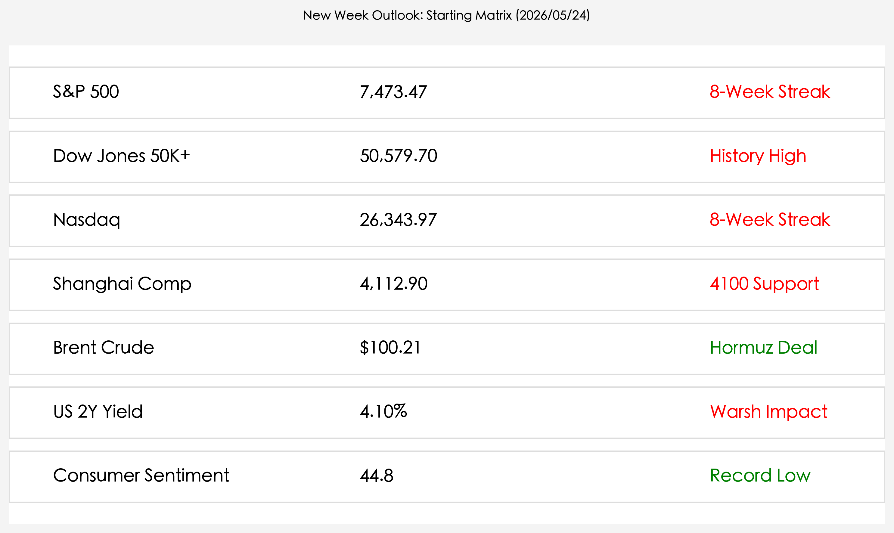

# 全球市场新周展望：霍尔木兹海峡重开预期对冲“沃什鹰派”冲击，美股休市下的亚太博弈

**日期：2026年05月24日 (星期日)** &nbsp; **时段：晚间 (新周展望)**

> **核心摘要**：随着特朗普宣布霍尔木兹海峡重开协议已“基本达成”，全球能源市场紧绷的神经得到初步释放，布伦特原油价格高位回落。然而，新任美联储主席沃什的“鹰派平衡”立场推升美债收益率，与创新高的美股形成显著背离。下周一美股因阵亡将士纪念日休市，市场目光将聚焦于亚太开盘及地缘协议的最终落地。

## 周末财经要闻终极汇总

本周末，全球金融市场被两大重磅变量主导：地缘政治的“降温”与美联储领导层的“转鹰”。

* **霍尔木兹海峡“破冰”**：周日，特朗普通过社交媒体宣布，关于结束长达 11 周的霍尔木兹海峡封锁协议已“基本达成”。该协议包含 14 点框架，旨在恢复这条承载全球 20% 原油贸易的关键水道。受此预期提振，布伦特原油价格从 110 美元的高点回落至 **$100.21** 附近。
* **沃什时代正式启航**：凯文·沃什于 5 月 22 日正式就任美联储主席。他在首秀中强调“物价稳定是绝对前提”，市场迅速将其解读为“鹰派”回归。2 年期美债收益率应声飙升至 **4.10%**，创下近期新高。
* **消费者信心“冰封”**：密歇根大学最新数据显示，美国消费者信心指数跌至 **44.8** 的历史新低。高昂的汽油价格（全美均价 $4.55）正严重侵蚀家庭购买力，与连涨八周的标普 500 指数形成了鲜明的“经济撕裂”。
* **AI 巨头的“强心针”**：英伟达披露的 800 亿美元回购计划和新一代 Rubin 架构细节，继续为全球算力链提供底部支撑，抵消了部分利率上升带来的估值压力。

## 新一周市场核心博弈逻辑

进入 5 月最后一周，市场将进入一个复杂的“多因素对冲”阶段。

1. **“和平红利”与“利率陷阱”的赛跑**：霍尔木兹海峡的重开将直接降低全球通胀预期，这对资产价格是重大利好。但与此同时，沃什领导下的美联储可能通过提高终端利率来压制通胀，这形成了“成本降、折现率升”的博弈局面。
2. **美股休市下的亚太先行**：由于周一（5 月 25 日）是美国阵亡将士纪念日，美股将全天休市。这意味着 A 股、港股和日经指数将率先对周末达成的地缘协议进行定价，流动性相对清淡的国际市场可能出现价格异动。
3. **K型分化的临界点**：当前标普 500 处于 **7,473.47** 点的高位，而普通民众信心却在谷底。这种背离是否会导致“消费降级”反噬企业利润，将是 6 月财报预警期的核心观察点。

## 本周重磅经济数据与会议前瞻

下周，市场将迎来沃什时代的首个“通胀体检”。

* **5月25日 (周一)**：**美国阵亡将士纪念日，美股休市。** 伦敦金属交易所 (LME) 也将休市。
* **5月26日 (周二)**：美国 3 月房价指数、谘商会消费者信心指数。
* **5月28日 (周四)**：**美国第一季度 GDP 修正值**。市场关注实际增长是否如美联储预期的那般稳健。
* **5月29日 (周五)**：**美国 4 月 PCE 物价指数**。这是联储最青睐的通胀指标，将决定沃什是否会在 6 月会议上采取更激进的行动。

## 头部券商/投行开盘策略点睛

* **高盛 (Goldman Sachs)**：**“关注‘算力+和平’双轮驱动”**。认为能源价格回落将显著改善制造业毛利，维持对亚太出口产业链的超配建议。
* **摩根大通 (JP Morgan)**：**“警惕 4.1% 收益率的引力”**。提醒投资者关注 2 年期美债收益率对高估值科技股的虹吸效应，建议在标普 7500 点上方保持谨慎。
* **中金公司 (CICC)**：**“ A 股估值修复进入下半场”**。认为地缘风险溢价的消退将吸引外资回流，看好上证综指在 4100 点支撑位之上的反弹韧性。

## 今日市场情绪：新周前夜的宁静与焦灼

当前市场情绪宛如一个巨大的沙漏，黑色原油的流出正转化为全球贸易的重新启动，但天平另一端依然承载着沉重的债务与通胀压力。

> Prompt: A giant hourglass with black oil (crude oil) flowing out instead of sand, slowly lifting a golden scale that represents the global market. In the background, a new dawn breaks over a silhouette of a city, symbolizing the Hormuz reopening and the new Fed era.

---
免责声明：内容仅供参考，不构成投资建议。
