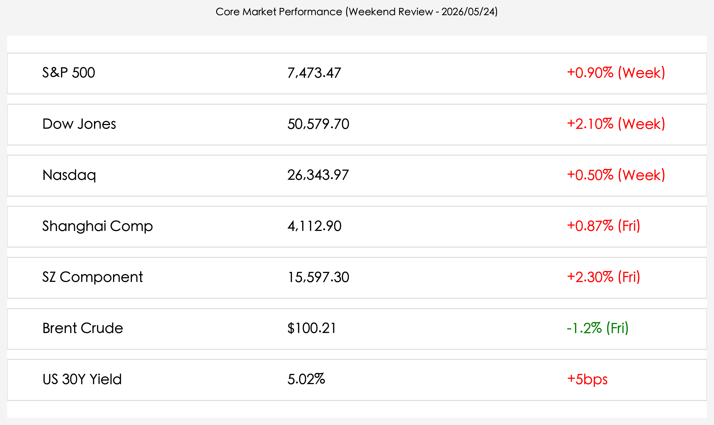
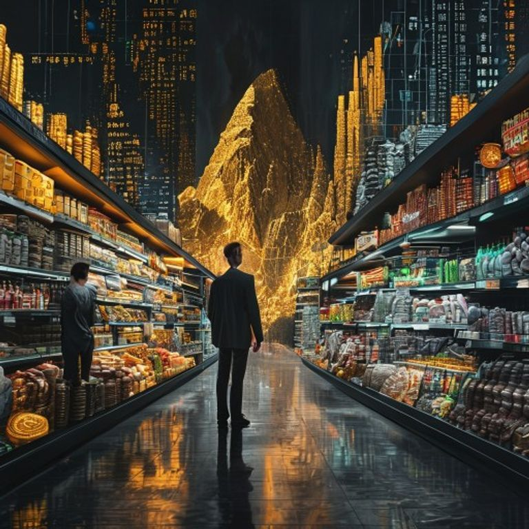

# 全球市场周报：美股八连涨创纪录，新任联储主席沃什开启“鹰派平衡”时代

**日期：2026年05月24日 (星期日)** &nbsp; **时段：上午 (周末复盘)**

> **核心摘要**：本周全球市场在极度分化中收官：美股标普 500 指数录得连续第八周上涨，创下 2023 年以来最长连胜纪录；与此同时，凯文·沃什正式接掌美联储，市场预期进入“鹰派平衡”新周期。尽管华尔街歌舞升平，但美国消费者信心指数跌至历史低点，地缘博弈与通胀迷局依然是下周开盘的核心悬念。

## 核心资产周度/日度表现回顾

本周全球金融资产展现了强大的“美式例外主义”。美股三大指数在震荡中稳步推高，尽管美债收益率攀升至多年高位，但并未阻碍权益类资产的狂欢。

* **道琼斯工业指数**：周五收报 **50,579.70** 点，本周累计大涨 **2.10%**，历史性站稳 5 万点上方。
* **标普 500 指数**：收报 **7,473.47** 点，周五微升 0.4%，本周累计上涨 **0.90%**，实现“八连阳”。
* **纳斯达克综合指数**：收报 **26,343.97** 点，本周累计上涨 **0.50%**。
* **上证指数**：周五收报 **4,112.90** 点，单日涨 0.87%，全周微跌 **0.54%**。
* **深证成指**：周五收报 **15,597.30** 点，单日涨 2.30%，全周累计上涨 **1.93%**。
* **伦敦布伦特原油**：收报 **$100.21** 美元/桶，周五下跌 1.2%，受中东和平谈判预期压制。
* **美债 30 年期收益率**：报 **5.02%**，自 2007 年以来首次跨越 5% 门槛，反映市场对长期高利率环境的定价。

> **行情洞察**：市场的“撕裂感”正在加剧。华尔街的繁荣建立在 AI 超级周期和大型科技股的强劲盈利之上，而美债收益率的飙升和消费者信心的匮乏则暗示了“实体经济”的隐痛。这种“高估值与弱信心”的背离，将是下周市场能否延续涨势的关键变量。

## 过去 48 小时重磅事件深度复盘

1. **凯文·沃什时代正式开启**：5 月 22 日（周五），凯文·沃什正式宣誓就任美联储主席。作为知名的“鹰派”，他的上任立即推动美债收益率全线走高。沃什在首次公开表态中重申了“物价稳定”的绝对重要性，基本终结了市场对 2026 年内降息的最后幻想。
2. **“和平红利”与油价博弈**：周末有报道称，伊朗与西方国家在霍尔木兹海峡通行权上达成关键妥协。这一进展让布伦特原油价格从高位回落至 100 美元附近，显著缓解了全球制造业的成本压力。
3. **消费者信心的“极寒时刻”**：密歇根大学最新调查显示，美国消费者信心指数跌至历史新低。家庭对未来一年的通胀预期上调至 4.8%。这一数据与屡创新高的股票市场形成鲜明对比，引发了机构对“消费降级”是否会反噬盈利的深度讨论。
4. **英伟达 Q1 财报的“长尾效应”**：尽管英伟达股价在财报发布后出现小幅获利回吐，但其披露的 800 亿美元回购计划和新一代 Rubin 架构细节，继续稳固了全球 AI 产业链的信心，带动了亚太地区半导体板块在周五的集体暴动。

## 下周全球宏观大事预警

* **美国阵亡将士纪念日 (周一)**：5 月 25 日美股将休市，全球市场预计将迎来短暂的“冷冻期”，交投清淡。
* **美伊协议正式文本**：市场预期下周将公布和平协议的具体条款，油价是否会跌破 95 美元关键支撑位将是能源板块的焦点。
* **日元保卫战**：日元兑美元汇率再次逼近 159 关口，日本央行是否会在美股休市期间进行“突袭式”干预值得高度关注。

## 顶级机构周末策略内参摘要

* **高盛 (Goldman Sachs)**：**“ sturdiness (稳健) 是关键词”**。预计 2026 年美国 GDP 增长将达到 2.6%，维持对标普 500 的看涨评级，认为当前的“广度回升”证明牛市并未终结。
* **摩根士丹利 (Morgan Stanley)**：**“关注 AI 资本支出”**。认为 2026 年五大科技巨头的 AI 支出将达到 8000 亿美元，将标普 500 的 2026 年终目标价上调至 **8,000 点**。
* **摩根大通 (JP Morgan)**：**“在噪音中寻找纪律”**。虽然对长期看好，但提醒投资者关注 35% 的衰退概率，建议配置具备强现金流的防御性科技标的。
* **中信证券 (CITIC)**：**“国产算力的转折点”**。认为国内政策对国产大模型的指导性适配将开启算力板块的“第二增长曲线”，看好下周 A 股科技主线的持续性。

## 今日市场情绪：巅峰上的孤独

当前市场情绪呈现出一种“孤独的繁荣”：华尔街在指数巅峰欢呼，而普通民众在货架前忧虑。这种经济结构的“K型分化”在艺术创作中被表现为一种分裂的现实。

> Prompt: Surrealism style, A human trader (real person) standing in a void, one side of the horizon shows a towering golden mountain of stock charts and digital coins representing Wall Street success, while the other side shows a dark empty grocery store representing Main Street struggle, the economic split, masterpiece, high detail, intricate composition, cinematic lighting, 8k resolution

---
免责声明：内容仅供参考，不构成投资建议。
