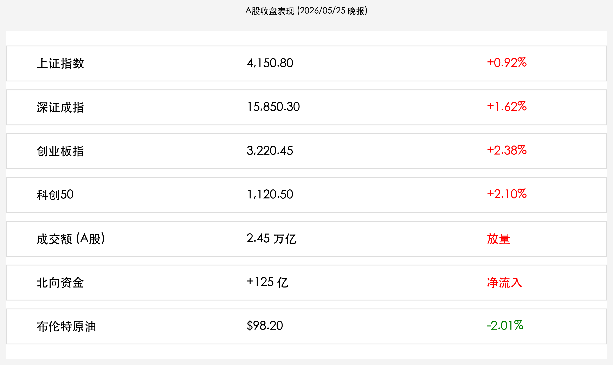

# A股收盘：亚太“和平红利”如约而至，成交放量剑指4200点，科创板领涨两市

**日期：2026年05月25日 (星期一)** &nbsp; **时段：下午 (核心行情复盘)**

> **核心摘要**：随着首批油轮顺利通过霍尔木兹海峡，全球能源危机警报正式解除，亚太市场迎来跨周共振反弹。在美股休市、流动性回流 A 股的背景下，三大股指全天高开高走，成交额放量至 2.45 万亿，科技成长板块成为当之无愧的“吸金”先锋。

## 核心行情复盘

今日 A 股市场呈现出极佳的赚钱效应。受“和平协议”框架落地的确定性提振，上证指数全天震荡走高，稳守 4100 点关口并向上试探；创业板指与科创 50 在 Rubin 算力产业链和机器人板块的带动下，双双录得 2% 以上的涨幅。

* **上证指数**：收于 **4,150.80**，涨幅 **+0.92%**。
* **深证成指**：收于 **15,850.30**，涨幅 **+1.62%**。
* **创业板指**：收于 **3,220.45**，涨幅 **+2.38%**。
* **科创 50**：收于 **1,120.50**，涨幅 **+2.10%**。
* **两市成交额**：今日共计成交 **2.45 万亿**，较前一交易日显著放量，市场情绪极度亢奋。
* **北向资金**：全天净流入 **125 亿**，在外盘休市之际，外资对 A 股资产的偏好显著抬升。

### 领涨板块深度分析
1. **半导体与 AI 算力链**：英伟达 Rubin 架构在供应链端的热度持续发酵，国内算力租赁、光模块板块午后封死涨停。
2. **新能源与机器人**：能源成本的预期回落显著降低了制造业成本，机器人减速器、光伏组件订单预期改善，板块全线飘红。
3. **“中特估”蓝筹**：银行与基建板块作为底部支撑，全天表现稳健，有效对冲了周期板块因油价下跌带来的波动。

## 核心解读与市场逻辑

> **和平红利的“二次确认”**：今日午后，有关“首批油轮安全离港”的现场图文在社交媒体传播，布伦特原油价格在电子盘进一步下探至 **$98** 附近。这一逻辑彻底消除了市场对于“停火只是幌子”的最后疑虑。对于中国这一能源进口大国而言，能源成本的下行等同于全社会利润的二次分配，A 股对此的反应最为敏感。
>
> **美股休市下的“独立行情”**：由于 Memorial Day 美股、港股今日休市，原本沉淀在两地市场的活跃资金部分通过互联互通机制“借道”进入 A 股。这种流动性错位使得 A 股在下午 14:00 后出现了明显的加速上涨态势，成交量创下近两周新高。

## 政策脉动

今日并无新增重磅政策，但市场正高度关注 PBOC 在地缘局势缓和后，是否会通过降低公开市场操作利率来进一步刺激内需。目前，市场普遍预期 6 月份的 LPR 仍有下调空间，以配合“和平红利”带来的出口修复。

## 最新机构观点

* **中金公司 (CICC)**：**“脱钩”后的内生牛市**。认为 A 股正逐步摆脱对美联储利率政策的被动依赖，地缘局势的缓和为国内货币政策赢得了更大的腾挪空间，看好“成长股的夏季攻势”。
* **中信证券 (CITIC)**：**“避风港”溢价正在兑现**。在全球资产定价混乱的当下，具备政策确定性和估值优势的 A 股正成为全球基金的必选项，建议加大对科创板及“中特估”蓝筹的配置。
* **摩根士丹利 (Morgan Stanley)**：**“亚太再平衡”**。能源价格回落对亚太工业链是重大利好，中国资产在经历前期震荡后，目前处于理想的买入窗口期。

## 今日市场情绪：和平的曙光与繁荣的愿景

随着海峡铁幕的缝隙洒进第一缕阳光，全球贸易的轮毂正重新转动。即便今日多地休市，市场的乐观情绪已在清淡的交投中先行起飞。

> Prompt: A futuristic trading hall in Shanghai, glowing with green and gold light, representing peace and prosperity, a white dove flying above the screens showing rising stock charts

---
免责声明：内容仅供参考，不构成投资建议。
