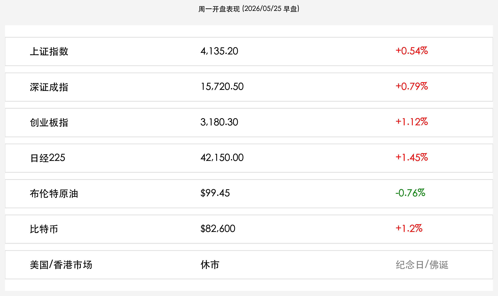

# 全球市场新周开启：亚太领衔“和平红利”行情，美股休市下的流动性博弈

**日期：2026年05月25日 (星期一)** &nbsp; **时段：上午 (新周展望)**

> **核心摘要**：特朗普关于霍尔木兹海峡重开的“深夜喜讯”点燃了亚太市场，日经 225 与 A 股双双高开。尽管美国、英国与香港今日因假期休市，全球交易量萎缩，但能源价格的回落为制造业注入强心针，市场正以前所未有的速度定价“和平红利”。

## 周末财经要闻终极汇总

* **霍尔木兹海峡“和平协议”框架浮现**：在特朗普社交媒体预热后，市场传出协议核心条款：美方承诺暂时推迟针对能源出口的新制裁，以换取海峡的无条件通行与多国海上联合安全机制。布伦特原油电子盘应声跌破 **$100** 关口。
* **沃什时代的“通胀狙击”准备**：尽管今日美股休市，但凯文·沃什上周末在杰克逊霍尔的一篇旧文重发引起关注，其重申“央行不应成为金融市场的保姆”，暗示 6 月可能直接加息 50 个基点以应对顽固通胀。
* **芯片产业链的“新地缘”格局**：英伟达 Rubin 架构在亚太供应链引起连锁反应。台积电与三星电子周一开盘均表现稳健，反映出算力需求对冲了利率上行担忧。

## 新一周市场核心博弈逻辑

1. **“和平预期”的成色检验**：本周市场的首要任务是验证霍尔木兹协议的真实成效。如果首批油轮顺利通过海峡，油价可能进一步回落至 90 美元区间，从而显著缓解全球通胀压力。
2. **休市期间的“影子定价”**：在美股、港股休市的背景下，日经指数与 A 股的表现将成为周二全球复市的“风向标”。当前低流动性环境可能放大涨跌幅，需警惕尾盘的避险回补。
3. **“沃什鹰”与 PCE 的对决**：本周五的 PCE 数据将是新任主席沃什的首个重大考验。如果数据超预期，即便地缘利好出尽，市场也将面临估值重塑的剧震。

## 本周重磅经济数据与会议前瞻

* **5月25日 (周一)**：**美国、英国、中国香港市场休市。** 市场关注 A 股独立行情。
* **5月26日 (周二)**：美国 3 月房价指数、谘商会消费者信心指数。复市后的美股将补涨/补跌周末地缘逻辑。
* **5月28日 (周四)**：**美国第一季度 GDP 修正值**。
* **5月29日 (周五)**：**美国 4 月 PCE 物价指数**（通胀终极考验）。

## 头部券商/投行开盘策略点睛

* **高盛 (Goldman Sachs)**：**“亚太出口链的黄金窗口”**。认为能源价格下跌对日本、中国等能源进口大国是显著利好，建议短期做多航空与造船。
* **野村证券 (Nomura)**：**“关注日元的结构性拐点”**。地缘局势缓和有助于缩小美日利差压力，预计日元有望在 158 附近企稳。
* **中信证券 (CITIC)**：**“ A 股的估值‘避风港’效应”**。在全球不确定性中，A 股内生逻辑与政策确定性正吸引外资重新审视，建议关注“中特估”下的蓝筹修复。

## 今日市场情绪：和平的曙光与假期的静谧

随着海峡铁幕的缝隙洒进第一缕阳光，全球贸易的轮毂正重新转动。即便今日多地休市，市场的乐观情绪已在清淡的交投中先行起飞。

> Prompt: A white dove flying over the Hormuz Strait, the dark shadows of blocked tankers are being replaced by glowing golden trade routes on the water surface, symbolizing the return of peace and global commerce.

---
免责声明：内容仅供参考，不构成投资建议。
