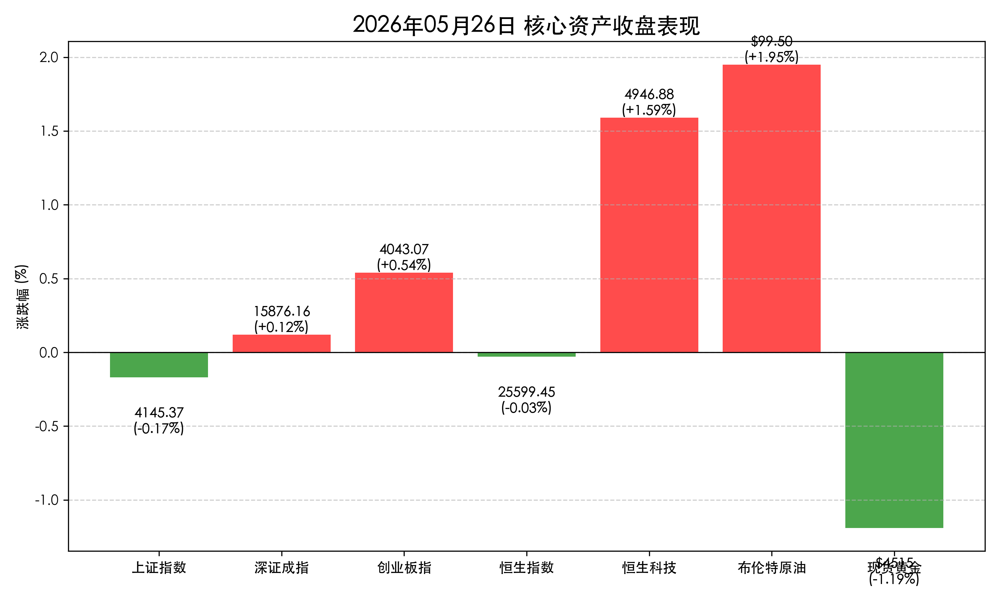

# A股天量分化：华为“韬定律”引爆先进封装，3.24万亿成交见证“和平红利”换向

**日期：2026年05月26日 (星期二)** &nbsp; **时段：晚间收盘**

> **核心摘要**：华为“韬定律”发布重塑半导体估值体系，带动先进封装与 PCB 板块逆势爆发。尽管科创 50 指数因前期获利盘回吐而高位回落，但两市 3.24 万亿的天量成交显示场外资金入场意愿极其强烈。在地缘政治风险溢价消退与科技自主的双重驱动下，A 股正步入结构性“换道”新周期。

## 核心行情复盘
今日 A 股三大指数呈现宽幅震荡分化走势。早盘受获利盘兑现影响集体低开，午后半导体等科技板块在先进封装主线带动下强力修复。

*   **上证指数**：收报 **4145.37 点**，下跌 **0.17%**。
*   **深证成指**：收报 **15876.16 点**，上涨 **0.12%**。
*   **创业板指**：收报 **4043.07 点**，上涨 **0.54%**。
*   **科创 50**：收报 **1867.71 点**，下跌 **1.49%**。
*   **成交额**：两市全天成交额达 **3.24 万亿元**，继续刷新近期天量记录。
*   **北向资金**：全天净流入 **91 亿元**，连续两日大手笔抢筹。

## 核心解读与市场逻辑
> 今日市场的灵魂在于华为正式发表的**“韬（τ）定律”**。该定律提出以“时间缩微”替代“几何缩微”，预示着国产半导体将跳过对极紫外光刻机的绝对依赖，通过 3D 集成和系统拓扑结构优化实现换道超车。这一逻辑直接点燃了**先进封装、PCB 以及 3D 堆叠相关产业链**。
> 
> 与此同时，早间提及的“和平红利”逻辑正在发生微调。虽然布伦特原油在 $99 附近震荡，但避险资产黄金出现获利回吐，显示市场已从最初的地缘恐慌全面转向“成本改善”交易。A 股 3.24 万亿的成交额证明，在 4000 点上方的震荡并非见顶，而是大级别的换手与调仓。

## 政策脉动
*   **流动性呵护**：中国人民银行今日开展 **2490 亿元 7 天期逆回购操作**，配合昨日 MLF 净投放，有效对冲了季末流动性波动，为 3 万亿级别的成交提供了坚实底座。
*   **科技自主**：商务部最新数据显示，4 月份新能源乘用车渗透率已突破 **61.4%**。高层再次强调人工智能激活新动能，尤其是 AI 算力与机器人产业的结合。
*   **监管规范**：证监会联合八部门印发方案，综合整治非法跨境证券业务。短期虽对部分跨境券商概念有压制，但长期有利于引导资金回流境内主板。

## 最新机构观点
*   **中信证券**：建议聚焦“支点”投资。华为“韬定律”将半导体博弈从制程引向架构，中国企业有望在先进封装领域迎来全球份额的快速扩张。
*   **中金公司**：看好 AIDC（AI 数据中心）驱动下的电力产业链。随着算力爆发，燃气轮机及配套发电设备的缺口将持续扩大，建议关注“电算协同”下的整机装备出海机会。
*   **国泰君安**：指出 A 股已从“普涨”进入“分化精选”阶段，建议规避涨幅过大的算力租赁，布局受益于成本下降的贵金属及制造业龙头。

## 今日市场情绪：换道中的天量震荡
今日市场情绪表现为“理性的狂热”。虽然下跌个股超 4000 只，但核心主线（先进封装、华为产业链）展现了极强的吸金能力和韧性。

> Prompt: Cyberpunk style, A futuristic digital foundry where golden chips are being woven into a 3D crystalline structure. In the background, a storm of red and green stock candles illuminates a calm harbor where merchant ships sail through a mist of fading dark oil., masterpiece, high detail, intricate composition, cinematic lighting, 8k resolution

---
免责声明：内容仅供参考，不构成投资建议。
