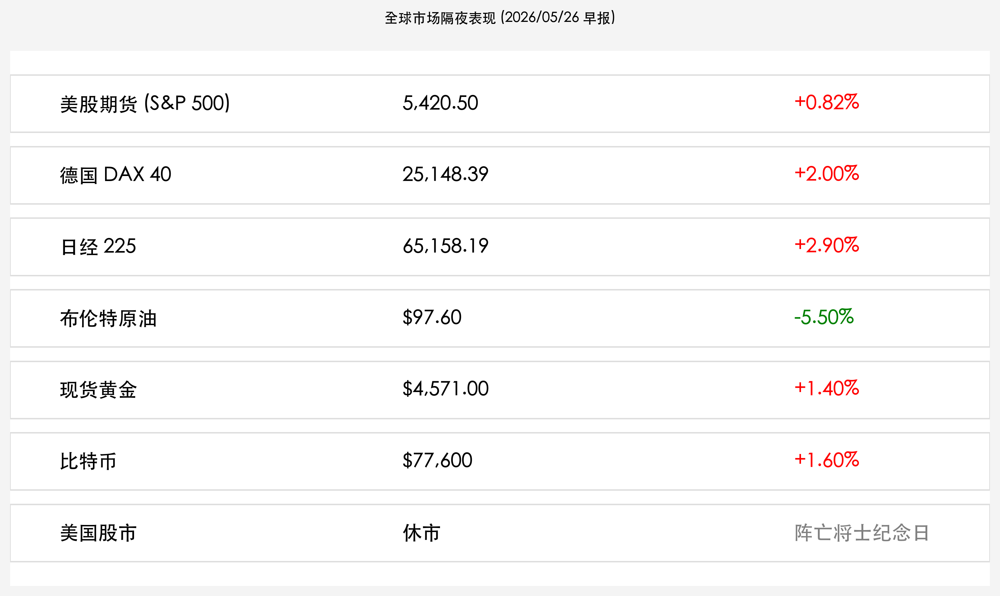

# 全球市场早报：中东和平鸽飞越海峡，亚太领衔“和平红利”狂欢

**日期：2026年05月26日 (星期二)** &nbsp; **时段：上午**

> **核心摘要**：随着美伊和平框架协议初步达成，国际原油价格大幅下挫，全球市场迎来“和平红利”爆发期。尽管美股因“阵亡将士纪念日”休市，但美股期货全线上扬，日经225指数录得历史新高，德国DAX指数创下四个月来最大单日涨幅。能源成本下行正重塑全球制造业盈利预期。

## 核心行情复盘
昨日西半球主要市场休市，但亚太与欧洲市场在和平预期推动下全线爆发。

*   **日经 225**：收报 **65,158.19 点**，大涨 **2.90%**，刷新历史最高纪录。
*   **德国 DAX 40**：收报 **25,148.39 点**，上涨 **2.00%**。
*   **美股期货 (S&P 500)**：报 **5,420.50 点**，上涨 **0.82%**。
*   **布伦特原油**：报 **$97.60 / 桶**，暴跌 **5.50%**，跌破百元大关。
*   **现货黄金**：报 **$4,571.00 / 盎司**，上涨 **1.40%**。
*   **比特币**：报 **$77,600**，上涨 **1.60%**。

## 核心解读与市场逻辑
> 市场的核心逻辑已从“滞胀担忧”彻底切换为“和平红利”。霍尔木兹海峡的重开预期直接终结了原油的短缺溢价。由于能源成本占到全球制造业成本的 15%-25%，油价跌破 $100 被视为对实体经济的一次系统性“减税”。
> 日本与德国作为高度依赖能源进口的制造业强国，受益最为直接。日经指数跨越 65,000 点大关，不仅反映了套利交易的平仓，更体现了全球资本对东亚制造业复苏的强力看好。

## 政策脉动
*   **外交突破**：美伊双方在日内瓦达成初步“停火与海峡通行框架协议”，预计霍尔木兹海峡将在 72 小时内全面恢复民用航运。
*   **联储风向**：在美股休市期间，凯文·沃什的政策表态继续发酵。由于油价大跌显著缓解了通胀压力，市场对联储 6 月份维持利率不变的概率预期升至 85%。
*   **贸易重启**：IMF 评估认为，若海峡顺利重启，全球 2026 年 GDP 增速有望上调 0.3 个百分点。

## 最新机构观点
*   **高盛**：指出“和平交易”刚刚开始，建议增配受益于能源成本下降的交通运输、消费性电子及高端装备制造业。
*   **摩根士丹利**：认为日经指数的破位上涨具有里程碑意义，这标志着日本摆脱通缩阴影后，进入了“和平+技术”双驱动的新牛市周期。
*   **贝莱德**：地缘政治溢价的消退将释放大量场外资金，美股开盘后有望在科技与工业板块带领下继续冲击高位。

## 今日市场情绪：和平鸽飞越海峡
今日全球市场风险偏好显著回升。原油的暴跌与股市的飙升形成鲜明对比，反映了市场对长期成本压力缓解的乐观预期。

> Prompt: Surrealism style, A majestic white dove carrying an olive branch made of emerald circuits, flying over a calm Strait of Hormuz. In the background, oil derricks are turning into flowering trees, and a sun rising behind a graph showing a downward oil price curve and upward stock market candles., masterpiece, high detail, intricate composition, cinematic lighting, 8k resolution

---
免责声明：内容仅供参考，不构成投资建议。
