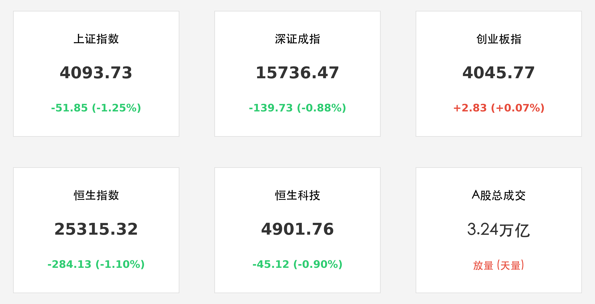
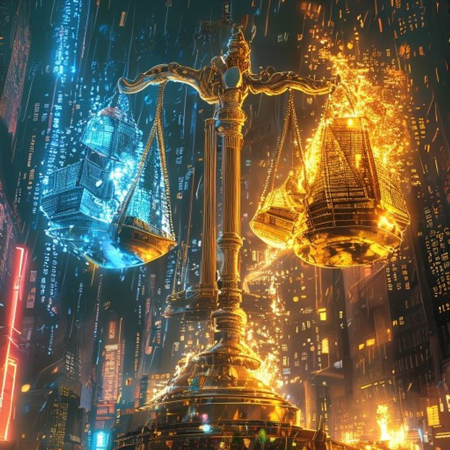

# A股天量分化：科技主线高位回调，3.24万亿成交见证资金防御大腾挪

**日期：2026年05月27日 (星期三)** &nbsp; **时段：晚间 (国内市场收盘复盘)**

> **核心摘要**：今日 A 股市场呈现极端放量震荡，全天成交额突破 **3.24 万亿元**，连续四日处于历史天量区间。尽管科技主线因获利盘兑现压力出现明显回调，但北向资金逆势抄底电力、白酒等防御性板块，市场结构性机会正在向低估值绩优股发生战略性腾挪。

## 核心行情复盘

周三市场呈现明显的“沪弱深强”与“结构分化”特征。沪指在有色、石油等权重板块拖累下全天单边下行，而创业板则在权重股支撑下走出独立行情，勉强收红。

*   **上证指数**：收报 **4093.73点**，下跌 **1.25%**。
*   **深证成指**：收报 **15736.47点**，下跌 **0.88%**。
*   **创业板指**：收报 **4045.77点**，上涨 **0.07%**。
*   **恒生指数**：收报 **25315.32点**，下跌 **1.10%**。
*   **市场活跃度**：全天成交额达 **3.24万亿元**。全市场近 4500 只个股下跌，赚钱效应降至冰点，显示高位筹码松动迹象明显。
*   **领涨板块**：防御性色彩浓厚。电力、白酒、影视院线涨幅居前；题材方面，超级电容与超超临界发电受政策利好逆市走强。
*   **领跌板块**：前期热点有色金属、石油、房地产跌幅居前；高位科技赛道（算力租赁、商业航天）出现集中获利了结。

## 核心解读与市场逻辑

1.  **“天量”不涨的警示信号**：连续四天维持 3 万亿以上的成交额，但指数却出现明显回调，这意味着市场已进入“分歧期”。多空双方在高位进行了剧烈的换手，短期内如果没有更强有力的利好支撑，市场可能面临回补缺口的技术性需求。
2.  **科技主线的“韬定律”博弈**：华为最新发表的“韬(τ)定律”提出以时间缩微替代几何缩微，引发了市场对先进制程路径的深度重构。虽然长期看好国产半导体，但短期由于涨幅过大，资金借利好出货迹象明显，芯片与算力板块今日承受了较大的内资主力流出压力。
3.  **资金的避风港转移**：在内资主力大幅撤离高位科技股的同时，北向资金却表现出明显的逆势流入特征。外资重点加仓了估值尚处低位的白酒与电力龙头，显示出在大盘震荡期，稳健的现金流与高股息资产再次成为大额资金的优先选择。

## 政策脉动

*   **基本面支撑**：国家统计局数据显示，1-4 月规模以上工业企业利润增长 **18.2%**，显示宏观经济复苏动能依然稳健，为市场中长期底部提供了坚实的业绩支撑。
*   **产业标准化**：工信部发布 2026 年汽车标准化要点，重点发力驾驶自动化与车路云一体化，相关产业链公司虽然今日随大盘调整，但中长线逻辑依然清晰。
*   **能源 AI 化**：国家能源局推进“人工智能+”能源建设，算力与电力的协同效应将成为未来科技板块的新增长点。

## 最新机构观点

*   **中信证券 (CITIC Securities)**：对下半年港股与 A 股维持整体乐观态度。认为当前估值已回归合理水平，建议投资者在震荡中关注高景气科技赛道（机器人、商业航天）及高股息红利板块。
*   **中金公司 (CICC)**：期待下半年的指数级“Beta 行情”。随着中国经济稳定性进一步被全球认可，预计市场将迎来“估值+业绩”的双击，看好内需修复相关的互联网与消费龙头。

## 今日市场情绪：天量博弈下的天平倾斜

> Prompt: Manga style, A colossal digital balance scale standing amidst a storm of data bits in a neon city, on one side glowing blue microchips are floating away, while on the other side solid golden shields and pillars of fire representing defensive energy stocks are being piled up, the scale is vibrating intensely from the sheer weight of 3 trillion trading volume, masterpiece, high detail, intricate composition, cinematic lighting, 8k resolution

---
免责声明：内容仅供参考，不构成投资建议。
