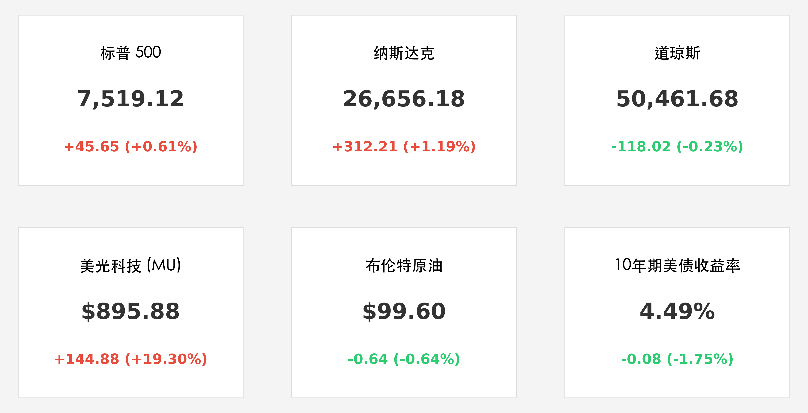
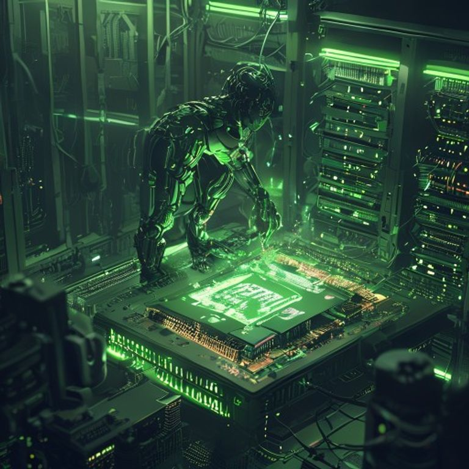

# 标普纳指再创新高：美光科技领衔 AI 狂飙，美联储进入“沃什时代”

**日期：2026年05月27日 (星期三)** &nbsp; **时段：上午 (国际市场隔夜复盘)**

> **核心摘要**：美股周二（5月26日）震荡走高，标普 500 与纳指双双刷新历史纪录。美光科技凭借 AI 算力爆发飙升 19%，市值突破万亿美元。与此同时，新任美联储主席沃什正式宣誓就职，市场对降息的期待已全面转向对 2026 年底加息的定价。

## 核心行情复盘

在阵亡将士纪念日后的首个交易日，华尔街表现出强劲的“科技牛”韧性。尽管道指受能源与医疗板块拖累微跌，但科技股的疯狂表现掩盖了一切不安。

*   **标普 500 (S&P 500)**：收于 **7,519.12** 点，上涨 45.65 点 (**+0.61%**)，创收盘历史新高。
*   **纳斯达克 (Nasdaq)**：收于 **26,656.18** 点，大涨 312.21 点 (**+1.19%**)，创收盘历史新高。
*   **道琼斯 (Dow Jones)**：收于 **50,461.68** 点，下跌 118.02 点 (**-0.23%**)。
*   **美光科技 (MU)**：受瑞银大幅调高目标价及政府半导体补贴利好驱动，股价暴涨 **19.30%** 至 **$895.88**，历史性突破 1 万亿美元市值。
*   **美债市场**：10 年期美债收益率回落 8 个基点至 **4.49%**，显示部分避险资金在利率不确定性中锁定高收益资产。
*   **大宗商品**：布伦特原油震荡回落至 **$99.60/桶**，尽管中东局势仍紧，但潜在的和平协议预期缓解了极度恐慌。

## 核心解读与市场逻辑

1.  **AI 算力“万亿俱乐部”扩容**：美光科技的暴发标志着 AI 溢价已从逻辑芯片（英伟达）全面扩散至高带宽存储（HBM）。市场公认，AI 的下一瓶颈在于存储墙的突破，MU 的财报预期已被机构视为“新时代的黄金”。
2.  **美联储的“沃什”变局**：凯文·沃什（Kevin Warsh）正式入主美联储，标志着鲍威尔时代的终结。沃什此前以“鹰派倾向”著称，其就职演说虽然强调“灵活”，但 3.8% 的粘性 CPI 让市场愈发确信：2026 年将不再有降息，甚至可能在年底迎来一次“信誉重建式”的加息。
3.  **地缘溢价的动态博弈**：尽管油价维持高位，但市场已开始定价“中东和谈”的可能性。Morgan Stanley 认为，即使局势维持现状，当前的金融环境也已通过美债收益率曲线完成了 35 个基点的“事实性加息”。

## 政策脉动

*   **联储换届**：沃什的首场议息会议将于 6 月举行，市场关注其是否会调整缩表（QT）节奏。
*   **产业政策**：美国商务部暗示将针对国内半导体先进制程提供第二轮大规模补贴，这是刺激 MU 等个股暴涨的直接政治诱因。
*   **通胀压力**：5 月核心 PCE 数据即将公布，该数据将成为判定沃什是否会立即采取强硬态度的关键。

## 最新机构观点

*   **高盛 (Goldman Sachs)**：将首次降息预期推迟至 **2026 年 12 月**。分析师指出，能源成本的传导效应使得核心通胀很难在年内降至 3% 以下，建议投资者超配具有 AI 盈利确定性的新兴市场龙头。
*   **摩根士丹利 (Morgan Stanley)**：维持 2026 年美国 GDP **2.3%** 的强韧增长预期。虽然利率维持高位，但 AI 驱动的资本开支与强劲的居民资产负债表将防止经济陷入硬着陆。
*   **瑞银 (UBS)**：大幅上调美光科技目标价至 $1000 以上，认为 HBM4 的领先优势将支撑其利润率持续扩张。

## 今日市场情绪：AI 普罗米修斯的火种

> Prompt: Cyberpunk style, A human-like cyborg Prometheus harvesting glowing green data fire from a massive semiconductor chip in a high-tech server room, representing the AI and Micron surge, ultra-detailed manga style, epic lighting, masterpiece, high detail, intricate composition, cinematic lighting, 8k resolution

---
免责声明：内容仅供参考，不构成投资建议。
