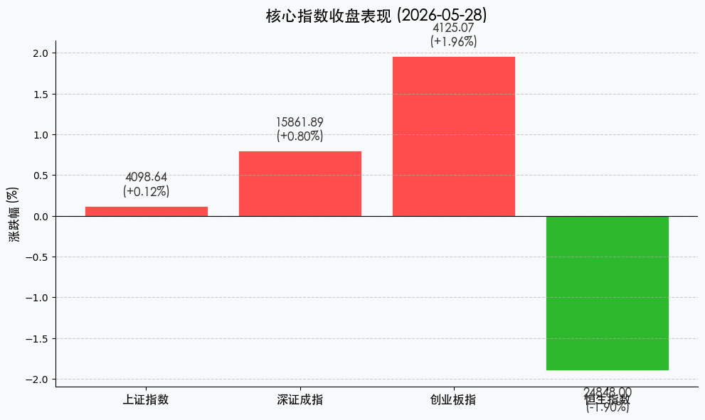
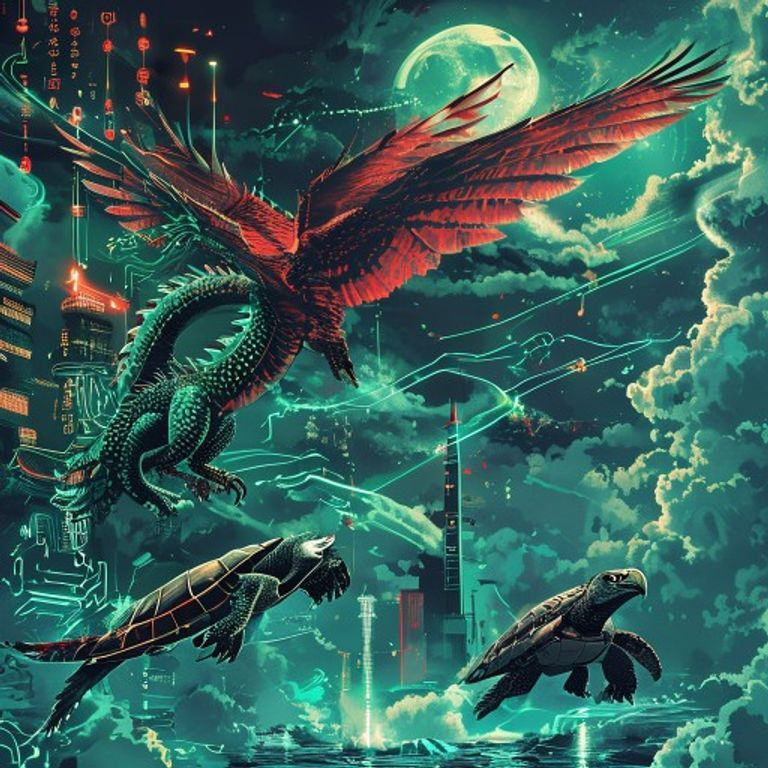

# A股缩量震荡：创业板指强势“超车”沪指，港股恒指跌破25000点关口

**日期：2026年05月28日 (星期四)** &nbsp; **时段：晚间 (国内市场收盘复盘)**

> **核心摘要**：今日 A 股市场呈现缩量震荡、指数分化的走势。尽管全天成交额萎缩至 **2.41 万亿元**，但创业板指大涨近 2% 表现强劲，收盘点位历史性超越上证指数。相比之下，港股市场受期指结算日拖累表现疲软，恒生指数大跌近 500 点，痛失 25000 点心理关口。

## 核心行情复盘

周四市场呈现明显的“内强外弱”格局。A 股在经历前期天量分化后，今日进入缩量修复阶段，科技主线在 AI 算力与半导体的带领下重回进攻位置。

*   **上证指数**：收报 **4098.64点**，微涨 **0.12%**。
*   **深证成指**：收报 **15861.89点**，上涨 **0.80%**。
*   **创业板指**：收报 **4125.07点**，大涨 **1.96%**，点位历史性超越上证指数。
*   **恒生指数**：收报 **24848.00点** 附近，大跌 **1.90%** (-479点)，受期指结算影响创两个月新低。
*   **市场活跃度**：两市合计成交额约 **2.41万亿元**，较前几日的 3 万亿量级显著萎缩，显示高位追高情绪趋于谨慎。
*   **领涨板块**：稀土永磁、半导体、通信设备及 AI 算力板块领涨。光模块（CPO）与 PCB 在经历调整后出现强力修复。
*   **领跌板块**：白酒、贵金属、证券板块走势低迷；港股美团-W 跌逾 6% 创两年新低。

## 核心解读与市场逻辑

1.  **创业板指的历史性“超车”**：今日市场最具标志性的事件是创业板指收盘点位超越上证指数。这一现象反映了当前 A 股市场的结构性牛市正由“全员普涨”向“硬科技驱动”深度转型。以半导体、算力、低空经济为代表的新质生产力权重在创业板中占比更高，其估值溢价正在重塑 A 股的坐标系。
2.  **“缩量”背后的筹码交换**：成交额回落至 2.4 万亿水平，说明获利盘的集中抛压已有所缓解。虽然量能萎缩限制了指数的向上突破力度，但也意味着筹码在 4100 点关口完成了初步的二次换手，市场正在寻找新的共识支点。
3.  **港股的“期结”阵痛与内资抄底**：恒指今日的重挫主要受期指结算日的技术性压力及权重科技股走弱影响。然而，南向资金今日净买入额突破 **100 亿港元**，显示内资在恒指回补缺口、回踩支撑位的过程中正在加速“扫货”优质廉价筹码。

## 政策脉动

*   **宏观定力**：中信证券 2026 资本市场论坛明确指出，中国经济正处于“韧链强基”关键期，预计全年 GDP 增速维持在 **5%** 左右。货币与财政政策的“双宽松”预期为市场底部提供了坚实的流动性保障。
*   **配置转向**：政策面引导资金流向新质生产力领域。“AI + 能源化工”作为今年核心主线的逻辑得到进一步强化，算力中心与电力配套的协同建设已成为基建投资的新高地。

## 最新机构观点

*   **中信证券 (CITIC Securities)**：提出“AI + 能化”的杠铃型配置结构。认为 2026 年的市场逻辑已由单纯的红利博弈转向“科技成长 + 周期修复”的双轮驱动。
*   **中金公司 (CICC)**：强调头部金融机构在资本市场改革中的确定性收益，并建议投资者在波动加大期采取多元分散配置策略，关注黄金与有色金属在地缘波动中的对冲价值。

## 今日市场情绪：创业板的“超车”时刻

> Prompt: Manga style, A futuristic Chinese dragon with emerald scales representing the ChiNext index soaring into a crystal sky, passing a milestone tower. Below, a steady stone turtle (SSE) crawls forward, while in the distance, a massive red-winged hawk (HSI) is diving into a turbulent dark ocean under a stormy moon. The scene is filled with glowing circuit patterns and floating data streams., masterpiece, high detail, intricate composition, cinematic lighting, 8k resolution

---
免责声明：内容仅供参考，不构成投资建议。
