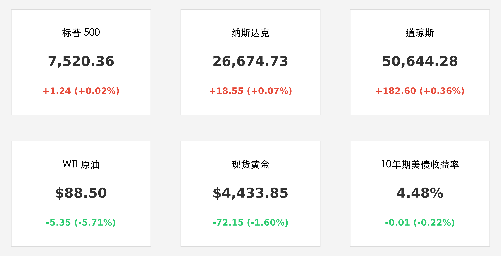
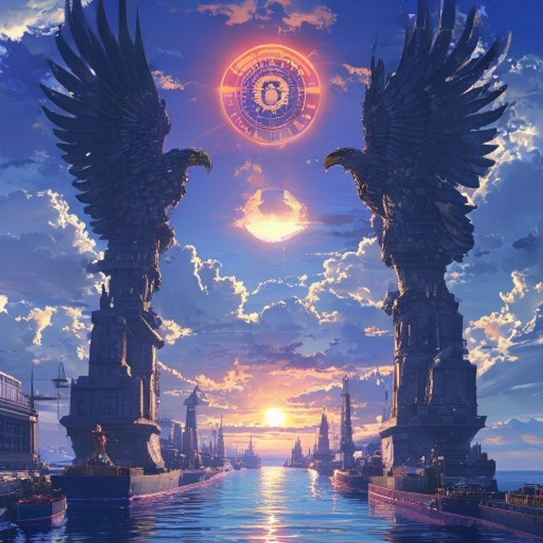

# 沃什鹰派新局与中东停火曙光：标普纳指微涨续刷纪录，油价暴跌 5% 见证“和平红利”

**日期：2026年05月28日 (星期四)** &nbsp; **时段：上午 (国际市场隔夜复盘)**

> **核心摘要**：美股周三（5月27日）在波动中再度走高，三大指数同步创下收盘历史新高。随着中东停火协议草案流出，油价暴跌近 6% 极大缓解了通胀忧虑。与此同时，新任联储主席沃什正式宣誓就职并重申抗通胀决心，市场正在“和平红利”与“沃什加息预期”之间寻找新的平衡点。

## 核心行情复盘

华尔街在周三经历了“和平预期”驱动的估值修复。尽管芯片板块在连续大涨后稍作歇息，但医疗与消费板块的走强成功对冲了能源股的颓势，推动大盘继续向上拓展空间。

*   **标普 500 (S&P 500)**：收于 **7,520.36** 点，微涨 1.24 点 (**+0.02%**)，连续第二日刷新历史纪录。
*   **纳斯达克 (Nasdaq)**：收于 **26,674.73** 点，微涨 18.55 点 (**+0.07%**)，续创历史新高。
*   **道琼斯 (Dow Jones)**：收于 **50,644.28** 点，大涨 182.60 点 (**+0.36%**)，成分股中联合健康等医疗龙头表现抢眼。
*   **大宗商品**：WTI 原油暴跌 **5.71%** 至 **$88.50/桶**，触及五周低点；黄金同步回落 1.6% 至 **$4,433.85/盎司**，反映出地缘溢价的快速消退。
*   **美债市场**：10 年期美债收益率小幅降至 **4.48%**。虽然沃什言论偏鹰，但能源价格下跌带来的通胀降温预期主导了长端债市。

## 核心解读与市场逻辑

1.  **“和平红利”重塑成本端**：据伊朗官方媒体报道，美伊关于恢复协议及开放霍尔木兹海峡的草案已进入最后审议阶段。这一消息直接引爆了原油市场的抛售潮。对于美股而言，油价的结构性回落不仅降低了企业运输成本，更重要的是为联储提供了暂缓激进加息的政策窗口。
2.  **沃什时代：从“透明”转向“效能”**：凯文·沃什在就职仪式上明确表示，美联储的未来将减少“无谓的前瞻性指引”，转而关注数据驱动的实质决策。他重申了对 2% 通胀目标的“绝对忠诚”，并暗示将加速缩减 9 万亿美元的资产负债表。这种“纪律性”让市场对 2026 年底的加息定价更加稳固，但也提升了美元资产的长期吸引力。
3.  **AI 算力主权的“休整期”**：三星电子与工会达成利润分享协议，消除了存储芯片供应链的重大不确定性。SK Hynix 与美光科技市值企稳于万亿美元之上，显示出市场在经历前几日的疯狂后，正从“情绪溢价”向“业绩兑现”过渡。

## 政策脉动

*   **联储重组**：沃什入主后，市场关注其是否会调整公开市场操作（OMO）的频率。
*   **半导体法案**：商务部正式确认将开启第二轮大规模补贴，重点覆盖先进封装与 HBM 存储。
*   **劳动力市场**：三星 10.5% 的利润分红协议可能引发全球半导体行业的新一轮“抢人大战”，进而推推升该行业的长期研发成本。

## 最新机构观点

*   **摩根大通 (JPMorgan)**：将美股评级维持在“中性”，认为虽然地缘风险缓解，但沃什的鹰派作风可能在下半年引发流动性边际收紧。
*   **贝莱德 (BlackRock)**：建议关注“能源转型中的韧性资产”。虽然短期油价下跌，但 AI 数据中心对稳定电力供应的需求将支撑电网基础设施板块的长期估值。
*   **巴克莱 (Barclays)**：预计沃什首场议息会议将维持利率不变，但可能大幅上调缩表（QT）规模，以此作为不加息的折中方案。

## 今日市场情绪：和平曙光下的沃什天平

> Prompt: Manga style, A futuristic harbor where massive cargo ships are passing through a narrow strait guarded by two giant stone statues of eagles. In the background, a digital sun with the Federal Reserve logo is rising over a calm blue ocean, symbolizing the 'Warsh Era' and the reopening of global trade routes., masterpiece, high detail, intricate composition, cinematic lighting, 8k resolution

---
免责声明：内容仅供参考，不构成投资建议。
