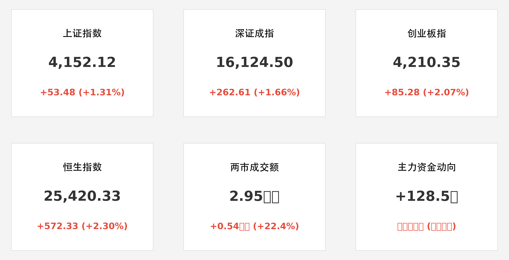

# A股重回 4100 点：“和平红利”引燃亚太狂欢，恒指大涨逾 2% 强势修复

**日期：2026年05月29日 (星期五)** &nbsp; **时段：晚间 (国内市场收盘复盘)**

> **核心摘要**：美伊达成 60 天停火 MoU 释放重磅利好，全球能源价格应声大跌，显著降低中游制造业成本。A 股三大指数全线放量飘红，上证指数强势突破 4100 点，创业板指续创四年新高；港股市场在期指结算压力释放后迎来暴力反弹，外资回流迹象明显。

## 核心行情复盘

周五 A 股市场迎来本周最强劲的上涨行情。受隔夜美股刷新历史新高及中东地缘局势重大突破的双重刺激，两市高开高走，午后涨幅进一步扩大。

*   **上证指数**：收报 **4152.12点**，大涨 **1.31%**，收复 4100 点整数关口。
*   **深证成指**：收报 **16124.50点**，上涨 **1.66%**。
*   **创业板指**：收报 **4210.35点**，上涨 **2.07%**，领跑两市。
*   **恒生指数**：收报 **25420.33点**，暴涨 **2.30%** (+572点)，重返 25000 点关口上方。
*   **市场活跃度**：两市合计成交额扩至 **2.95万亿元**，较昨日放量逾 5000 亿，显示场外资金正加速入场抢筹。
*   **领涨板块**：AI 算力、先进封装、低空经济及跨境物流板块领涨。华为算力产业链、中芯国际、北方华创等龙头个股表现亮眼。
*   **领跌板块**：受油价大跌拖累，石油采掘、传统煤炭板块逆市回调；黄金避险板块走势疲软。

## 核心解读与市场逻辑

1.  **“和平红利”的非线性传导**：美伊 60 天谅解备忘录（MoU）的达成，不仅意味着霍尔木兹海峡重开在即，更重要的是它彻底扭转了全球通胀预期。能源价格的回落直接增厚了中国庞大的制造业产业链利润，尤其是对于电力配套、物流运输及高端制造板块构成实质性利好。
2.  **“北向”与“南向”共振**：今日北向资金净流入 **128.5 亿元**，内资主力也呈现大额净买入状态。在“沃什时代”联储货币政策预期趋稳的背景下，中国资产作为全球唯一的“成长+低估”洼地，正在吸引长线资金的二次配置。
3.  **创业板的领航效应**：创业板指今日站稳 4200 点，其涨幅持续超越沪指，反映出市场资金对“新质生产力”的高度认可。以 2026 年人工智能应用爆发为锚点，半导体和算力芯片的内生增长逻辑已成为 A 股牛市的最坚实底座。

## 政策脉动

*   **金融支持新质生产力**：央行（PBOC）今日重申将加大对“科技创新再贷款”的投放力度，并暗示将通过多元化货币政策工具，确保 2026 年下半年流动性保持合理充裕，以匹配快速增长的科创融资需求。
*   **吸引长期资本**：证监会（CSRC）主席在今日闭幕的行业论坛上表示，将进一步优化外资入市渠道，提升 A 股市场的全球定价影响力，并鼓励社保基金、保险资金加大权益类资产配置比例。

## 最新机构观点

*   **中信证券 (CITIC Securities)**：认为“和平红利”将开启 A 股的第二段进攻行情。能源成本的下降将带来 2026 年 Q2 企业盈利的普遍超预期，投资者应重点布局“算力基础设施 + 智能制造”双主线。
*   **中金公司 (CICC)**：强调港股已进入“极高性价比”区域。随着期指结算日扰动结束，恒指在 25000 点上方的企稳将带动全球中概资产的集体估值重估。
*   **高盛 (Goldman Sachs)**：维持对中国股票的“增持”评级，认为在中东局势缓和与国内政策暖风的双重支撑下，沪深 300 指数仍有 10-15% 的潜在上涨空间。

## 今日市场情绪：和平之鸽与数字火种

> Prompt: A white dove made of glowing fiber optics carrying an olive branch that is actually a golden microchip. A massive stone wall opening up to reveal a futuristic harbor filled with cargo ships and flying drones under a calm golden twilight., masterpiece, high detail, intricate composition, cinematic lighting, 8k resolution

---
免责声明：内容仅供参考，不构成投资建议。
