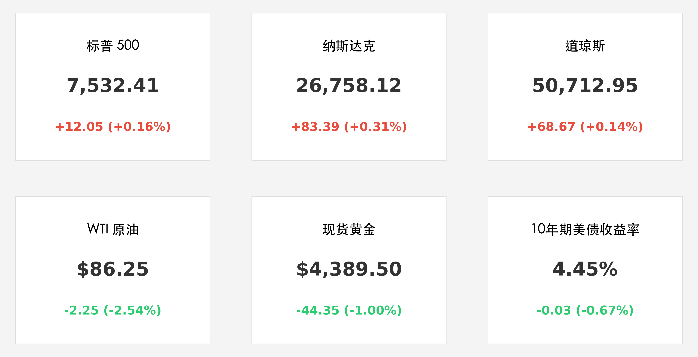

# 霍尔木兹海峡重开在即：美伊达成 60 天停火谅解备忘录，油价续跌助力美股再创历史新高

**日期：2026年05月29日 (星期五)** &nbsp; **时段：上午 (国际市场隔夜复盘)**

> **核心摘要**：美伊达成 60 天谅解备忘录（MoU），计划在 30 天内重开霍尔木兹海峡，原油价格应声下跌 2.5%，极大缓解全球通胀忧虑。美股三大指数集体刷新收盘历史纪录，AI 算力龙头领涨，市场正式步入“沃什时代”的稳态博弈。

## 核心行情复盘

隔夜美股（5月28日）继续受“和平红利”驱动，三大指数在波动中稳步走高，悉数创下收盘历史新高。随着能源价格的持续回落，市场对于“沃什鹰派”加息的担忧被通胀降温的预期所抵消。

*   **标普 500 (S&P 500)**：收报 **7,532.41点**，上涨 **0.16%**，再创历史纪录。
*   **纳斯达克 (Nasdaq)**：收报 **26,758.12点**，上涨 **0.31%**，续刷历史新高。
*   **道琼斯 (Dow Jones)**：收报 **50,712.95点**，上涨 **0.14%**，蓝筹板块表现稳健。
*   **大宗商品**：WTI 原油收报 **$86.25/桶**，大跌 **2.54%**；现货黄金回落至 **$4,389.50/盎司**，跌幅 **1.00%**。
*   **美债市场**：10 年期美债收益率微降至 **4.45%**，能源价格下跌缓解了长端利率的上行压力。
*   **领涨行业**：AI 算力、半导体、物流运输及全球零售。英伟达与超微电脑受供应链改善预期推动持续活跃。
*   **领跌行业**：能源开采、贵金属避险及传统公用事业。

## 核心解读与市场逻辑

1.  **“60天谅解备忘录”的历史性突破**：美伊两国就一份为期 60 天的 MoU 达成初步共识，最核心的条款是双方确认将在 30 天内全面重启霍尔木兹海峡。这一“能源生命线”的重开预期，不仅意味着全球油市将迎来供应端的显著修复，更标志着地缘冲突从“高烈度对抗”转向“谈判博弈期”。原油价格的加速下行（本月已累计下跌约 10%）为全球风险资产的估值修复提供了最坚实的基础。
2.  **“沃什时代”的预期锚定**：新任联储主席凯文·沃什（Kevin Warsh）上任一周以来，其“数据驱动、减少前瞻性指引”的作风开始被市场消化。尽管他此前被视为鹰派，但当前“能源通胀”的快速退潮，实际上为他赢得了更多观察窗口。市场正在形成共识：只要通胀路径受控，沃什更倾向于通过缩减 9 万亿美元资产负债表（QT）来回收流动性，而非激进加息。
3.  **算力与全球供应链的“解脱交易”**：中东局势的缓和直接利好跨洋物流，三星、台积电等科技巨头的全球供应链不确定性大幅降低。AI 硬件板块在此背景下表现出极强的韧性，反映出资金在避险情绪退潮后，正加速回流至高成长性的确定性主线。

## 政策脉动

*   **美伊外交定力**：白宫方面证实，总统特朗普已审阅 MoU 草案，并将其视为“美国实力的胜利”。国务卿马可·鲁比奥将于今日（5月29日）在华盛顿会见巴基斯坦外长，进一步敲定监督机制。
*   **联储 QT 预期**：华尔街预计沃什将在下次议息会议上正式提议加大缩表规模，以此作为对冲“和平红利”引发的金融条件过度宽松的平衡手段。
*   **伊朗局势动态**：尽管达成协议，但 CENTCOM 报告在 5 月 28 日仍拦截了部分无人机，显示停火初期的执行层面仍存摩擦，市场对此保持审慎乐观。

## 最新机构观点

*   **摩根大通 (JPMorgan)**：将原油年底目标价下调至 **$80/桶**，认为霍尔木兹海峡重启将重塑 2026 年下半年的全球通胀格局。
*   **贝莱德 (BlackRock)**：强调当前应关注“被错杀的运输与零售主线”。随着能源成本下降，美股盈利周期有望在 Q3 迎来非线性的爆发。
*   **高盛 (Goldman Sachs)**：认为沃什上台后的首个决策将是“战术性缩表”，投资者应在标普 7500 点上方保持关注质量因子（Quality Factor）和强现金流标的。

## 今日市场情绪：和平曙光下的金钥

> Prompt: Manga style, A giant golden key with intricate circuit patterns is turning in a massive stone gate at the entrance of a narrow blue strait. Cargo ships are lining up to pass through as a brilliant morning sun with the 'Peace' symbol rises in the background. Digital petals are falling from the sky., masterpiece, high detail, intricate composition, cinematic lighting, 8k resolution

---
免责声明：内容仅供参考，不构成投资建议。
