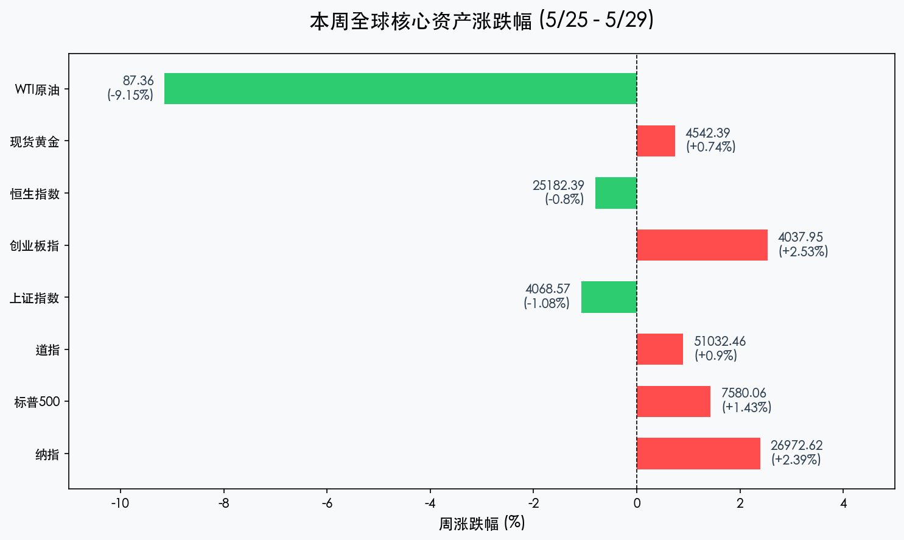
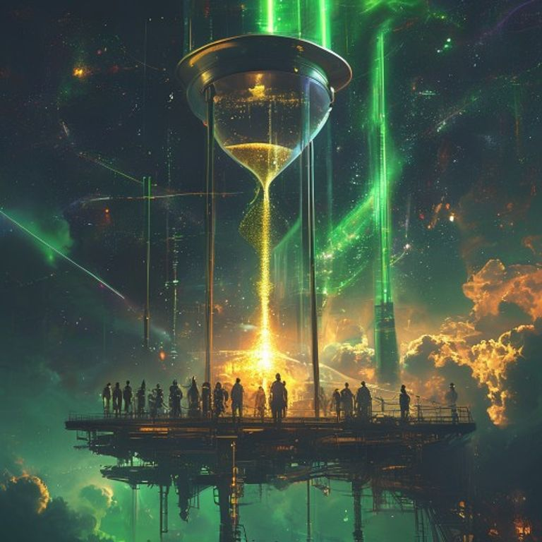

# 全球市场周报：美股九连涨跨越51000点，AI“神谕”与停火预期重塑估值逻辑

**日期：2026年05月30日 (星期六)** &nbsp; **时段：周六晚报 (周末复盘模式)**

> **核心摘要**：本周全球市场呈现显著的“美强中稳”格局。美股标普500录得九连涨，戴尔财报验证AI盈利神话，美伊停火预期重挫油价并剥离战争溢价；A股则在经历极致拥挤后开启“黄金右脚”筑底，资金向红利与防御板块迁移。

## 核心资产周度/日度表现回顾

本周（05月25日-05月29日）全球主要资产波动剧烈，原油成为最大“输家”，而AI产业链则继续引领全球风险资产估值中轴上移。

*   **道琼斯工业指数 (Dow Jones)**：本周累计上涨 **0.90%**，收报 **51,032.46点**，史上首次站上5.1万点。
*   **标普 500 指数 (S&P 500)**：本周累计上涨 **1.43%**，收报 **7,580.06点**，连续第9周上涨，创2023年来最长连涨纪录。
*   **纳斯达克综合指数 (Nasdaq)**：本周累计上涨 **2.39%**，收报 **26,972.62点**，科技龙头英伟达、戴尔轮番接力。
*   **上证指数 (SSE Composite)**：本周累计下跌 **1.08%**，收报 **4,068.57点**，目前处于高位震荡及回补缺口阶段。
*   **创业板指 (Chinext)**：本周累计上涨 **2.53%**，收报 **4,037.95点**，周线四连阳，显示成长赛道仍有韧性。
*   **恒生指数 (Hang Seng)**：本周累计下跌 **0.80%**，收报 **25,182.39点**，在2.5万点关口博弈加剧。
*   **WTI原油 (Oil)**：本周累计暴跌 **9.15%**，收报 **$87.36/桶**，创4月以来最大单周跌幅。
*   **现货黄金 (Gold)**：本周累计上涨 **0.74%**，收报 **$4,542.39/盎司**，呈现强势V型反转。

## 过去 48 小时重磅事件深度复盘

> **1. AI盈利神话的“二次确认”**：
> 戴尔科技 (Dell) 在本周五的暴涨（+32.8%）是本周市场最重要的信号。其AI服务器订单的指数级增长，证明了AI基建投资已从“PPT概念”转化为扎实的利润数据。这直接带动了全球半导体及数字基建板块的估值修复，联想集团等亚太相关标的亦创下历史新高。

> **2. “中东停火”传闻剥离战争溢价**：
> 市场传出美伊双方已基本敲定为期60天的停火谅解备忘录，霍尔木兹海峡重开预期令原油价格瞬间承压。原油价格的下挫不仅是通胀的“灭火器”，更是全球制造业的“助推器”，地缘风险溢价的剥离显著提升了投资者的整体风险偏好。

> **3. 美联储迈入“沃什时代”**：
> 凯文·沃什 (Kevin Warsh) 正式就任美联储主席。他在本周的简短致辞中强调了“通胀目标的严肃性”与“金融稳定的重要性”。市场将其解读为“鹰派管理下的流动性呵护”，美元指数在100关口维持强势震荡。

## 下周全球宏观大事预警

1.  **中国5月PMI数据 (05/31)**：这是观察国内内生动能是否如期回升的关键窗口，将直接影响下周一A股的开盘成色。
2.  **美国非农就业报告 (06/05)**：沃什上台后的首份核心劳动力市场数据，将决定美联储6月利率会议的基调。
3.  **SpaceX上市路演细节**：随着其上市日期（06/12）临近，作为估值1.75万亿美金的巨无霸，其流动性虹吸效应已开始被大宗机构提前预案。

## 顶级机构周末策略内参摘要

*   **高盛 (Goldman Sachs)**：显著上调标普500至 **8,000点**。理由是AI驱动的EPS增长将抵消估值偏高的负面影响，建议继续持有“AI基建核心资产”。
*   **中金公司 (CICC)**：A股底部已现，当前处于“黄金右脚”的二次确认阶段。建议关注“新质生产力”中的半导体、算力中轴，以及高分红红利资产的底仓价值。
*   **摩根士丹利 (Morgan Stanley)**：地缘局势的缓和将引导资金从避险资产回流风险资产，预计下周日韩股市将延续本周的强势补涨。

## 今日市场情绪：星际沙漏的转换

> Prompt: A giant hourglass in space where the top half is filled with black oil turning into golden light as it falls, while a group of futuristic traders on a floating glass platform watch a massive green K-line bridge extending towards a distant nebula.

---
免责声明：内容仅供参考，不构成投资建议。
