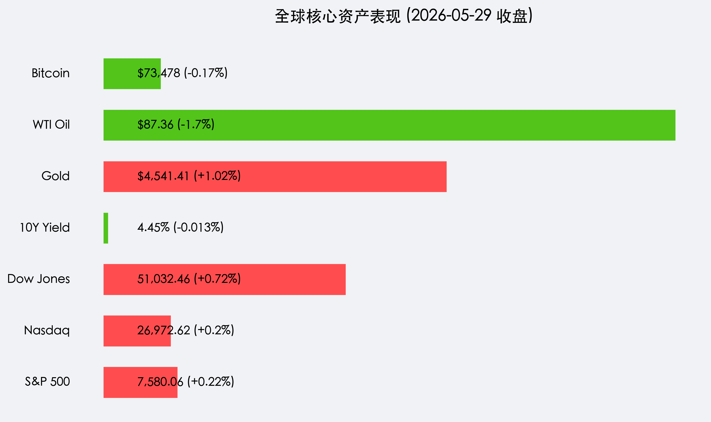

# 美股再创历史新高：AI 算力爆发与美伊停火预期点燃全球“风险偏好”

**日期：2026年05月30日 (星期六)** &nbsp; **时段：早报 (国际市场隔夜复盘)**

> **核心摘要**：美股周五全线走高，标普500与纳指再创历史新高。戴尔财报引爆 AI 算力中轴，美伊停火谈判取得重大突破传闻令油价重挫，通胀预期降温。全球市场正迎来“基本面韧性+地缘局势缓和”的双向驱动。

## 核心行情复盘

隔夜美股市场在 AI 龙头的带领下延续强势节奏，标普 500 指数录得连续第九周上涨，创下 2023 年以来最长周连涨纪录。

*   **标普 500 指数 (S&P 500)**：收报 **7,580.06 点**，上涨 **0.22%**。
*   **纳斯达克综合指数 (Nasdaq)**：收报 **26,972.62 点**，上涨 **0.20%**。
*   **道琼斯工业平均指数 (Dow Jones)**：收报 **51,032.46 点**，上涨 **0.72%**。
*   **10 年期美债收益率**：收报 **4.45%**，小幅回落。
*   **现货黄金 (Gold)**：收报 **$4,541.41**，大涨 **1.02%**，避险与实际利率回落共振。
*   **WTI 原油 (Oil)**：收报 **$87.36/桶**，重挫 **1.7%**。
*   **比特币 (BTC)**：报 **$73,478**，在高位维持窄幅震荡。

## 核心解读与市场逻辑

1.  **AI 算力“长坡厚雪”**：戴尔科技 (Dell Technologies) 季度业绩远超预期，股价暴涨 **32.8%**。其财报揭示 AI 服务器需求仍处于“饥渴状态”，彻底击碎了市场对 AI 泡沫破裂的担忧。作为硬件底层的最强注脚，戴尔的暴涨带动了从芯片到液冷散热的整个 AI 产业链信心。
2.  **“中东之春”2.0 预期**：据多方媒体报道，美伊谈判代表已就延长 60 天停火及重开霍尔木兹海峡达成初步框架。这一地缘政治的巨大“黑天鹅”转向“白天鹅”，直接打压了原油价格，从而通过能源成本端缓解了长期通胀压力，为联储后续政策空间腾出了余地。
3.  **Core PCE 释放积极信号**：4 月 Core PCE 物价指数月率录得 0.2%，略低于预期的 0.3%。虽然年率仍具粘性，但月度的边际改善让市场坚信通胀正在回归下行通道，而非二次爆发。

## 政策脉动

*   **美联储 (Fed) 动态**：亚特兰大联储主席博斯蒂克暗示，当前的限制性利率正逐步生效。尽管 2026 年底前是否降息仍有分歧，但“不加息”已成为共识。
*   **地缘局势重大突破**：白宫方面对美伊谈判表示“谨慎乐观”，若协议达成，将不仅是能源市场的解药，更是全球供应链风险溢价的大幅消减。

## 最新机构观点

*   **高盛 (Goldman Sachs)**：AI 基础设施建设正进入“第二阶段”，不仅是英伟达，像戴尔这样具备整机集成和分销能力的巨头将迎来价值重估。
*   **摩根大通 (J.P. Morgan)**：原油价格的下行是全球消费的隐形利好。预计 2026 年下半年全球 GDP 增长将受益于能源成本下降而上修。
*   **贝莱德 (BlackRock)**：建议维持对美股的超配。在科技股提供增长动力、传统板块受益于通胀缓解的背景下，指数上涨的广度（Market Breadth）正在优化。

## 今日市场情绪：数字凤凰的涅槃

> Prompt: A massive mechanical phoenix made of glowing silicon wafers and fiber optics rising majestically from a sea of digital code, while in the background, a dark oil storm is dissipating into a calm crystal blue ocean under a bright sunrise., masterpiece, high detail, intricate composition, cinematic lighting, 8k resolution

---
免责声明：内容仅供参考，不构成投资建议。
