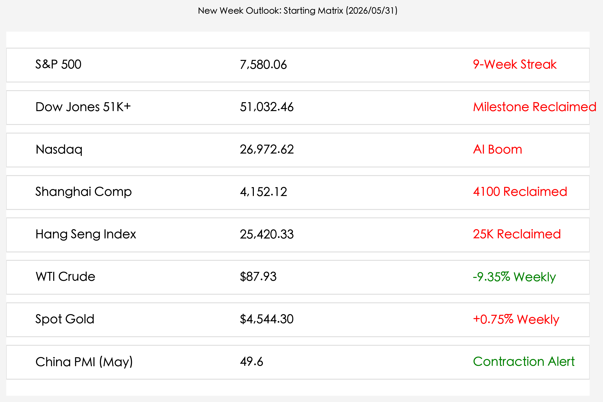

# 全球市场新周展望：地缘和平红利引路，中国 PMI 警讯与美非农决战前瞻

**日期：2026年05月31日 (星期日)** &nbsp; **时段：晚间 (新周展望)**

> **核心摘要**：本周末全球焦点聚焦于中东“60天停火备忘录”签署后能源水道霍尔木兹海峡的重开预期，WTI油价已暴跌至$87.93。然而，官方制造业PMI收缩至49.6，令中国经济的复苏势头再次笼罩阴霾。新一周市场将迎来财新PMI与美国非农就业报告，在联储主席沃什的鹰派平衡主导下，全球资产价格面临增长与流动性的深度重塑。

## 周末财经要闻终极汇总

本周末，全球金融市场在“停火地缘红利”的延续与“宏观景气波动”的分化中，正紧锣密鼓地为新一周开盘进行定价。

*   **中东地缘拐点与霍尔木兹海峡重开**：特朗普政府宣布与伊朗达成的 60 天停火谅解备忘录（MoU）取得重大框架性共识，承诺在 30 天内恢复全球近 20% 原油贸易命脉霍尔木兹海峡的通航。这一能源“生命线”的解封预期促使 WTI 原油本周暴跌 **9.35%**，最终收报 **$87.93/桶**，地缘风险溢价大幅消退。
*   **中国 5 月官方制造业 PMI 跌入收缩**：国家统计局公布的 5 月官方制造业 PMI 为 **49.6**，意外低于预期的 50.3，较上月大幅回落，再次回到荣枯线以下。表明虽然能源及物流端成本看跌，但国内制造业在需求偏弱及产能调结构期景气度略有承压。
*   **美股九连涨首站 5.1 万点**：周五美股三大指数继续创历史新高，道琼斯指数收报 **51,032.46点**，史上首度跨越 5.1 万大关；纳斯达克指数收报 **26,972.62点**。戴尔（Dell）及英伟达暴涨的积压服务器订单向市场暴力验证了 AI 算力潮强劲的业绩支撑。
*   **监管层加固跨境资金管理，MLF 稳健支持**：央行维持 1000 亿元 MLF 的净投放以呵护年中流动性；同时，金融监管部门近期加大对跨境证券业务违规外流的规范治理。长远看，这有助于稳定离岸及在岸市场的核心资金存量，利好 A 股长线表现。

## 新一周市场核心博弈逻辑

进入 6 月首周，多空博弈将围绕“成本降（地缘好转）”与“需求忧（PMI 警讯）”双向展开。

1.  **“停火红利”与“增长冷风”的对冲**：霍尔木兹海峡重开不仅拉低通胀预期，更直接改善了中国中游制造业的原材料与海运物流成本。然而，中国 5 月 PMI 再次跌破 50 大关，也预示着 A 股在突破 4100 点大关（收盘 4152.12）后，市场热度可能从前期普涨的估值修复，转向寻找真正有利润弹性和政策托底的结构性成长板块。
2.  **“沃什鹰派”与非农就业的定价决战**：新任联储主席凯文·沃什（Kevin Warsh）在上任首秀中高举物价红线，刺激 2 年期美债收益率飙升至 **4.10%**。本周五的 5 月非农就业数据是沃什时代的首次就业数据大考，将对 6 月联储利率决策起到定音鼓作用，直接决定高估值科技股的虹吸效应强弱。
3.  **港股半导体做空盘与下半年解禁压力**：恒生指数虽强力站上 25420.33 点，但港股龙头（如中芯国际等）在近期遭遇创纪录的卖空头寸，且下半年市场面临限售股解禁与新股 IPO 密集分流资金的预期。因此，周一亚太开盘后，科技成长主线的波动幅度或将显著放大。

## 本周重磅经济数据与会议前瞻

下周全球将迎来数项重磅数据，市场焦点在于验证中国中小企业活力及美国就业市场的松紧程度。

*   **6月01日 (周一)**：**中国 5 月财新制造业 PMI**（更聚焦中小及出口型企业的表现）、美国 5 月 ISM 制造业 PMI。
*   **6月03日 (周三)**：美国 5 月 ADP 就业人数（“小非农”）。
*   **6月04日 (周四)**：欧央行（ECB）利率决议，市场预期降息动作可能更加趋于谨慎。
*   **6月05日 (周五)**：**美国 5 月季调后非农就业人口报告**、美国 5 月失业率。

## 头部券商/投行开盘策略点睛

*   **中信证券 (CITIC Securities)**：**“把握地缘重估，红利与科技双轮驱动”**。认为官方 PMI 的短期收缩将倒逼下半年财政与货币逆周期政策更显性投放。A 股跨越 4100 点后，成本回落有利于改善企业利润，继续看好 AI 算力链和防御高股息的核心资产配置。
*   **中金公司 (CICC)**：**“港股高性价比底座未改”**：尽管下半年有解禁和做空头寸波动，但港股恒指收复 25000 关口显示外资回流仍在继续。油价暴跌带来航运、跨境电商成本的显著下降，港股中概股具极佳弹性。
*   **高盛 (Goldman Sachs)**：**“防范 2 年期收益率对高估值挤压”**：虽然戴尔和英伟达确认了 AI 业绩兑现，但沃什的鹰派表态推动美债利率走高，这可能使美股主要指数在高位呈现结构性休整，维持对中国股票的“超配”策略。

## 今日市场情绪：曙光与警讯并存的破晓

当前的市场情绪充满着两面性：中东和平鸽飞过红海海峡，融化了黑金原油带来的通胀坚冰，并在全球贸易上折射出金色的希望；但在天平的另一端，制造业工厂的冷却齿轮与美债收益率的高企，依然要求投资者在步入新一周时保持克制与清醒。

> Prompt: Surrealism style, A majestic golden peace dove made of digital circuits flying over a vast ocean, holding a green olive branch that glows with soft light. Below, the dark waves of the sea are turning from black crude oil into calm, shimmering green water. In the background, a massive silver gears of a factory are spinning slowly under a clear dawn sky, while a digital screen on a far cliff displays a glowing green number '4100' and a red warning flag for 'PMI 49.6'. A human trader (real person) stands on a rocky shore, looking up at the sky with a hopeful but vigilant expression., masterpiece, high detail, intricate composition, cinematic lighting, 8k resolution

---
免责声明：内容仅供参考，不构成投资建议。
