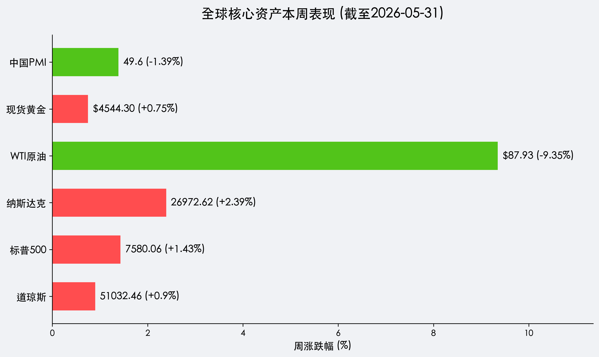

# 全球市场周报：美股跨越 51,000 点见证“九连涨”，中东和平曙光与中国 PMI 疲态下的新博弈

**日期：2026年05月31日 (星期日)** &nbsp; **时段：早报 (周末复盘模式)**

> **核心摘要**：美股标普500录得九连涨，道指跨越51,000点大关。美伊停火谅解备忘录达成初步框架，油价周暴跌逾9%剥离地缘溢价；然而，今日公布的中国5月PMI意外萎缩至49.6，预示全球复苏斜率存在显著分化，市场进入“和平红利”与“增长修复”的二次对冲期。

## 核心资产周度/日度表现回顾

本周（05月25日-05月29日）全球市场在“AI盈利神话”与“地缘转机”双轮驱动下，美股主要指数全线创下历史新高。

*   **道琼斯工业指数 (Dow Jones)**：本周累计上涨 **0.90%**，收报 **51,032.46点**，史上首次站上5.1万点里程碑。
*   **标普 500 指数 (S&P 500)**：本周累计上涨 **1.43%**，收报 **7,580.06点**，实现九连涨，创两年来最长连涨纪录。
*   **纳斯达克综合指数 (Nasdaq)**：本周累计上涨 **2.39%**，收报 **26,972.62点**，戴尔、英伟达等 AI 核心资产引爆估值天花板。
*   **WTI原油 (Oil)**：本周累计暴跌 **9.35%**，收报 **$87.93/桶**，霍尔木兹海峡重开预期令风险溢价迅速回撤。
*   **现货黄金 (Gold)**：本周累计上涨 **0.75%**，收报 **$4,544.30/盎司**，呈现避险消退后的资产抗通胀韧性。
*   **中国官方制造业 PMI (5月)**：今日公布值为 **49.6**，低于预期的 50.3 及前值 50.3，显示国内制造业景气度在能源波动及内需偏弱背景下再度承压。

## 过去 48 小时重磅事件深度复盘

> **1. 中东“停火谅解备忘录”签署预期**：
> 市场广泛流传美伊已达成一份为期 60 天的停火初步框架（MoU），最核心承诺为 30 天内重开霍尔木兹海峡。这一“能源生命线”的重启预期直接导致油价崩盘，从成本端彻底扭转了全球滞胀担忧，被华尔街称为 2026 年上半年的“最大和平红利”。

> **2. AI 服务器订单的“暴力验证”**：
> 戴尔科技（Dell）本周暴涨逾 40% 的背后，是其 AI 服务器订单积压量呈现指数级增长。这向全球投资者确认了：AI 浪潮不仅没有泡沫破裂，反而正在加速从“芯片层”向“服务器及应用层”传导。

> **3. 关税政策的“周末涟漪”**：
> 美国上诉法院的一项裁决允许行政部门在特定条件下快速重启部分关税项目，这在周末引发了投资者的警觉。尽管“和平红利”主导当前情绪，但全球贸易政策的潜在波动仍是下周开盘的隐忧。

## 下周全球宏观大事预警

1.  **中国 5 月财新 PMI (06/01)**：在官方数据收缩后，市场将密切关注财新数据（更多代表中小企业）是否呈现同样走势，以验证内需疲弱的广度。
2.  **美国 5 月非农就业报告 (06/05)**：这是凯文·沃什入主联储后的首个就业窗口，数据强弱将直接决定“沃什鹰派”在 6 月议息会议上的定价。
3.  **香格里拉对话会**：亚太安全局势的讨论可能对局部地缘板块产生情绪扰动。

## 顶级机构周末策略内参摘要

*   **高盛 (Goldman Sachs)**：美股九连涨后，估值虽然偏高，但盈利增长的斜率足以支撑当前点位。建议关注“AI 基础设施+物流运输”双主线，认为油价下跌将显著提升消费板块利润。
*   **摩根士丹利 (Morgan Stanley)**：亚洲市场面临分化。中国 PMI 的 miss 预示下周 A 股及港股可能在开盘面临一定调整压力，建议增配具有防御属性的红利资产。
*   **摩根大通 (J.P. Morgan)**：强调出口韧性是中国资产的底座。尽管 PMI 下跌，但未来产出预期依然处于 60 以上的高位，不应过度恐慌。

## 今日市场情绪：和平曙光与工厂寒冬的共生

> Prompt: A giant hourglass in space where the top half is filled with black oil turning into golden light as it falls, while in the background, a massive silver gears of a factory are cooling down under a stormy sky, contrasting with a bright morning sun.

---
免责声明：内容仅供参考，不构成投资建议。
