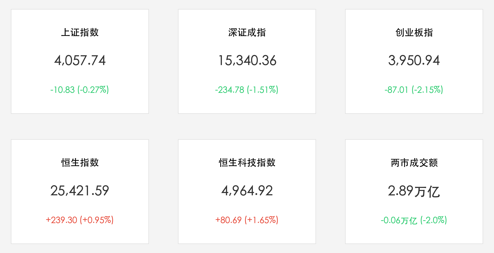

# A股冲高回落：煤炭与AI应用逆势吸金，恒指收涨近1%强势领跑

**日期：2026年06月01日 (星期一)** &nbsp; **时段：晚间 (国内市场收盘复盘)**

> **核心摘要**：本周第一个交易日国内市场呈现显著的结构性震荡分化。A 股三大指数全天冲高回落，沪深两市成交额达 2.89 万亿元，资金明显从高位硬件端（半导体、CPO）向防御红利（煤炭）与软件应用（IT服务、传媒）转移；而港股则在科技分化中表现亮眼，恒生指数收涨近 1% 成功收复 25400 点关口。

## 核心行情复盘

周一 A 股市场震荡走弱，沪指全天冲高回落，创业板指跌超 2%。两市成交额小幅缩量，但仍维持在 2.89 万亿元的历史高位点位。

*   **上证指数**：收报 **4057.74点**，微跌 **10.83点**，跌幅为 **0.27%**。
*   **深证成指**：收报 **15340.36点**，下跌 **234.78点**，跌幅为 **1.51%**。
*   **创业板指**：收报 **3950.94点**，下跌 **87.01点**，跌幅为 **2.15%**。
*   **恒生指数**：收报 **25421.59点**，上涨 **239.30点**，涨幅为 **0.95%**，成功收复 25400 点关口。
*   **恒生科技指数**：收报 **4964.92点**，上涨 **80.69点**，涨幅为 **1.65%**。
*   **市场成交与资金**：沪深北三市成交额约 **2.89万亿元**，较上周五略微缩量 600 亿。板块资金流向严重撕裂，主力资金抛售科技硬件（电子行业净流出超 268 亿元），但大举流入软件开发与 IT 服务板块。
*   **领涨行业**：
    *   **煤炭开采与加工**：板块涨幅居前，昊华能源、晋控煤业等个股强势涨停，主要受夏季用能高峰补库以及印尼出口限制传闻影响。
    *   **AI应用与软件服务**：软通动力、蓝色光标等大批软件及传媒个股涨停，展示了算力分流后应用端的强大吸金能力。
*   **领跌行业**：
    *   **科技硬件与半导体**：光通信（CPO）、芯片制造板块大幅下挫，东山精密、胜宏科技等龙头大幅净流出，主要由于前期涨幅过大、交易拥挤度过高，资金选择高位获利了结。
    *   **白酒与消费**：表现疲软，白酒巨头小幅走弱，防守属性未能敌过红利板块的吸引力。

## 核心解读与市场逻辑

1.  **从“造AI（算力）”向“用AI（应用）”的资金大迁徙**：今日盘面最核心的特征是硬件与软件的“冰火两重天”。半导体与 CPO 前期积攒了丰厚的获利盘，在 6 月限售股解禁高压（约 3300 亿）的心理关口前，部分主力选择落袋为安；相反，ChatGPT-5 及国产大模型落地预期的重估，推动资金流向软通动力等 IT服务及传媒软件，展现了 AI 应用的内生逻辑。
2.  **红利防御的“周期之锚”**：煤炭板块的暴涨并非单纯的防御，而是由印尼煤炭出口限制传闻及夏季火电补库的“基本面共振”驱动。在市场风险偏好小幅收敛时，拥有高股息、稳定现金流的煤炭股成为了不可多得的避险中军。
3.  **港股科技的韧性突围**：港股收盘大涨近 1% 成为今日亚太市场的亮点。这主要得益于恒生科技指数成分股中，部分新消费龙头与出海互联网公司的出色业绩，在欧美通胀预期见顶、全球避险资金寻找避风港的背景下，港股的估值洼地效应更加突出。

## 政策脉动

*   **国家安全与能源安全保障**：监管层近期多次强调保障夏季电力与煤炭迎峰度夏的安全稳定供应。安监力度的升级从供给端约束了煤炭的释放，为煤炭行业提供了价格坚实支撑。
*   **促进数字经济与AI应用落地**：工信部等部门今日出台新一批支持中小企业数字化转型和 AI 应用示范项目的政策，进一步刺激了资金在软件和 IT 服务的积极布局。

## 最新机构观点

*   **中信证券**：**“科技硬端休整，AI与红利的杠铃结构更加清晰”**。中信证券认为，6 月面临的解禁压力导致科技硬件进入中场整理，但这不是牛市的终结。主力资金从“建造 AI”向“适应 AI”过渡，软件应用将接棒算力，配合煤炭等“现金流红利”，形成了新一轮防御加进攻的杠铃搭配。
*   **中金公司**：**“关注高股息资产的周期重估”**。中金指出，在海内外宏观不确定性犹存的阶段，高股息的资源品（如煤炭、钨等）估值重估将持续。煤炭行业已脱离单纯的周期属性，正向高分红的公共事业属性靠拢，建议继续超配。
*   **高盛**：**“中国股票仍是避险与成长的极佳结合”**。高盛维持对中国资产的超配评级，尽管 A 股指数短期出现技术性回撤，但两市接近 3 万亿的巨大成交量表明市场流动性极其宽裕，短期分化调整反而为长线资金提供了优质成长股的买入良机。

## 今日市场情绪：分化割裂与红利避险的纠结

今日的市场情绪如同一面被割裂的双面镜。一方面，前期火热的半导体芯片与光模块在落袋为安的卖单下逐渐降温，绿色下挫的绿光笼罩着硬件展台；另一方面，软件开发与红利煤炭板块在数字浪潮与夏季用能的高温下熊熊燃烧，展现出极强的韧性。投资者正在这冷热交织的齿轮转动中，寻找新一轮博弈的支点。

> Prompt: Cyberpunk style, A human trader (real person) walks on a split pathway. On the left side, warm-red glowing coal crystals and digital light streams representing rising AI applications ascend. On the right side, cooling green computer chips and dark optical cables represent declining hardware. In the background, a massive digital screen shows falling green K-lines and rising red arrows under a dark Cyberpunk sky., masterpiece, high detail, intricate composition, cinematic lighting, 8k resolution

---
免责声明：内容仅供参考，不构成投资建议。
