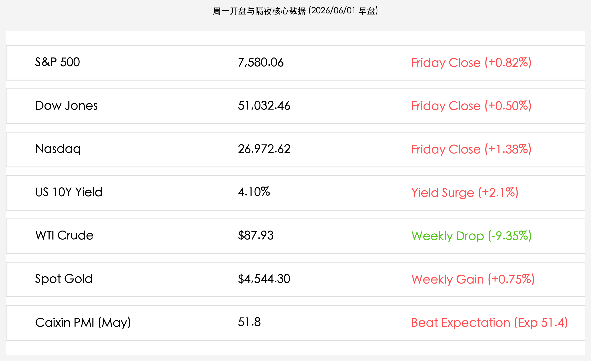

# 全球市场新周启航：财新 PMI 强劲扩张对冲官方警讯，美股创历史新高迎战“非农决战”

**日期：2026年06月01日 (星期一)** &nbsp; **时段：上午 (新周展望)**

> **核心摘要**：本周一开盘全球市场聚焦于超预期的中国 5 月财新 PMI（51.8），该数据连续 6 个月扩张并与官方 PMI 的收缩形成对冲，缓解了市场的增长隐忧。与此同时，隔夜美股实现“九连涨”并创历史新高，市场正逐步定价沃什联储时代的鹰派平衡，静待本周五美国非农就业报告的终极审判。

## 周末财经要闻终极汇总

*   **5月财新制造业 PMI 录得 51.8 显韧性**：今日公布的 5 月中国财新制造业 PMI 录得 **51.8**，显著优于市场预期的 **51.4**。尽管相比 4 月的 52.2 略有回落，但已连续 6 个月保持在荣枯线以上，与之前官方制造业 PMI (49.6) 的收缩形成鲜明对比，凸显出民营及中小企业在外贸出口链与原材料成本端改善下的强劲活力。
*   **美股主要指数续创收盘历史新高**：上周五美股三大指数集体狂飙，标普 500 指数收报 **7,580.06点**，实现“九连涨”创两年最长连涨纪录；道琼斯指数收报 **51,032.46点**，历史性跨越 5.1 万点关口。AI 服务器订单暴增（戴尔业绩暴涨订单积压引爆股价）以及中东“停火谅解备忘录”重开海峡的良好预期，共同推升了全球风险偏好。
*   **美债收益率飙升与新主席的鹰派宣言**：新任美联储主席凯文·沃什（Kevin Warsh）高举抗通胀红线，推动 2 年期和 10 年期美债收益率同步走高，10 年期美债收益率收报 **4.10%**（周环比上行 2.1%）。市场正谨慎消化“沃什鹰派”利率维持高位对高估值科技股的虹吸与估值挤压。
*   **中东停火预期拉动油价暴跌，黄金抗通胀韧性犹存**：特朗普政府与伊朗达成的 60 天停火谅解备忘录（MoU）取得框架性共识，霍尔木兹海峡重开预期促使 WTI 原油全周累计暴跌 **9.35%**，最终收报 **$87.93/桶**，从成本端缓解全球滞胀忧虑；现货黄金小幅上涨 **0.75%** 收报 **$4,544.30/盎司**，表现出避险消退后的抗通胀资产韧性。

## 新一周市场核心博弈逻辑

1.  **财新与官方 PMI 背离的结构性定价**：5 月官方制造业 PMI（49.6，偏重工业及大型国企）与财新 PMI（51.8，偏外贸及中小民营企业）出现分化，反映出国内制造业的“冷热不均”。下半年财政与货币逆周期政策是否会因官方数据走弱而加速显性投放，以及出口链的高景气能否顶住外需博弈，是新一周 A 股和港股最重要的看点。
2.  **“通胀改善（油价大跌）”与“鹰派高利率（沃什鹰）”的对冲**：油价大幅暴跌（跌破 $88 关口）为中下游和出口型企业创造了实质性的运费与原材料降本红利；然而，联储新主席沃什的强硬立场使得利率水平居高不下，2 年期美债利率高企（4.10%）仍是对高估值科技成长板块的戴维斯双击考验。
3.  **“小非农”与五月非农报告的终极决战**：本周五将迎来 5 月季调后非农就业数据，这是沃什入主联储后的首个就业大考。劳动力市场的降温幅度（目前预期 9.6 万人）将直接奠定 6 月中旬 FOMC 会议的加息/降息基调，多空交织的博弈逻辑将在周五迎来大白。

## 本周重磅经济数据与会议前瞻

*   **6月01日 (周一)**：**中国 5 月财新制造业 PMI**（已公布为 51.8，超预期）、美国 5 月 ISM 制造业 PMI。
*   **6月03日 (周三)**：美国 5 月 ADP 就业人数（“小非农”）。
*   **6月04日 (周四)**：欧洲央行（ECB）公布利率决议，市场预期降息节奏在欧美通胀粘性下将更加趋于谨慎。
*   **6月05日 (周五)**：**美国 5 月季调后非农就业人口报告**、美国 5 月失业率（全球市场核心定音锤）。

## 头部券商/投行开盘策略点睛

*   **高盛 (Goldman Sachs)**：**“出口韧性与成本下降双赢”**。财新 PMI 的超预期表现进一步印证了中国外贸链的抗压底座。原油暴跌使航运、跨境电商成本显著下行，继续维持对中国股票的“超配”策略，并建议逢低布局盈利能见度高的大盘股。
*   **中信证券 (CITIC Securities)**：**“把握高景气出海，防御红利与成长分化”**。虽然官方 PMI 收缩需要政策逆周期托底，但财新 PMI 的强势保障了基本盘。A 股站上 4100 点大关后将呈现红利资产（稳定器）与“AI 算力/出海”成长双向对决的结构性牛市中场表现。
*   **摩根士丹利 (Morgan Stanley)**：**“谨防非农前的收益率高压”**。沃什的强势上任将持续对美股形成高位估值挤压，非农报告公布前全球流动性或将倾向于防御。建议港股投资者保持“红利防御为主、科技高弹性为辅”的双轨配置。

## 今日市场情绪：重装上阵与冷暖交织的破晓

财新 PMI 的利好如清晨的第一缕微光，照亮了中小民营企业与外贸出口的航线；但在沃什的鹰派宣言与高企的美债收益率天平另一端，制造工厂的齿轮依然在冷暖交织的空气中谨慎转动。投资者在新周开启时，正以更加理性与克制的目光审视这场“和平红利”与“增长冷风”的对决。

> Prompt: Surrealism style, A majestic golden mechanical sailing ship navigating a calm emerald ocean, its sails composed of glowing digital circuits displaying green upward arrows. In the background, a giant digital screen rises from the water, displaying the numbers '51.8' and '7580' in neon gold. On the shore, a massive clockwork gear cooling down under a quiet sunrise sky. A human trader (real person) stands at the ship's helm, looking towards a bright, hopeful horizon with confidence., masterpiece, high detail, intricate composition, cinematic lighting, 8k resolution

---
免责声明：内容仅供参考，不构成投资建议。
