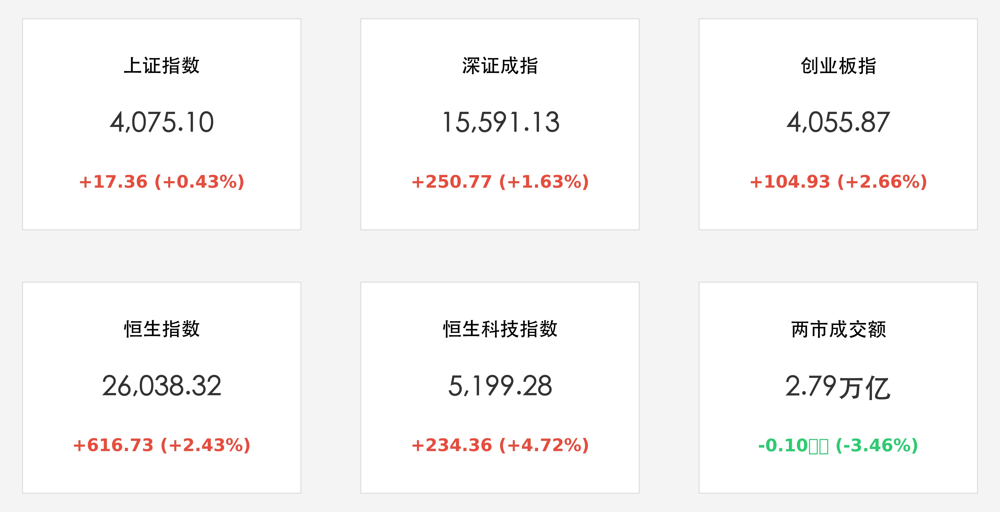
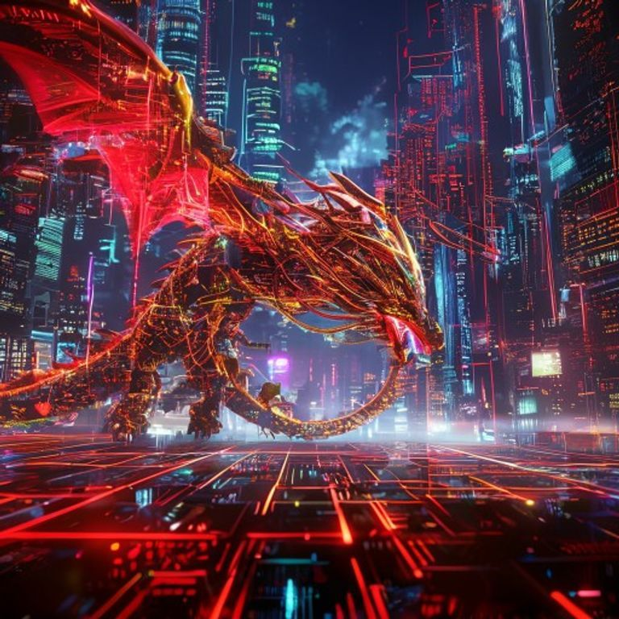

# A股与港股携手狂飙：科网巨头引爆港股恒指收复26000点，CPO与元件板块掀涨停潮

**日期：2026年06月02日 (星期二)** &nbsp; **时段：晚间 (国内市场收盘复盘)**

> **核心摘要**：本交易日国内及港股市场展现出强劲的爆发力。受AI算力需求增长与行业利好政策推动，A股三大指数集体大涨，其中创业板指飙升2.66%，CPO与元件板块掀起涨停潮；港股市场同样表现亮眼，恒生科技指数在腾讯等科网巨头的带领下狂飙4.72%，恒指大涨逾600点重新站上26000点关口。

## 核心行情复盘

周二国内与港股市场全面走高，科技成长股与互联网巨头表现极其强势。虽然两市成交额小幅缩量，但市场资金向科技核心主线集中的趋势非常显著。

*   **上证指数**：收报 **4075.10点**，上涨 **17.36点**，涨幅为 **0.43%**。
*   **深证成指**：收报 **15591.13点**，上涨 **250.77点**，涨幅为 **1.63%**。
*   **创业板指**：收报 **4055.87点**，上涨 **104.93点**，涨幅为 **2.66%**。
*   **恒生指数**：收报 **26038.32点**，上涨 **616.73点**，涨幅为 **2.43%**，重回 26000 点关键关口之上。
*   **恒生科技指数**：收报 **5199.28点**，上涨 **234.36点**，涨幅为 **4.72%**。
*   **市场成交与资金**：沪深北三市成交额约 **2.79万亿元**，较前一交易日略微缩量 1000 亿。存量资金在板块内部分化腾挪，科技硬件（MLCC、CPO）与港股互联网巨头成为今日绝对的资金避风港与吸金主力。
*   **领涨行业**：
    *   **CPO与光纤概念**：领涨全场。AI算力订单激增与技术迭代促使行业板块集体走强，阿莱德、光库科技、长盈通、源杰科技等大幅冲高，亨通光电等个股强势涨停。
    *   **元件（MLCC/被动元件）**：受AI服务器及高性能终端对MLCC需求暴增利好刺激，风华高科、深圳华强等板块龙头掀起涨停潮。
    *   **人形机器人**：通用机器人宇树科技科创板IPO获通过，且英伟达宣布与之开展设计合作，引爆人形机器人概念股，阿莱德、利和兴等多股封板。
    *   **港股互联网巨头**：腾讯控股大涨超 10%，美团涨超 9%，阿里巴巴及京东等权重股集体走高，带动恒生科技指数大涨。
*   **领跌行业**：
    *   **影视院线与文化传媒**：赛马、NFT概念、文娱消费等板块出现高位技术性回调，元隆雅图、中体产业等跌幅居前。
    *   **美容护理与互联网电商**：表现相对疲软，资金从传统大消费防御方向流出，进入科技弹性品种。

## 核心解读与市场逻辑

> **AI服务器硬件采购的“繁荣闭环”**
> 
> 今日A股最夺目的亮色来自于CPO、MLCC等算力基建硬件板块。伴随着前一日高位半导体落袋为安的恐慌释放，主力资金快速反应，借由全球AI服务器出货激增这一坚实基本面，将视线转向了技术壁垒高、供需紧张的被动元件与光模块。MLCC的“量价齐升”与CPO的“订单落地”形成强烈的逻辑共振，表明本轮科技行情已从早期的“政策预期”向“基本面业绩兑现”深度演进。

> **微信AI助手预期与科网股的估值跃迁**
> 
> 港股科网股的绝地反弹是今日亚太市场的另一大焦点。腾讯控股大涨超10%，主要得益于微信AI助手即将推出的市场预期。微信作为国内第一大超级社交生态，其AI化改造意味着极高粘性的流量能够瞬间转化为商业价值，这彻底点燃了外资与长线资金对中国平台经济AI化叙事的兴趣，港股的估值洼地效应在此次估值跃迁中被成倍放大。

## 政策脉动

*   **资本市场支持硬科技企业上市**：通用机器人公司宇树科技科创板IPO获通过，体现了监管层对高端装备制造、人形机器人等新质生产力企业的支持力度持续加大，科创板的政策红利窗口继续敞开。
*   **鼓励互联网平台创新与AI场景落地**：工信部及相关部门近期多次提出，支持国内互联网龙头加速在大模型落地、超级应用智能化等领域的创新，释放数据要素价值，为实体经济数字转型赋能。

## 最新机构观点

*   **中信证券**：**“硬科技进入中报业绩兑现期，CPO与MLCC继续看好”**。中信证券认为，虽然今天成交额略有萎缩，但科技硬件板块的资金回流极度坚决。随着AI服务器全球供应链瓶颈缓解，被动元件MLCC与光通信核心器件的排单情况远超此前预期，业绩的高确定性将支撑硬科技板块走出坚实的中期业绩行情。
*   **中金公司**：**“港股重新站稳26000点，互联网巨头迎价值重塑机会”**。中金公司指出，微信AI助手等创新预期证明了中国互联网平台在AI时代依然具备强大的应用落地与商业变现壁垒。外资资金流向也显示出对高现金流、低估值的中国科网巨头配置倾向，建议继续超配港股科网龙头。
*   **申万宏源**：**“英伟达合作助力，人形机器人步入产业化提速通道”**。申万宏源指出，英伟达与国内机器人企业联手推出参考设计，且政策端IPO通道畅通，预示着人形机器人这一AI最具想象力的物理实体应用正在走向产业化元年。人形机器人产业链的电机、传感器、控制系统等核心部件将迎来长期的进口替代与放量需求。

## 今日市场情绪：狂飙的科技与情绪的全面修复

今日国内与港股市场情绪迎来了酣畅淋漓的全面爆发。在前一日硬件高位调整的短暂阴霾后，科技芯片、被动元件与港股互联网巨头携手重回舞台中央。市场仿佛看到了一条用数字光纤与赤红芯片编织而成的数码神龙正拔地而起，昂首冲向科幻感十足的霓虹夜空，宣告着牛市行情在科技主线上依然坚韧澎湃。

> Prompt: Cyberpunk style, A massive dragon woven from glowing red and golden digital circuits and fiber optic cables rises from a futuristic grid-like floor. In the background, towering holographic skyscrapers under a neon-lit cyberpunk city sky display soaring red stock charts and glowing internet app logos., masterpiece, high detail, intricate composition, cinematic lighting, 8k resolution

---

免责声明：内容仅供参考，不构成投资建议。
