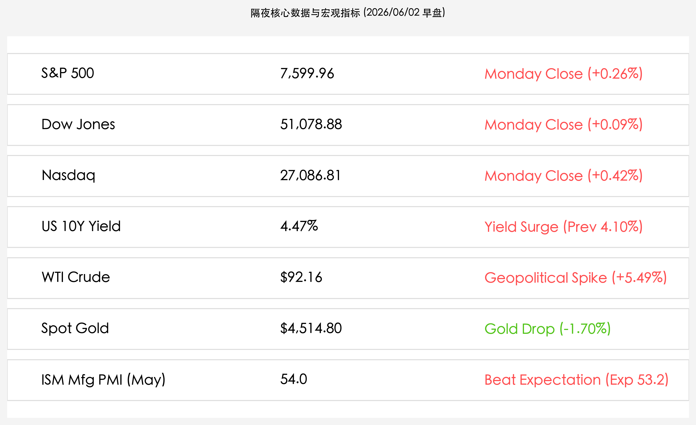

# 标普纳指续创历史新高：强劲制造业数据引爆美债利率与油价飙升的“极限拉扯”

**日期：2026年06月02日 (星期二)** &nbsp; **时段：上午 (常规交易日复盘)**

> **核心摘要**：隔夜美股三大指数再度全线走高并创收盘历史新高，纳指历史性首次收于 27,000 点上方。强劲的 5 月美国 ISM 制造业 PMI（54.0）创两年多新高，推升 10 年期美债收益率狂飙至 4.47%；同时中东局势的不确定性促使 WTI 原油暴涨 5.49% 重回 92 美元。市场正在强势宏观数据、利率高压与能源危机的“极限拉扯”中寻找平衡。

## 核心行情复盘

隔夜全球核心资产表现强劲，科技股及大宗商品领涨，但债市与金市明显承压：

*   **美股指数集体创下历史新高**：道琼斯工业平均指数微涨 **46.42点**，报 **51,078.88点**（+0.09%）；标普 500 指数收涨 **19.90点**，报 **7,599.96点**（+0.26%）；纳斯达克综合指数大涨 **114.19点**，报 **27,086.81点**（+0.42%），这是纳指历史首次站稳 27,000 点关口。
*   **美债收益率强势回升**：在 ISM 制造业 PMI 走强及降息预期降温背景下，10 年期美债收益率狂飙至 **4.47%**，较上交易日（4.10%）显著上行，对高估值成长股形成估值压力。
*   **商品市场惊现剧烈分化**：受中东地缘政治紧张局势可能导致霍尔木兹海峡受阻及燃油供应短缺的影响，国际油价暴涨。WTI 原油收报 **$92.16/桶**（+5.49%），布伦特原油收报 **$94.98/桶**（+4.24%）。与之相对，COMEX 黄金期货则因美债收益率激增及实际利率走高而震荡下挫 **1.70%**，收盘报 **$4,514.80/盎司**。
*   **中国资产多头显露韧性**：中概股表现不俗，纳斯达克中国金龙指数收涨 **1.47%**。热门中概股蔚来（NIO）和哔哩哔哩（BILI）大涨超 6%，反映了财新制造业 PMI（51.8）超预期的余温依然存在。

## 核心解读与市场逻辑

> **补库存驱动的“繁荣”与利率高压的对立**
> 
> 5 月美国 ISM 制造业 PMI 升至 **54.0**，远超市场预期的 53.2，创下 2022 年 5 月以来的最高纪录。然而，华尔街分析师警告称，当前制造业的快速扩张在很大程度上具有“欺骗性”。企业为了防范中东地缘政治恶化导致的供应链中断风险，正在积极进行**预防性补库存 (Stockpiling)**。一旦这轮补库存周期结束，制造业的增速或将快速放缓。同时，强劲的经济数据直接逆转了此前的通胀缓和逻辑，推升 10 年期美债利率飙升，构成了市场的主要矛盾。
> 
> **金油走势背离的利率剪刀差**
> 
> 面对中东局势的恶化，原油以大涨 5.49% 凸显了避险与成本端的恐慌情绪；而传统的避险黄金却大跌 1.70%。这背后的深层逻辑在于**实际利率的上升**。ISM 数据的火热令市场对美联储维持高利率（Higher for longer）甚至进一步加息的预期重新抬头，强势的美债收益率压制了无息资产黄金，形成了“原油狂欢、黄金失血”的独特剪刀差。

## 政策脉动

*   **美联储加息预期死灰复燃**：随着 5 月 ISM 制造业 PMI 的超预期火热，以及投入成本和出厂费用以近四年来最快速度上涨，通胀阴霾重新笼罩。华尔街知名宏观策略师埃德·亚德尼（Ed Yardeni）公开警告，若后续非农报告或通胀指标再度走强，美联储甚至可能不得不提前在 **7月重新考虑加息** 25 个基点，这对市场目前普遍定价的“鹰派平衡”将是巨大的考验。

## 最新机构观点

*   **DataTrek Research**：**“反弹逼近极限，需防范震荡整固”**。标普 500 指数此轮的连涨已接近“双西格玛（Two Sigma）”级别的过度偏离，短期内追涨的性价比较低，快速获利难度显著增加，市场大概率将在此位置进入高位盘整或区间震荡。
*   **华尔街共识警告**：**“警惕通胀粘性回归”**。5 月标普全球美国制造业 PMI 终值（55.1）与 ISM 制造业数据相互印证。企业预防性补库存虽保障了短期内的订单，但投入成本的暴涨说明通胀下行的最后一公里极度艰难。
*   **买方配置策略**：**“采用杠铃策略防御”**。在高收益率与高油价的“双高”环境下，建议投资者均衡配置：一端配置敏感于利率走高且具估值优势的金融板块；另一端继续持有具备绝对盈利动能的科技龙头（如 AI 服务器、芯片等核心资产），同时维持一部分现金头寸以应对地缘局势的突发恶化。

## 今日市场情绪：冷热交织的机械之舞

经济齿轮正以两年来最高速度飞旋，但负重前行的利率铁链已被瞬间拉紧。在中东原油烈火与美债收益率风暴的对立之中，市场情绪在“强增长”与“高通胀”的冰与火中艰难起舞，冷峻的机械美学背后是对即将到来的非农大考的屏息以待。

> Prompt: Surrealism style, A massive glowing brass clockwork gear representing the manufacturing sector actively rotating, while being bound by thick, red glowing digital laser chains representing high interest rates. In the background, a dark ocean under a stormy sky is illuminated by a towering oil derrick engulfed in golden flames. No human visible., masterpiece, high detail, intricate composition, cinematic lighting, 8k resolution

---
免责声明：内容仅供参考，不构成投资建议。
