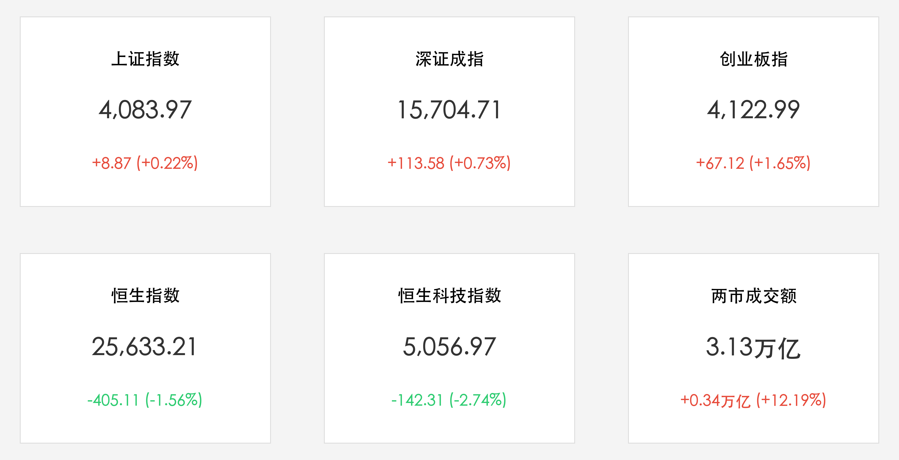

# 创业板狂飙首破4200关口：3.13万亿天量爆发，高盛降级警报引爆港股大幅回调

**日期：2026年06月03日 (星期三)** &nbsp; **时段：下午 (常规交易日复盘)**

> **核心摘要**：今日中国A股与港股市场出现历史性大分化。A股在3.13万亿元天量成交量支撑下，创业板指冲高突破4200点大关创历史新高，光通信与芯片半导体爆发。然而，高盛下调H股评级至“平配”的报告引发港股巨震，恒生科技指数大跌2.74%，美团、腾讯等互联网巨头集体回调。

## 核心行情复盘

今日国内及港股市场在放量中呈现极致分化，半导体、光通信领涨，而互联网与新能源走弱：

*   **A股三大指数集体收红**：上证指数收涨 **8.87点**，报 **4,083.97点**（+0.22%）；深证成指收涨 **113.58点**，报 **15,704.71点**（+0.73%）；创业板指收涨 **67.12点**，报 **4,122.99点**（+1.65%）。早盘创业板指曾历史性首次突破 **4,200点** 整数关口。
*   **港股市场大幅回调**：恒生指数收跌 **405.11点**，报 **25,633.21点**（-1.56%）；恒生科技指数收跌 **142.31点**，报 **5,056.97点**（-2.74%）。
*   **成交额爆出历史天量**：沪深两市全天成交额达 **3.13万亿元**，较前一交易日（2.79万亿元）显著放量约 **3,370亿元**（+12.19%）。
*   **资金动向与个股涨跌分化**：虽然主要指数收涨，但全市场呈现极端的结构分化，全市场超过 **3700只个股下跌**。主力资金流向上：
    *   **强力流入**：半导体板块主力净流入约 **87.18亿元**，通信设备板块主力净流入约 **67.72亿元**。光模块（CPO）、光纤概念股等多股涨停。
    *   **撤离流出**：新能源（电池板块净流出约 **37.81亿元**）、软件应用及传统防御板块成为主力资金撤离的主要方向。午后煤炭、电力、油气等部分防守性板块小幅拉升。

## 核心解读与市场逻辑

> **高盛“踩港挺A”：机会成本与硬科技红利的终极分化**
> 
> 今日市场最重磅的催化剂来自高盛发布的最新中国股市策略报告。高盛将 H 股（港股）的投资评级从“超配”下调至“平配”，但同时继续维持对 A 股的“超配”评级，并年内第二次上调了沪深 300 指数 12 个月的目标价。这一战术性修正直接引爆了港股市场的回调，尤其是对权重互联网板块造成了估值压力。
> 
> 高盛的降级逻辑有两点：第一是由于美团等互联网巨头在即时零售和外卖领域的补贴战超出预期，拖累了盈利增速，复苏进程预计推迟 3 至 6 个月，因此将 MSCI 中国指数的 2026 年 EPS 增速预测从 12% 下调至 8%；第二是在北亚其他市场（如日韩和台湾）展现出更强盈利周期性的背景下，维持超配港股的“机会成本”在上升。与此相反，高盛看好 A 股更贴近“物理 AI”和“硬科技”（如半导体、光模块、电力）的属性，且估值更分散，流动性极度充裕。
> 
> A 股今日的 3.13 万亿天量放量，完全印证了资金对于 AI 硬件产业链的狂热。创业板指历史性站上 4200 点大关，以中际旭创为首的光通信（CPO）和芯片硬件主力资金狂买超百亿。然而，指数光鲜的背后是超过 3700 只个股的下跌，资金的“高低切换”与结构割裂达到了阶段性顶峰。

## 政策脉动

*   **监管引导中长期资金入市**：证监会（CSRC）重申2026年工作重点在于维护市场稳定性，防止大起大落，并通过政策引导中长期资金源源不断地流入股市，这为 A 股在 3 万亿成交天量下的结构性调整提供了强有力的风险底线支撑。

## 最新机构观点

*   **高盛**：**“A股相比区域内其他市场在夏普比率上表现优异”**。高盛指出，A 股具备更强的盈利增长前景、更有利的流动性条件以及更直接的 AI 硬件暴露度。而港股互联网巨头面临的无序补贴战正在稀释短期的 EPS 兑现度，当前应更倾向于寻找港股的阿尔法（alpha）主题，而对贝塔（beta）配置保持谨慎。
*   **中信证券**：**“A股硬科技逻辑不可动摇，港股核心品种已具性价比”**。中信证券认为，尽管外资调仓导致港股承压，但互联网巨头估值回撤已提供了安全边际，金山软件、快手等核心标的仍维持“买入”评级。同时，资金向半导体和科创券商流动的趋势将延续。
*   **中信建投**：**“国内宏观处于普林格周期第五阶段，配置商品与黄金”**。当前沪深 300 和中证 500 上市公司的业绩超预期表现依然高于过去五年均值，硬科技和周期品盈利路径清晰，估值仍有支撑。

## 今日市场情绪：狂飙的硬科技与碎裂的港股之镜

今日市场主力资金再次展现出极具冷酷与现实的配仓选择：一面是发光的 AI 服务器和硬科技半导体，在 A 股这片 3.13 万亿成交量的肥沃土地上，用芯片的光芒建起通往 4200 点历史新高的拱桥；另一面则是高盛的降级警报在港股上空回响，被激战补贴拖累的互联网巨头们伴随着泛滥的红浪，连同恒指这面镜子一起碎裂并向下沉没。左岸的狂欢与右岸的跌落，被这杆偏向“硬科技”的天平秤衡量得清清楚楚。

> Prompt: Surrealism style, A majestic stone bridge of glowing green circuits connecting two cliffs. The left cliff is labeled with a golden 'A' symbol and illuminated by bright rays from a colossal glowing server. The right cliff, labeled with a silver 'H' symbol, is crumbling and sinking into turbulent stormy red waters where massive black waves crash. A massive golden scale is heavily tilted towards the left cliff., masterpiece, high detail, intricate composition, cinematic lighting, 8k resolution

---

免责声明：内容仅供参考，不构成投资建议。
