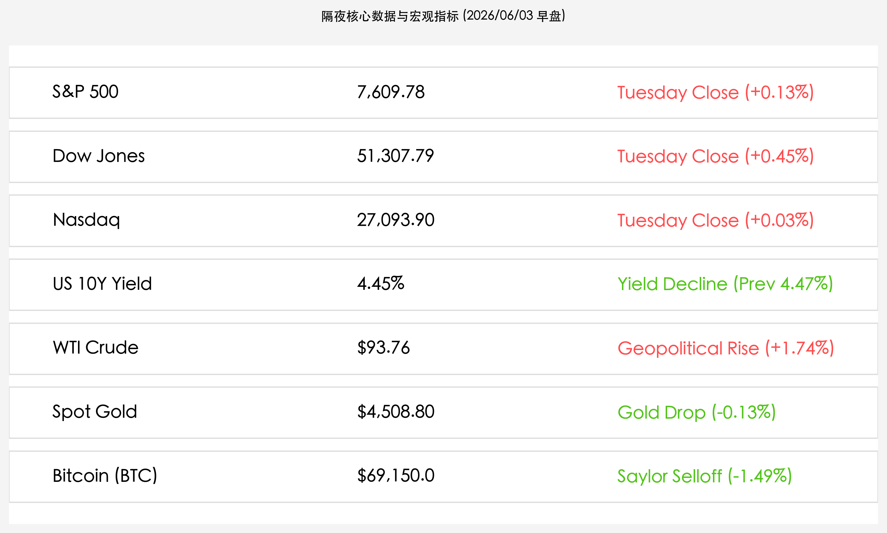
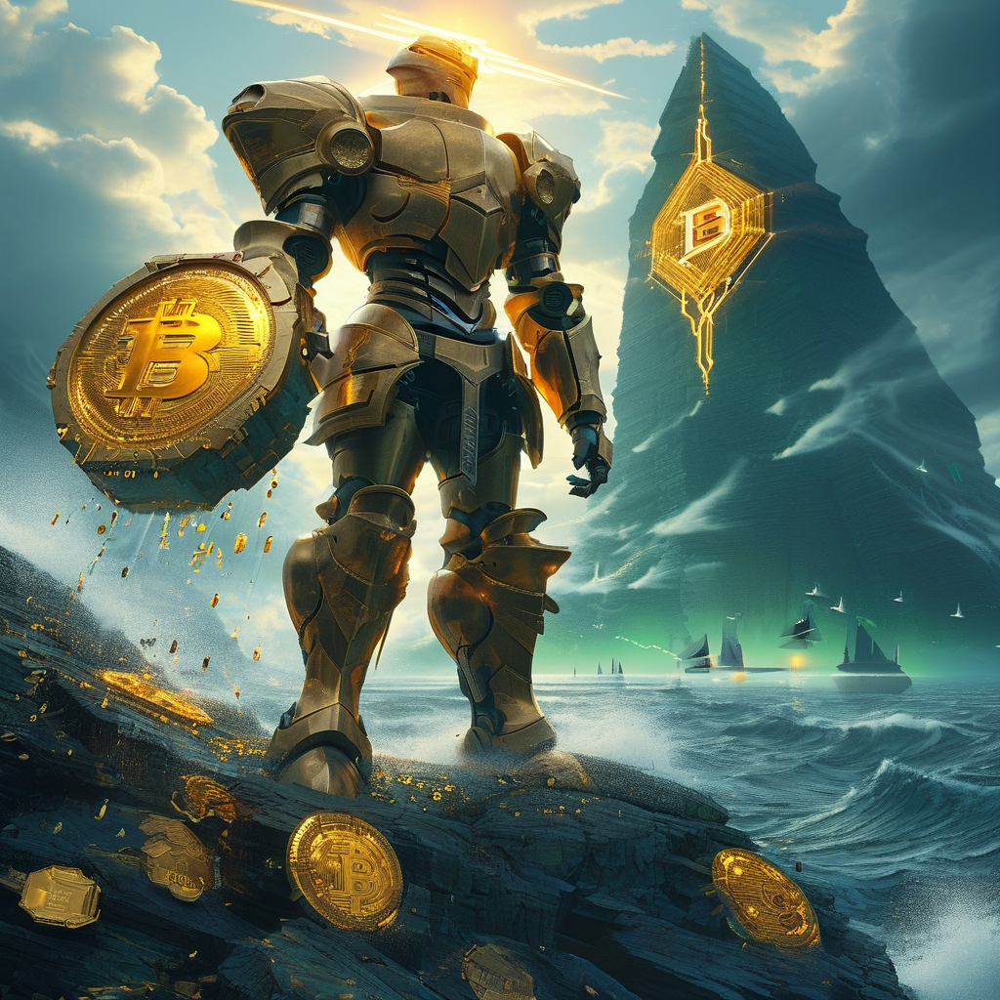

# 标普道指续创收盘新高：AI狂潮引爆Marvell飙升，谷歌抽水与MicroStrategy破戒售币拖累市场

**日期：2026年06月03日 (星期三)** &nbsp; **时段：上午 (常规交易日复盘)**

> **核心摘要**：隔夜美股再度分化上涨，标普 500 与道琼斯指数续创收盘历史新高，而纳指受谷歌“抽水”大跌拖累微幅收涨。AI 硬件产业链依然是市场最强引擎，Marvell 大涨超 32% 领跑。然而，谷歌宣布 800 亿美元股票增发计划对科技股流动性造成压力，同时 MicroStrategy 四年来首次出售比特币打破其“永不卖币”信条，引爆加密市场大跌，BTC 跌破 70,000 美元大关。

## 核心行情复盘

隔夜全球核心资产表现活跃，科技股及大宗商品领涨，但债市与加密市场走势明显分化：

*   **美股指数集体创下历史新高**：道琼斯工业平均指数大涨 **228.91点**，报 **51,307.79点**（+0.45%）；标普 500 指数收涨 **9.82点**，报 **7,609.78点**（+0.13%）；纳斯达克综合指数微涨 **7.09点**，报 **27,093.90点**（+0.03%），标普与道指续创历史新高。
*   **美债收益率小幅回落**：10 年期美债收益率微降至 **4.45%**（昨日为 4.47%），在非农大考前，债市情绪略有缓和。
*   **商品与加密市场剧烈震荡**：受美军袭击伊朗 Qeshm 岛无人机基地等中东地缘摩擦影响，油价延续强势，WTI 原油收报 **$93.76/桶**（+1.74%）。伦敦现货黄金微跌 **0.13%**，收报 **$4,508.80/盎司**。加密资产遭遇重创，比特币跌破 70,000 美元，收报 **$69,150.0/枚**（-1.49%）。
*   **领涨/领跌科技股**：
    *   **Marvell Technology (MRVL)**：飙升 **32.5%**，创下历史新高，此前英伟达 CEO 黄仁勋公开表示 Marvell 有潜力成为“万亿美元市值公司”。
    *   **Hewlett Packard Enterprise (HPE)**：暴涨 **19.5%**，其最新的季度业绩显示，AI 服务器基础设施需求极度强劲，业绩远超分析师预期。
    *   **Alphabet (GOOGL)**：逆势走低，主要由于公司宣布了一项高达 **800亿美元** 的股票增发计划，用于筹集资金进行大规模 AI 基础设施扩张与研发。

## 核心解读与市场逻辑

> **AI 基建的“估值重塑”与谷歌的“天量抽水”**
> 
> 英伟达 CEO 黄仁勋对 Marvell 的点评，直接引爆了市场对光通信与先进制程硬件的炒作热潮。HPE 的强劲财报则为 AI 基建订单的落地提供了最坚实的证据。然而，硬币的另一面是谷歌突然宣布 800 亿美元的增发计划。这不仅创下了美股历史性的科技股集资纪录，更引发了华尔街对科技巨头在 AI 领域“军备竞赛”消耗过大的担忧，对中短期科技板块的资金流动性造成了直接的抽水效应。

> **MicroStrategy “信仰破灭”的涟漪效应**
> 
> 迈克尔·塞勒（Michael Saylor）旗下的 MicroStrategy（现简称为 Strategy）向 SEC 披露，其在 5 月末出售了 32 枚比特币以筹集 250 万美元用于支付优先股股利。虽然抛售金额极小，但这是该公司四年来首次打破其“永不卖币”的信条。这一举动在加密市场引发了“信仰动摇”的恐慌情绪，导致比特币瞬间跌破 70,000 美元大关，并在 Polymarket 预测平台上引发了激烈的交割规则争议，突显了当前加密市场对于核心资金动向的敏感脆弱性。

## 政策脉动

*   **美伊地缘谈判与军事摩擦并存**：美国国务卿马科·鲁比奥称美伊和平协议已“近在咫尺”，但美军在波斯湾对伊朗 Qeshm 岛的无人机控制基地进行了“自卫性打击”。特朗普总统公开否认美伊对话中断，表示周末至今双方保持“持续沟通”。地缘冲突的复杂走势继续推高油价，构成通胀粘性的隐忧。

## 最新机构观点

*   **高盛**：**“巨头军备竞赛步入下半场，现金流质量成为估值分水岭”**。高盛指出，谷歌的天量增发意味着巨头在 AI 领域的研发投入毫无放缓迹象，但增发对市场流动性的稀释效应不容忽视，未来科技股内部将因现金流充裕度与融资依赖度出现明显的估值分化。
*   **摩根大通**：**“中东停火与冲突的双重博弈下，建议增配防御性大宗商品”**。摩根大通认为，尽管外交斡旋在进行，但军事摩擦仍未平息，霍尔木兹海峡的风险溢价并未消除，WTI原油在90美元上方仍有坚实支撑。
*   **中信证券**：**“加密资产短期承压，静待宏观政策与通胀见顶信号”**。微策公司的首次抛售虽然是由于分红等特殊财务安排，但对长期“铁粉”的心理冲击不可忽视。比特币短期或在 68,000 至 71,000 美元之间震荡整固，需密切关注周五非农数据对利率路径的指引。

## 今日市场情绪：利益与信仰的博弈

隔夜美股展现出了极致的博弈场景：一面是 AI 硬件巨头在英伟达 CEO 的赞誉声中如巨人般傲立，用璀璨的芯片光芒构筑通往万亿美元市值的金桥；另一面则是谷歌增发的巨雷在科技天空中炸响，以及加密市场信仰图腾 MicroStrategy 的首度售币导致比特币黑金硬币破裂流失。狂飙的 AI 与动摇的信仰，在红绿交织的数据风暴中展现出冷峻的对抗。

> Prompt: Surrealism style, A colossal stone titan in a golden armor stands on a cliff of glowing green circuits, holding a massive, glowing golden AI server that projects a laser bridge across a stormy dark ocean. Below, in the turbulent waves of red K-line charts, a giant black coin with a Bitcoin symbol is cracking, with tiny golden drops leaking out. In the background, a towering holographic mountain shaped like the Google 'G' logo is split by a bolt of lightning, while a fleet of small ships navigates towards the light of the titan. No human visible., masterpiece, high detail, intricate composition, cinematic lighting, 8k resolution

---

免责声明：内容仅供参考，不构成投资建议。
