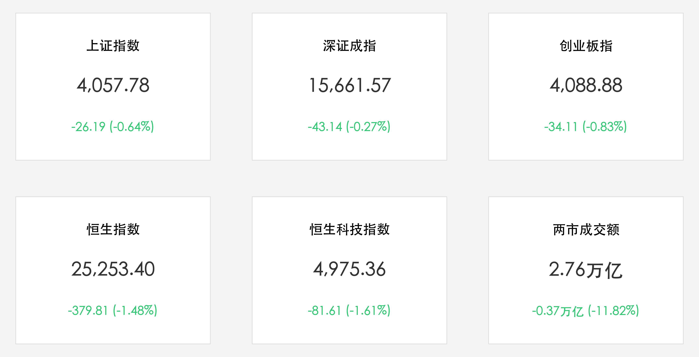

# 沪深两市缩量震荡：科技硬核主线坚挺，大基金与存储芯片掀涨停潮，大消费板块集体回调

**日期：2026年06月04日 (星期四)** &nbsp; **时段：下午 (常规交易日复盘)**

> **核心摘要**：今日中国A股与港股市场在经历连续大涨后迎来技术性震荡调整。两市成交额回落至2.76万亿元，缩量近3700亿元，全市场逾4100只个股下跌。然而，半导体与芯片产业链逆势爆发，存储芯片、大基金概念掀起涨停潮，京东方A获主力资金天量买入。相比之下，大消费（白酒、零售）及有色、资源板块集体回调，港股科技巨头亦持续承压。

## 核心行情复盘

今日国内及港股市场在缩量中呈现明显的结构性分化，半导体与芯片产业链一枝独秀，而消费与周期品板块走势偏弱：

*   **A股三大指数集体收跌**：上证指数收跌 **26.19点**，报 **4,057.78点**（-0.64%）；深证成指收跌 **43.14点**，报 **15,661.57点**（-0.27%）；创业板指收跌 **34.11点**，报 **4,088.88点**（-0.83%）。
*   **港股市场同步回调**：恒生指数收跌 **379.81点**，报 **25,253.40点**（-1.48%）；恒生科技指数收跌 **81.61点**，报 **4,975.36点**（-1.61%）。
*   **成交额较昨日有所萎缩**：沪深两市全天成交额合计为 **2.76万亿元**，较前一交易日（3.13万亿元）减少约 **3,700亿元**（-11.82%），显示出高位获利回吐与买盘转为谨慎。
*   **资金动向与个股涨跌分化**：市场呈现极端的结构分化，全市场超过 **4100只个股下跌**。但主力资金在科技主线抱团明显：
    *   **芯片产业链爆发**：存储芯片概念股掀起涨停潮，万通发展、太极实业、盈方微、大为股份、德明利等强劲涨停。大基金持股及半导体设备材料概念备受资金追捧。
    *   **主力资金净流入**：元件、光学光电子、半导体等板块录得主力资金净流入。个股方面，京东方A（BOE）获主力资金大幅净买入约 **34.8亿元**，三安光电等也获得显著流入。
    *   **领跌板块**：零售、白酒等大消费板块跌幅居前，中百集团、中央商场等个股跌停。此外，油气开采及服务、工业金属、贵金属等板块表现低迷。

## 核心解读与市场逻辑

> **存储周期上行与硬科技的避险属性**
> 
> 在经历前期的快速上行后，大盘今日出现技术性休整。然而，虽然指数承压且成交量回落至2.76万亿元，资金并未盲目离场，而是更加坚定地抱团于“自主可控”和“AI算力硬件”方向。高盛在最新行业分析中指出，随着服务器与AI设备配置比例提升，全球存储芯片的供需缺口将延续至2028年，其上行周期的持续性仍被市场严重低估。这一逻辑直接点燃了A股存储芯片及大基金持股板块的狂热。在震荡市中，技术壁垒极高的硬科技资产再次展现出独特的“避险防御”属性。

> **大消费的补跌与A/H两地分化**
> 
> 与科技板块的火热相反，今日白酒、零售等传统消费股大面积补跌，中百集团等个股甚至触及跌停。这反映出国内宏观经济信用周期在结构上依然处于“科技与外需强、消费与内需弱”的K型分化状态。港股方面，恒指与恒生科技指数大跌超1.4%，主要原因在于海外流动性预期的扰动，以及高盛此前对港股互联网巨头补贴战稀释短期利润的担忧在持续发酵，两地市场正共同经历阶段性的高位筹码出清。

## 政策脉动

*   **央行“公开市场零操作”的平滑调控逻辑**：6月3日及4日，中国人民银行在公开市场连续两天维持7天期逆回购“零操作”。业内分析指出，此举因当前银行体系流动性极为充裕。央行秉持“看价不看量”和“总量中性、节奏平滑”的调控原则，旨在避免资金利率过度下行，体现了精准平稳的调控逻辑，而非货币政策转向。
*   **证监会双向开放与高水平整治**：证监会副主席刘浩凌重申，优质企业用好国内与国际两个市场是赋能科技创新的关键，目前境外上市备案管理有序推进。同时，监管部门持续强化对非法跨境证券业务的整治。此外，商业不动产REITs试点工作在深圳等地加速落地，目前已申报3只REIT，预计募资超80亿元，有力支撑实体经济融资。

## 最新机构观点

*   **中信证券**：**“通用制造复苏渐行渐近，聚焦AI与出海敞口”**。中信证券认为，2026年下半年国内外AI算力与具身智能将迎来关键进展。建议投资者密切关注相关重点公司在AI敞口以及具有国际竞争力的产能出海（出海敞口）方面的边际变化，同时紧跟电力板块基本面与估值的双重修复。
*   **中金公司**：**“科技硬件与国产半导体设备厂商站上全球算力红利中心”**。中金公司指出，AI服务器及高阶光模块的快速放量，极大拉动了半导体设备和材料的国产化需求。中微公司等核心设备厂商正显著受益于国产化替代的加速，并将在全球算力基建的浪潮中占据重要地位。
*   **高盛**：**“新兴市场盈利预期上修，存储上行周期超出想象”**。高盛将MSCI新兴市场指数的12个月目标价上修至2000点，并大幅调高2026/2027年企业盈利增长预测。高盛认为，服务器升级将导致存储芯片短缺持续到2028年，存储厂商将迎来更长更强的繁荣周期。此外，高盛将先导智能A股评级上调至“买入”，看好其在储能与电池设备领域的突破。

## 今日市场情绪：科技堡垒中的缩量退潮

今日市场在红绿震荡中完成了高位的洗盘：伴随着大盘2.76万亿的缩量退潮，高涨的大消费与传统资源板块在信用周期的寒流下逐渐沉没。然而，在一片红色退潮之中，由存储芯片、大基金与半导体设备铸就的“科技堡垒”依然坚挺，散发着碧绿的光芒。主力资金的天量加持，如同给这套自主可控的硬件系统注入了坚实的屏障，抵御着市场整体的低迷情绪。

> Prompt: Surrealism style, A colossal silver silicon castle made of glowing green memory chips and circuits stands firm on a rocky cliff. In the background, a vast dark red ocean representing the broader market correction is slowly receding, while a giant broken golden scale representing consumer stocks sinks beneath the waves. No human visible., masterpiece, high detail, intricate composition, cinematic lighting, 8k resolution

---

免责声明：内容仅供参考，不构成投资建议。
