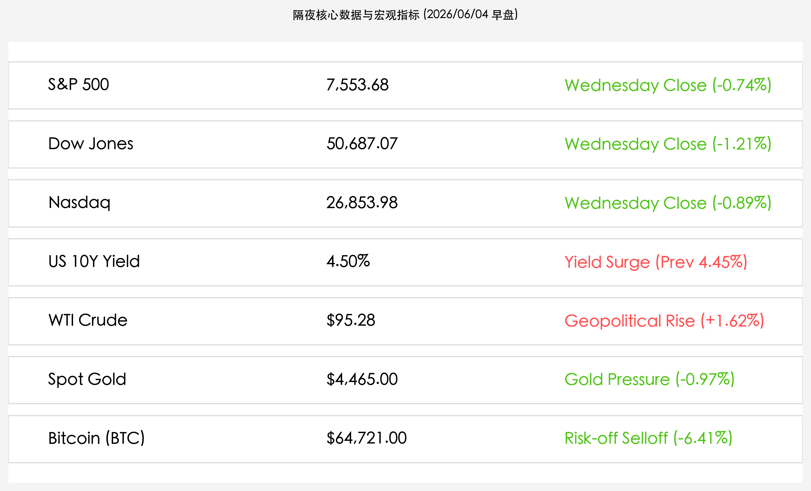
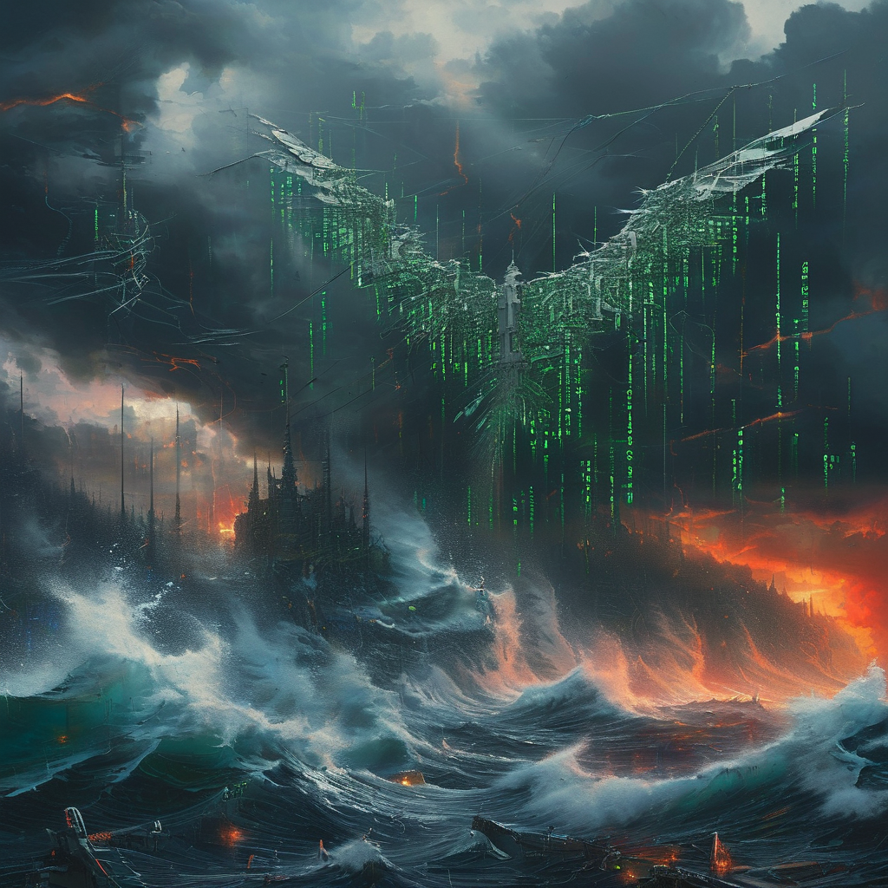

# 隔夜美股高位回调：中东火炮引爆油价冲天，谷歌天量吸金与博通财报虚高重创科技股

**日期：2026年06月04日 (星期四)** &nbsp; **时段：上午 (常规交易日复盘)**

> **核心摘要**：隔夜全球市场避险情绪急剧升温，美股主要指数全线收跌，标普500结束九连涨。中东地缘局势骤然升级，极大地推高了原油价格，WTI原油突破95美元。同时，谷歌高达847.5亿美元的天量增发稀释效应，以及博通业绩超预期但指引未达“耳语”预期导致股价大跌，共同重创科技股。避险资产分化，比特币重挫逾6%退守64,000美元大关，现货黄金亦同步走低。

## 核心行情复盘

隔夜全球核心资产集体走弱，地缘局势升级推动能源价格狂飙，科技股及加密市场大面积回调：

*   **美股指数冲高回落**：道琼斯工业平均指数大跌 **620.72点**，报 **50,687.07点**（-1.21%）；标普 500 指数收跌 **56.10点**，报 **7,553.68点**（-0.74%），终结了此前连续九个交易日的上涨势头；纳斯达克综合指数下跌 **239.92点**，报 **26,853.98点**（-0.89%）。
*   **美债收益率再度反弹**：10 年期美债收益率攀升至 **4.50%**（昨日为 4.45%），地缘政治冲突带来的原油飙升加剧了通胀隐忧，令债市承压。
*   **油价暴涨与商品分化**：受伊朗导弹袭击科威特、巴林及美国对伊空袭影响，霍尔木兹海峡地缘溢价飙升，WTI 原油收涨 **1.62%**，报 **$95.28/桶**。黄金表现疲软，现货黄金下跌 **0.97%**，收报 **$4,465.00/盎司**。避险资金流向美元，非美资产普遍承压。
*   **加密市场大幅下挫**：避险情绪引发加密资产剧烈洗盘，比特币跌破多个关键支撑位，收报 **$64,721.00/枚**（-6.41%）。
*   **领涨/领跌科技股与个股动向**：
    *   **Alphabet (GOOGL)**：因机构需求强劲，公司将天量股权融资规模从800亿美元扩大至 **847.5亿美元**（包括伯克希尔·哈撒韦认购的100亿美元），巨大的稀释担忧导致股价显著承压。
    *   **Broadcom (AVGO)**：发布第二财季报告，营收达 221.87 亿美元（+48% YoY），非-GAAP EPS 2.44 美元，AI芯片收入达 108 亿美元。虽业绩及 Q3 指引强劲，但因未能匹配市场极高的“耳语预期”（Whisper Number），且营收增幅略低于部分最乐观预期，股价在盘后交易中大跌逾 6%。
    *   **Rivian (RIVN)**：逆势走强，受益于旗下 R2 SUV 预订订单表现持续火爆，吸引了资金的防御性流入。

## 核心解读与市场逻辑

> **中东“战火重燃”与“二次通胀”警报**
> 
> 隔夜中东局势发生了实质性恶化，伊朗革命卫队对科威特和巴林（美军基地所在地）的直接导弹与无人机袭击，标志着冲突从局部摩擦走向了直接对抗。科威特国际机场的被迫关闭不仅是地缘危机的体现，更是对航运与能源命脉——霍尔木兹海峡安全的直接威胁。油价瞬间拉升至 95 美元上方，直接点燃了债市对能源驱动型通胀的恐惧，10年期美债收益率迅速回升至 4.50% 的警戒线，打压了美股大盘的估值空间。

> **天量“吸金”与财报“高标惩罚”：科技股的双重夹击**
> 
> 科技股昨日承受了资金面的双重打击。一方面，谷歌高达 847.5 亿美元的史上最大股权融资计划正式尘埃落定。尽管有巴菲特的伯克希尔·哈撒韦 100 亿美元的“背书”，但如此巨大的流动性“抽水”对科技板块的边际资金压力显而易见。另一方面，半导体风向标博通（AVGO）的财报遭遇了极致的“买预期、卖事实”。即便其 AI 芯片业务录得 143% 的爆发性增长，且给出了强劲的 Q3 指引，但面对华尔街早已被英伟达等巨头吊高的“胃口”，任何微小的瑕疵（如仅符合预期而非大幅超越）都会被视为做空理由，盘后超 6% 的跌幅反映了当前 AI 板块估值容错率极低的现状。

## 政策脉动

*   **美国众议院通过限制对伊战争权力决议**：美国众议院于 6 月 3 日通过了一项限制总统对伊军事行动权力的战争权力决议。尽管该决议在很大程度上属于象征性举措，但它反映了美国国内对于战事升级并陷入长期冲突的强烈担忧。同时，特朗普总统表示美伊对话并未完全中断，试图平息市场对于爆发全面战争的恐慌。

## 最新机构观点

*   **高盛**：**“地缘局戏与天量融资共振，市场进入高波动防御阶段”**。高盛认为，谷歌 847.5 亿美元的募资以及博通财报后的股价重挫，表明科技股当前的估值已透支了极多乐观预期。在中东冲突加剧推高油价的背景下，通胀风险再次抬头，建议短期增配抗通胀资产与现金流稳定的防御性个股。
*   **摩根大通**：**“油价95美元成为通胀粘性新起点，债市吸引力上升”**。摩根大通指出，原油供应端的风险溢价在短时间内难以消除。如果 WTI 原油持续保持在 95 美元以上，将对美联储的降息路径产生实质性阻碍，10 年期美债收益率有可能向 4.65% 发起冲击。
*   **中信证券**：**“海外避险情绪传导，A股硬科技资产具备相对韧性”**。中信证券分析称，隔夜海外市场的剧烈调整主要受地缘冲突及加密市场流动性踩踏影响。A股在3万亿资金充裕的环境下，受益于国产替代与物理AI链条的强健度，具备较好的防御性，短期波动或带来优质半导体龙头的上车机会。

## 今日市场情绪：战火硝烟下的估值退潮

隔夜市场主导权被红色的战火硝烟与绿色的资本退潮牢牢掌控：中东地缘恶化宛如霍尔木兹海峡上空炸响的惊雷，将滚滚黑金推向95美元的高位，并化作10年期美债收益率上行的引力。在巨大的资本稀释面前，即便是巴菲特百亿巨资的加持，也无法阻挡谷歌宏伟尖塔下的流动性流失；而在被极致胃口吊高的华尔街面前，博通即使交出AI翻倍的亮丽答卷，依然因微小的瑕疵被无情抛售。战火、吸金与严苛的考核，让狂热的AI科技在红绿交织的暴风雨中迎来了冷峻的价值审视。

> Prompt: Surrealism style, A stormy black sea made of liquid oil under a sky filled with crimson lightning. In the middle of the sea, a colossal white marble tower is splitting in half, with countless glowing green numbers and stock ticker symbols pouring out into the water. In the background, a giant glowing microchip lies cracked beneath the dark waves, while a mechanical bird made of drone parts flies overhead. No human visible., masterpiece, high detail, intricate composition, cinematic lighting, 8k resolution

---

免责声明：内容仅供参考，不构成投资建议。
