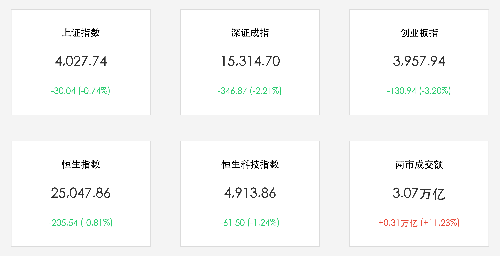

# A股放量大跌风格剧震：两市成交破3.1万亿掀高低切，创业板大跌3.2%，机器人与商业航天逆市爆发

**日期：2026年06月05日 (星期五)** &nbsp; **时段：下午 (常规交易日复盘)**

> **核心摘要**：今日A股与港股主要指数呈现显著的冲高回落与大分化。在央行投放5000亿元流动性与量化监管加码的背景下，两市成交额爆量突破3.1万亿元，创下近期高点。受资金避险“高低切换”策略驱动，前期涨幅巨大的AI算力、光模块等高位科技板块遭遇获利盘集中回吐，拖累创业板指暴跌3.20%，科创50指数跌幅超4%。然而，华为云发布具身智能平台点燃机器人赛道，SpaceX IPO路演提振商业航天，全市场有超3200只个股逆市上涨，凸显了结构性行情的火爆和极强的防御性承接。

## 核心行情复盘

今日A股与港股主要指数全线收跌，两市成交量出现爆发式增长，市场内部风格切换极为剧烈：

*   **A股主要指数集体收跌**：上证指数收盘报 **4,027.74点**，跌幅为 **0.74%**；深证成指收盘报 **15,314.70点**，跌幅为 **2.21%**；创业板指收盘报 **3,957.94点**，大跌 **130.94点**，跌幅达 **3.20%**；科创 50 指数跌幅超过 **4%**。
*   **港股市场同步走弱**：恒生指数收盘报 **25,047.86点**，较前一交易日下跌约 **205.54点**（跌幅 **0.81%**）；恒生科技指数收盘报 **4,913.86点**，下跌约 **61.50点**（跌幅 **1.24%**）。
*   **成交额暴增至天量**：沪深两市合计成交额达 **3.07万亿元**（约30,692亿元），较前一交易日大幅放量 **3,115亿元**（+11.23%），显示资金在大换手和方向转移。
*   **个股呈现结构性普涨**：尽管大盘指数受科技权重股拖累大幅收跌，但全市场仍有超 **3200只** 个股录得上涨，赚钱效应依然局部火爆。
*   **行业板块剧烈分化**：
    *   **领涨主线（机器人与商业航天）**：**机器人及具身智能板块** 爆发涨停潮，绿的谐波等多股大涨，主要催化剂为华为云发布具身智能平台及人形机器人量产预期；**商业航天/卫星导航板块** 表现强劲，航天装备、玻璃基板、光纤概念等跌幅极小或逆市上扬，受SpaceX IPO估值重塑催化。
    *   **领跌板块（高位科技与电力）**：前期强势的 **电力及公用事业** 遭遇利好出尽的获利回吐；AI算力、光模块、先进封装等 **高位科技板块** 放量回调，构成对创业板与科创板指数的最大拖累。

## 核心解读与市场逻辑

> **“天量换手”与“高低切”：极致的资金避险防御**
> 
> 今日市场最醒目的特征在于超过3.1万亿元的巨额成交额，这反映了主力资金在极高波动率下的筹码大重组。隔夜美股半导体巨头博通因未能满足苛刻的“耳语预期”而大跌近15%，这一情绪震荡直接传导至国内，引发了市场对前期过度拥挤的AI硬件、光模块等高位科技股估值的短期担忧。资金开始从高位科技股撤离，实施大面积的“高低切换”避险策略。虽然这种权重科技股的流出直接导致了以科技股为权重的创业板指和科创50指数大幅回调，但全市场仍有超3200只个股上涨，说明资金并非恐慌性出逃，而是在寻找低位、高性价比的绩优赛道。

> **具身智能与商业航天：承接天量资金的新避风港**
> 
> 在大科技板块出现松动时，人形机器人与商业航天挺身而出，成为天量换手资金的首选承载地。华为云具身智能平台的发布极大地缩短了市场对人形机器人产业化落地的心理预期，而SpaceX的IPO路演估值重塑更是点燃了商业航天板块。相比于已经历数波拉升、交易极为拥挤的算力硬件，处于产业落地前夜、估值偏低的机器人和卫星链条，无疑具有更高的风险收益比。这种行业层面的“冷热交替”，显示出市场虽然指数见顶回撤，但结构性牛市的轮动逻辑依然强韧。

## 政策脉动

*   **央行开展5000亿元买断式逆回购稳定流动性**：中国人民银行于6月5日开展5000亿元的3个月期买断式逆回购操作。在今日市场天量震荡、资金大轮动的关键节点，央行这一重磅流动性工具的投放有效熨平了跨季前的短期资金面波动，为市场的顺畅换手提供了坚实的流动性底座。
*   **上交所收紧交易业务单元管理规范通道公平**：上交所修订交易业务单元管理要求，发文严禁向个别特定投资者提供交易通道便利，旨在打击量化交易中的跑通道、特权接入等不公平交易行为。此举再次安全保障了市场的“公平、公正、公开”，短期内对高频量化和日内套利资金带来一定的情绪压制。

## 最新机构观点

*   **中信证券**：**“高低切交织牛市中场，市场风格向均衡与绩优收敛”**。中信证券分析，今日创业板指的大跌并不代表本轮牛市格局的终结，而是前期累积的大量获利筹码在外部事件（美股博通大跌）的情绪催化下进行的主动出清。在万亿级成交量的托底下，资金“从高向低”的转移非常迅速，机器人与低位概念股的强势印证了牛市火种未灭。短期内建议关注拥有确定性业绩和产业变革契机的低位制造与自主可控细分龙头。
*   **中金公司**：**“通道监管降温高频博弈，利好长线资金与指数结构优化”**。中金公司指出，上交所严禁个别投资者通道便利的要求，意味着监管对于交易公平性的底线非常明确。这将在中长期限制高频量化对市场波动率的放大，引导资金从博弈高频短波段转向长期基本面。虽然科技股短期面临估值挤出，但经历回撤后的科技龙头性价比将再度凸显。
*   **申万宏源**：**“SpaceX重塑商业航天上限，具身智能开启硬科技下半场”**。申万宏源认为，机器人与商业航天是典型的“星辰大海”式赛道。SpaceX的估值重构为国内商业航天产业链划定了极高的估值上限，而华为的入局则为人形机器人软硬件协同提供了国家级支撑。在AI算力短期估值承压的背景下，具身智能和商业航天有望接力算力，成为科技主线的下半场核心看点。

## 今日市场情绪：天量变局中的“机甲风暴”与“卫星出海”

今日市场情绪在巨额资金的极速换手中经历了冰火两重天的洗礼。美股博通的余震伴随着获利盘的重抛，化作汹涌的暗绿色代码潮汐，席卷并冲刷了由算力与光模块堆砌的高位科技灯塔，使其在创业板的暴跌中蒙上了一层阴霾。然而，就在天量换手的变局中，华为云具身智能的号角骤然吹响，一个巨大的钢铁机甲（机器人）从沸腾的绿色代码海啸中破浪而出，其手臂上托举着一颗因SpaceX路演而熠熠生辉的商业卫星，冲破重重迷雾投射下耀眼的金色光辉。在万亿换手的重灾区，这股“机甲与卫星”的组合不仅承接了庞大的避险资金，更在废墟中立起了硬科技下半场轮动的闪亮旗帜。

> Prompt: Surrealism style, A giant metallic humanoid robot rises from a turbulent dark-green sea made of electronic components and code, holding a glowing satellite with solar panels. In the background, towering silver servers are dissolving into a green mist under a stormy sky. No human visible., masterpiece, high detail, intricate composition, cinematic lighting, 8k resolution

---

免责声明：内容仅供参考，不构成投资建议。
