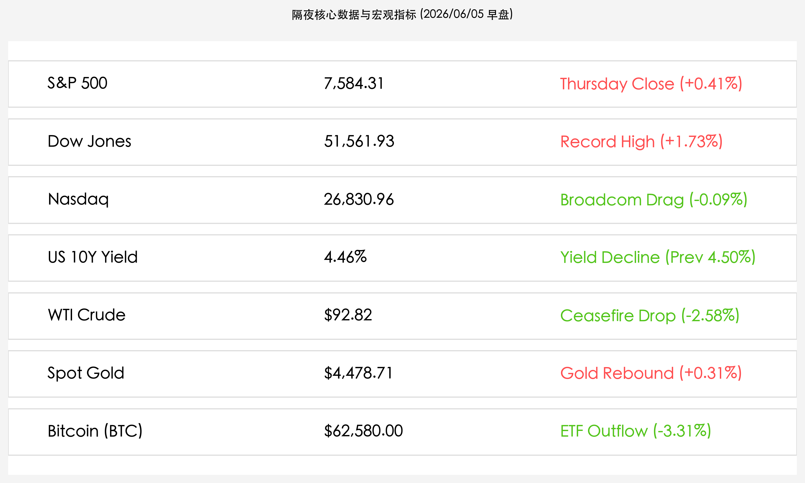

# 隔夜美股全线狂飙：蓝筹道指续创收盘新高，中东停火预期拉低油价，科技股因博通指引未及预期微跌

**日期：2026年06月05日 (星期五)** &nbsp; **时段：上午 (常规交易日复盘)**

> **核心摘要**：隔夜全球金融市场呈现显著的风险偏好修复与板块轮动。中东停火预期重燃推动WTI油价大跌逾2.5%退守93美元，美债收益率同步回落，极大平息了通胀担忧。在此背景下，资金疯狂涌入传统蓝筹与价值板块，推动道琼斯指数暴涨逾870点，续创收盘历史新高；S&P 500指数录得小幅上涨。相比之下，纳斯达克指数微跌，主要受到半导体巨头博通（Broadcom）因下季AI业绩指引未达极度乐观的“耳语预期”而暴跌近15%的拖累。比特币继续受ETF流出影响下跌逾3%。

## 核心行情复盘

隔夜全球核心资产走势分化，地缘局势缓和推动能源价格回调，蓝筹股迎来爆发，而科技股及加密市场受个股财报及资金流出影响走势偏弱：

*   **美股指数涨跌不一**：道琼斯工业平均指数大涨 **874.86点**，报 **51,561.93点**（+1.73%），创下收盘历史新高；标普 500 指数收涨 **30.63点**，报 **7,584.31点**（+0.41%）；纳斯达克综合指数微跌 **23.02点**，报 **26,830.96点**（-0.09%）。
*   **国债收益率与大宗商品震荡下行**：10 年期美债收益率回落至 **4.46%**（昨日为 4.50%），受中东局势缓和所带动的通胀降温预期影响。
*   **原油价格重挫与黄金小幅反弹**：以色列与黎巴嫩达成停火共识的利好，显著平息了霍尔木兹海峡地缘溢价，WTI 原油价格大跌 **2.58%**，收报 **$92.82/桶**；布伦特原油收报 **$95.15/桶**。现货黄金录得上涨 **0.31%**，收报 **$4,478.71/盎司**。
*   **加密货币市场走势疲软**：比特币继续承压，跌幅达 **3.31%**，收报 **$62,580.00/枚**，主要归因于现货ETF的持续资金净流出，以及部分资金向传统权益类资产回流。
*   **核心个股动向与板块分化**：
    *   **博通 (AVGO)**：虽然公布的第二财季业绩强劲且AI芯片需求旺盛，但由于给出的第三财季指引未能匹配市场极度苛刻的“耳语预期”（Whisper Number），股价放量暴跌 **14.82%**，收报 **$408.20/股**，成为科技板块的最大拖累。
    *   **英伟达 (NVDA)**：逆势反弹，收涨约 **2%**，报 **$218.80/股** 左右，市场对 Computex 2026 期间发布的新一代芯片设计与软硬件生态的乐观情绪仍在持续发酵。
    *   **传统蓝筹股崛起**：金融、工业、消费等传统板块在无风险利率下行及地缘风险消退的推动下，获得主力资金大规模建仓，成为道指创下新高的核心动力。

## 核心解读与市场逻辑

> **“和平红利”重燃，通胀压力降温与估值空间拓展**
> 
> 隔夜市场最核心的推动力来自于中东局势的实质性解冻。以色列与黎巴嫩达成的停火谅解备忘录，使此前高度紧张的地缘政治冲突出现了喘息之机。这一变化不仅拉低了油价，使其脱离了95美元的高危警戒线，更通过降温通胀预期直接压低了10年期美债收益率至4.46%。借贷成本的预期下降，释放了权益类市场的贴现率压力，尤其是对传统重资产与顺周期蓝筹板块形成直接利好。

> **“耳语预期”的苛刻考验：科技股估值容错率低企**
> 
> 与蓝筹股的普涨相反，科技板块再次遭遇了博通（AVGO）财报后的“高标惩罚”。博通的业绩本身极其优秀，但在当前高企的AI板块估值体系下，仅满足官方预设指引是不够的，必须超越极其苛刻的“耳语预期”。博通大跌14.82%表明，当前华尔街对AI核心硬件链条的审视标准已达到极致，任何缺乏额外惊喜的表现都会被市场视作短期的获利了结借口。相比之下，英伟达凭借 Computex 2026 的持续余温得以逆势走强，但科技板块分化的走势反映出资金在追求极致性价比与防御性配置之间的徘徊。

## 政策脉动

*   **美国众议院通过战争权力限制决议**：美国众议院正式通过限制总统对伊军事行动权力的决议，进一步巩固了国内防范战争升级、避免直接卷入中东冲突的政治基调，有助于稳定全球市场的避险情绪。
*   **初请失业金人数超预期上行**：美国至6月1日当周初请失业金人数升至 **22.5万人**，超出了市场预期的 21.1万至21.4万人。虽然劳动力市场仍处于相对健康状态，但这一超预期增幅暗示经济增长和就业市场正在逐步冷却，在客观上强化了美联储未来的降息逻辑。

## 最新机构观点

*   **高盛**：**“蓝筹轮动将是夏季主旋律，科技股进入业绩去伪存真期”**。高盛分析指出，在通胀隐忧因油价回落而缓解后，无风险利率的下降将令此前被低估的顺周期蓝筹和价值股迎来补涨机会。同时，博通财报的剧烈波动证明，AI泡沫正从“纯概念”向“超预期兑现”阶段过渡，高估值股票的配置权重短期需要适当收缩。
*   **摩根大通**：**“停火协议仍需时间检验，原油波动率依然处于高位”**。摩根大通认为，尽管以色列与黎巴嫩达成的停火协议带来了短暂的市场喘息，但由于Hezbollah官方高调拒绝该协议，中东地区长期的和平依然面临巨大不确定性。油价回落至93美元以下为债市提供了良好的买入机会，但商品配置上不宜过早做空能源。
*   **中信证券**：**“美劳动力市场温和冷却，利好亚太成长板块的流动性传导”**。中信证券认为，美国失业金人数上行和债市利率走低显示海外宏观政策面偏向温和，海外资金可能会在科技高估值压力下寻求流向性价比较高、国产替代逻辑明确的中国半导体与AI硬件资产。

## 今日市场情绪：金光要塞下的科技分化

隔夜全球市场呈现明显的防御轮动与资产洗牌：中东局势的破冰将原油价格自高位击落，推动通胀预期的潮水退去。在降息预期的微风与和平光芒下，由传统价值、金融和顺周期蓝筹筑起的“金光要塞”拔地而起，牢牢拱卫着道指的创纪录高度。然而，在科技的另一侧，博通即便亮出卓越的数据也终因未及极端挑剔的胃口而大面积泄洪，化作绿色数据代码顺着银色塔身滑落。狂热的科技追逐与冷峻的蓝筹防御，在一升一沉的红绿变局中正重新划定资本的平衡线。

> Prompt: Surrealism style, A colossal golden fortress representing the blue-chip Dow Jones stands towering on a cliff, shining with a brilliant white light. In the background, a calm dark-green ocean representing the receding oil risk is slowly settling, while a giant silver server tower representing tech stocks shows a small crack with green code leaking out. No human visible., masterpiece, high detail, intricate composition, cinematic lighting, 8k resolution

---

免责声明：内容仅供参考，不构成投资建议。
