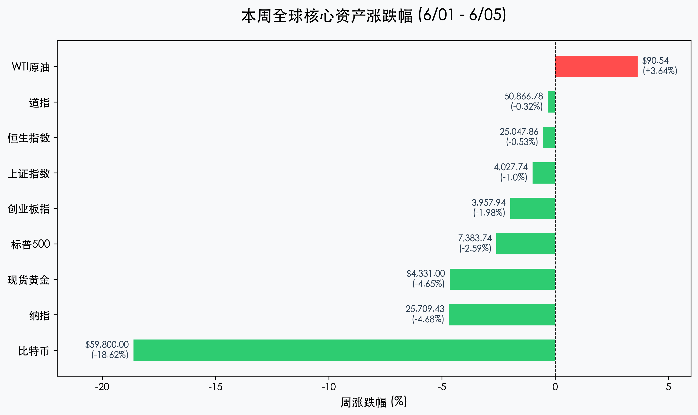

# 全球市场周报：美股惊现非农风暴，比特币跌破六万关口，A股三万亿巨量“高低大切换”

**日期：2026年06月06日 (星期六)** &nbsp; **时段：周六晚报 (周末复盘模式)**

> **核心摘要**：本周全球市场遭遇流动性风暴与信仰动摇的双重夹击。美国“爆表”非农数据彻底扑灭降息预期，十年期美债利率飙升至4.55%重创高估值科技股；加密市场因MicroStrategy罕见破戒售币及美债利率高压，比特币惨烈跌破6万美元整数关口，全周累计暴跌超18%。国内A股则在3.1万亿元天量换手中经历“高低大切换”，虽有指数受科技权重拖累大跌，但华为云具身智能平台与SpaceX路演分别点燃机器人和商业航天主线，两市超3200只个股逆市上涨，彰显新质生产力的抗跌韧性。

## 核心资产周度/日度表现回顾

本周（06月01日-06月05日）全球主要资产波动剧烈，流动性紧缩风暴导致高估值成长资产与加密市场惨烈去杠杆，原油在成本端对冲地缘溢价，而中国资产在天量换手中显现极强抗风险韧性。

*   **道琼斯工业指数 (Dow Jones)**：周五收报 **50,866.78点**，单日下跌 **1.35%**，全周累计下跌 **-0.32%**。
*   **标普 500 指数 (S&P 500)**：周五收报 **7,383.74点**，单日下跌 **2.64%**，全周累计下跌 **-2.59%**，结束此前长连涨态势。
*   **纳斯达克综合指数 (Nasdaq)**：周五收报 **25,709.43点**，单日大跌 **4.18%**，全周累计大跌 **-4.68%**，高估值半导体及AI软件受美债收益率狂飙重创。
*   **上证指数 (SSE Composite)**：周五收报 **4,027.74点**，单日下跌 **0.74%**，全周累计下跌 **-1.00%**，处于4000点大盘洗盘筑底阶段。
*   **创业板指 (Chinext)**：周五收报 **3,957.94点**，单日暴跌 **3.20%**，全周累计下跌 **-1.98%**，主要受科技成长权重高位回调拖累。
*   **恒生指数 (Hang Seng)**：周五收报 **25,047.86点**，单日下跌 **0.81%**，全周累计微跌 **-0.53%**，在2.5万点关口承接力强大。
*   **WTI原油 (Oil)**：周五收报 **$90.54/桶**，单日下跌 **2.46%**，全周累计上涨 **+3.64%**，受中东停火与霍尔木兹海峡重开预期博弈主导。
*   **现货黄金 (Gold)**：周五收报 **$4,331.00/盎司**，单日大跌 **3.30%**，全周累计下跌 **-4.65%**，高无风险利率重压下避险资金大幅流出。
*   **比特币 (BTC)**：周五收报 **$59,800.00/枚**，单日暴跌 **4.44%**，全周累计暴涨 **-18.62%**，失守60,000美元大关。

## 过去 48 小时重磅事件深度复盘

> **1. “爆表”非农引爆加息定价，全球流动性高压重置估值分母端**
> 
> 美国5月新增非农就业人数达 17.2万人，几乎翻倍于市场预期，更可怕的是3月与4月数据被大幅上修了 9.3万人。强韧的就业报告排除了美国经济衰退假说，但也彻底封锁了美联储的短期降息通道。市场不仅打消降息幻想，甚至开始定价重启加息的可能性，推动10年期美债利率狂飙至 4.55%。在全球流动性收紧与利率分母端重压下，高估值科技股遭遇流动性踩踏，纳斯达克录得近月来最惨烈单日跌幅。

> **2. 微策打破四年“永不卖币”誓言，加密市场共识图腾遭遇裂解**
> 
> 迈克尔·塞勒（Michael Saylor）旗下的MicroStrategy本周向SEC披露了其4年多来的首度售币行为，虽然售币金额极小，但却无情打破了其“永不卖币”的信条，在加密市场引发多头“信仰动摇”的恐慌踩踏。叠加非农风暴带来的美债收益率弹升与强美元挤压，加密市场流动性遭遇瞬间蒸发，比特币周五跌破60,000美元大关，录得全周超 18% 的断崖式下跌。

> **3. A股两市爆发3.1万亿元成交，资金“高低大切换”实现深幅洗盘**
> 
> 周五国内A股和港股经历了一场惊心动魄的“高低大切换”大分化。在前期科技股大涨、量化监管收紧以及外围非农预警等多重因素叠加下，前期拥挤度过高的AI算力、光模块等高位板块遭遇主力资金集中回吐，拖累创业板指暴跌3.20%。但市场资金并未离场，而是大幅向低估值高分红红利板块防御转移，同时华为云具身智能平台发布点燃了机器人及人形机器人量产预期，SpaceX路演催化了商业航天板块。两市全天爆量成交 3.07万亿元，个股呈现超 3200只 逆市上涨的结构性普涨态势，反映出极强的内生防御承接力。

## 下周全球宏观大事预警

1.  **中国5月CPI与PPI数据 (06/10)**：将公布5月国内物价与工业品价格指数，是观察国内消费端与工业端景气度改善成色的关键指标。
2.  **美联储6月利率决议 (FOMC) (06/11)**：新任主席凯文·沃什（Kevin Warsh）执掌联储后的首次利率大考。爆表非农数据后，美联储的最新声明、点阵图以及经济预测（SEP）将直接定调下半年全球金融流动性的宽严风向。
3.  **SpaceX 历史性 IPO 认购细节与估值定价**：作为全球估值高达1.75万亿美元的科技巨头，其上市细节和巨额融资动向将持续重构全球高端制造、卫星通信产业链的估值格局。

## 顶级机构周末策略内参摘要

*   **摩根士丹利 (Morgan Stanley)**：**“非农飓风彻底锁死降息，防守重于进攻，增配高股息与传统价值”**。非农数据的极强表现宣告了美联储短期内无缘降息。在高美债收益率（4.55%）压制下，高估值科技股仍有去泡沫需求，资金将加速向能源、原材料、金融等红利板块迁移。
*   **中信证券 (CITIC Securities)**：**“A股3.1万亿天量换手，阵痛过后科技成长仍是新质生产力中轴，机器人与商业航天将领航”**。周五A股大跌是高位资金借外围非农利空进行的高低切避险换手。机器人的华为平台发布与SpaceX的IPO催化并非短期概念，而是新质生产力的具象化体现，回调是逢低布局低估值硬科技与具身智能龙头的良机。
*   **高盛 (Goldman Sachs)**：**“全球流动性脉冲式收紧，维持对中国资产的‘防御性超配’”**。高盛指出，美债收益率冲高将引发跨资产流动性踩踏，商品与加密资产承压。但中国资产估值处于低位，且周五3.1万亿成交表明国内资金承接力强大，在红利防御和具身智能的交织下，中国股市抗风险性优于外围。

## 今日市场情绪：雨夜中的硅甲护卫与坠落的图腾

今日市场情绪在猝不及防的非农数据与加密市场图腾崩塌中展现出冷峻的对抗。在雨夜的霓虹未来都市中，由华为具身智能与机器人板块铸就的巨大硅甲护卫在黑暗中矗立，散发着碧绿的防御光芒。然而在它的周围，由爆表非农催生的红色K线数字瀑布从天空中倾泻而下，代表加密市场信仰的巨大比特币霓虹广告牌在瓢泼大雨中闪烁开裂，面临着去中心化共识的重置。在这场无风险利率风暴的肆虐下，远处一枚象征着商业航天的SpaceX火箭穿破阴霾直刺星空，预示着虽然流动性退潮，但硬核科技的征途依然星辰大海。

> Prompt: Cyberpunk style, In a rainy, neon-drenched futuristic megacity, a colossal humanoid robot stands as a guardian, its eyes glowing with green data. Around it, holographic stock charts show cascading red lines, and a massive neon Bitcoin billboard is flickering and glitching in the downpour. Below, in the wet streets, a fleet of delivery drones and self-driving cars carrying glowing cargo navigate the dark avenues, while in the sky, a SpaceX-style rocket pierces through the heavy smog towards the stars. No human visible., masterpiece, high detail, intricate composition, cinematic lighting, 8k resolution

---

免责声明：内容仅供参考，不构成投资建议。
