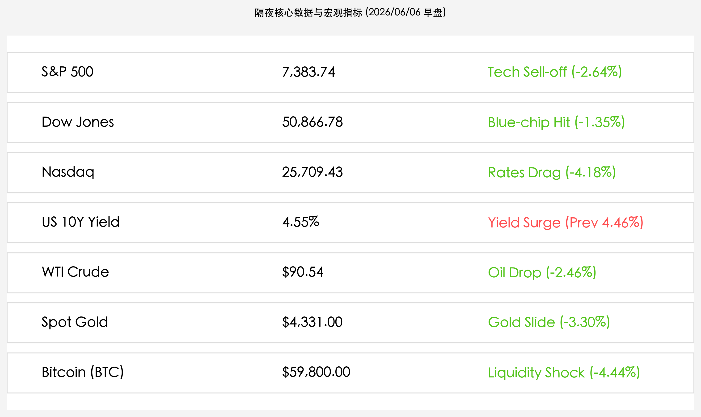

# 隔夜美股遭受非农风暴洗劫：纳指暴泄超4%，十年美债冲上4.55%，全球商品数字货币血流成河

**日期：2026年06月06日 (星期六)** &nbsp; **时段：上午 (常规交易日复盘)**

> **核心摘要**：隔夜美股遭遇近月来最剧烈的“好消息即坏消息”抛售潮。美国5月非农就业人口惊人增长17.2万人，远超预估，加之前值大幅上修，打碎了市场对美联储快速降息的幻想，甚至引爆加息定价。十年期美债利率狂飙至4.55%，流动性紧缩风暴导致科技股失血，纳指崩跌4.18%；强美元与利率走高双重挤压下，现货黄金重挫3.30%，比特币跌破6万美元整数大关。

## 核心行情复盘

隔夜全球金融市场在超预期就业数据的重击下全线失守，高估值成长资产与大宗商品经历惨烈去杠杆：

*   **美股三大指数全线重挫**：标普 500 指数收跌 **200.57点**，报 **7,383.74点**（-2.64%）；纳斯达克综合指数暴跌 **1,121.53点**，报 **25,709.43点**（-4.18%）；道琼斯工业平均指数收跌 **695.15点**，报 **50,866.78点**（-1.35%）。
*   **美债收益率急速弹升**：10 年期美债收益率狂飙至 **4.55%**，单日跃升 9 个基点，完全抹去此前的温和回落态势，预示着高利率周期的延长。
*   **大宗商品价格大面积失血**：美债与美元的强势反弹直接刺破了商品估值，WTI 原油价格下跌 **2.46%**，收报 **$90.54/桶**；布伦特原油收报 **$93.09/桶**。现货黄金录得暴跌 **3.30%**，收报 **$4,331.00/盎司**。
*   **加密市场流动性坍塌**：比特币日内暴跌 **4.44%**，收报 **$59,800.00/枚**，直接失守60,000美元关键心理防线。
*   **核心板块与个股惨淡**：高估值的半导体与AI核心软硬件板块成为抛售风暴眼，昨日表现坚挺的英伟达等AI龙头大面积跟跌，仅有极少数传统防御型板块微幅抗跌。

## 核心解读与市场逻辑

> **“爆表”非农引爆加息忧虑，“好消息”沦为“坏消息”的逻辑闭环**
> 
> 5月新增17.2万人的非农数据几乎翻倍于市场预期，更可怕的是3月与4月被合计大幅上修了9.3万人。这不仅排除了美国经济“硬着陆”或劳动力市场失速的风险，也宣告了劳动力市场供需依然处于极度紧张状态。在通胀仍未完全消退的当前环境下，如此具有韧性的经济表现使得市场对于“高利率更久（Higher for longer）”的叙事迅速升温，交易员甚至开始定价美联储在年内重启加息的可能。经济的“好消息”由此彻底沦为股市的“坏消息”。

> **估值重置与流动性冲击：美债飙升下的全球资产洗牌**
> 
> 10年期美债收益率大幅拉升至4.55%，无风险利率的攀升成为了估值分母端的致命杀手。首当其冲的是纳斯达克及AI半导体等高估值板块，在分母端上行以及此前博通事件未消的情绪叠加下出现恐慌性估值重构。同时，利率的走高和美元的再度强势不仅导致全球权益资产失水，更在商品和加密货币市场引爆了跨资产的流动性连环收紧。黄金和比特币等无息或高风险属性资产的同步抛售，是本轮美元流动性脉冲式收缩的直接体现。

## 政策脉动

*   **美5月非农就业大幅超预期**：美国劳工统计局公布数据显示，5月非农新增就业人数达 **17.2万人**（预期 8.5万-10.5万人），失业率持平于 **4.3%**。历史数据的显著上修使得美国劳动力市场的底色更显强硬。
*   **美联储年内政策路径再度蒙尘**：强劲的就业报告使市场彻底打消了对联储短期内转向降息的押注，美联储决策中“稳就业”的担忧退居幕后，而对抗“通胀反复”的权重被动拉高，鹰派预期的全面回归将限制未来几个季度的金融宽松度。

## 最新机构观点

*   **摩根士丹利**：**“意外上行的非农数据彻底锁死了降息通道，通胀与高利率依然是夏季的核心主线”**。摩根士丹利指出，本次爆表数据令先前的温和冷却假说破产。随着美联储对劳动力市场转弱的担忧被消除，短期内任何降息选项都将被束之高阁。在美债收益率再度冲击4.6%的压力下，市场将继续对高溢价资产进行去泡沫化。
*   **高盛**：**“劳动力市场的极强韧性证明经济不需要降息刺激，加息讨论或将重返决策视野”**。高盛分析师表示，美国宏观经济韧性十足，这意味着美联储可以腾出手来，在通胀偏高时继续采取压制性举措。本次数据甚至开始唤醒市场的年内加息定价，这将是权益类市场最沉重的枷锁。
*   **中信证券 / 中金公司**：**“全球流动性脉冲式紧缩，中国资产局部‘高低切’韧性面临外围情绪传导”**。国内机构分析，外围无风险利率弹升将对人民币汇率及成长股带来短期压制。不过，鉴于央行周五释放的5000亿流动性及A股已在进行大幅度的“高低切换”避险出清，国内市场的防线相对牢固，周一开盘虽会有外围恐慌的短时波及，但低估值高分红蓝筹与机器人、商业航天等新产业线仍可能成为中线避风港。

## 今日市场情绪：非农风暴下的“金衡失序”与“硅塔碎裂”

今日市场情绪在猝不及防的非农数据飓风中彻底沦陷。天空中卷起由泛青色代码和失控的非农就业报告化作的暴虐风暴。暴风雨的中心，象征着美联储利率权衡的巨大黄金天秤出现剧烈的失序，标有“加息”的一端沉重下坠，将无数闪耀的金条与比特币等数字硬币从托盘上狠狠甩入黑暗的深渊。在风暴背景下，那座曾高耸入云、代表高估值科技股的银色硅谷服务器塔，被怒吼的绿色美债利息闪电拦腰劈中，无数亮绿色的代码如泪水般顺着龟裂的金属缝隙喷涌而出，消融在狂风暴雨中。这幅资产崩坍的画卷，深刻勾勒出在无风险利率泰山压顶之下，全球流动性大潮退去时的残酷图景。

> Prompt: Surrealism style, A colossal golden scale representing the Federal Reserve stands amid a fierce dark-green storm. One side of the scale labeled "Rate Hike" is heavy and sinking, while gold bars and glowing digital coins are sliding off into a deep abyss. In the background, green lightning strikes a towering silver server structure representing tech stocks, causing green digital code to leak out under a dark stormy sky. No human visible., masterpiece, high detail, intricate composition, cinematic lighting, 8k resolution

---

免责声明：内容仅供参考，不构成投资建议。
