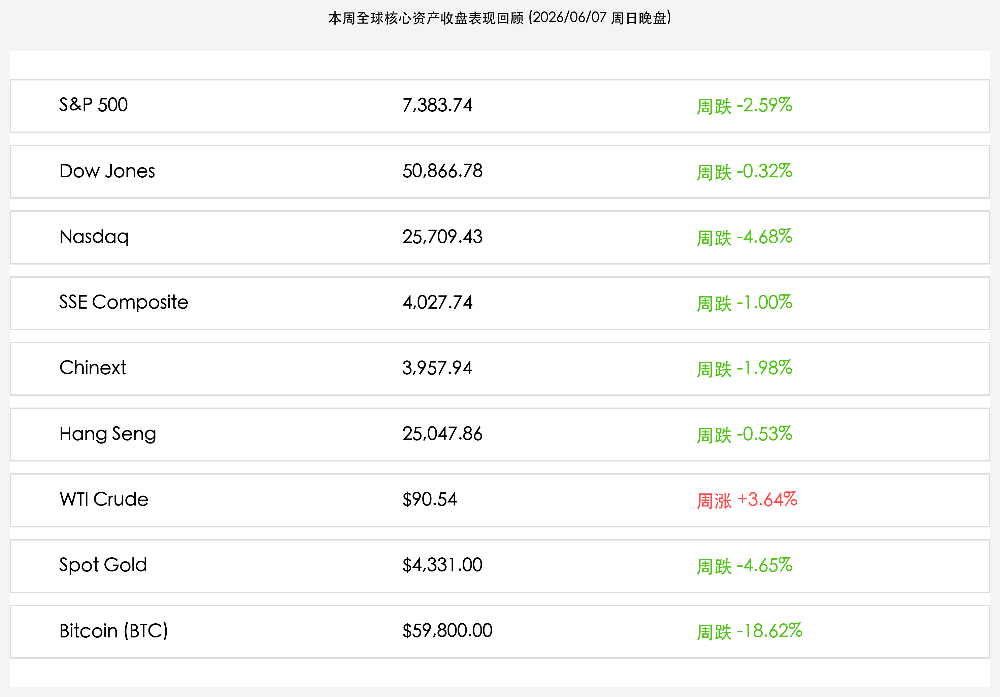

# 全球市场周报（周日晚间版）：强监管筑牢中国资产价值底座，SpaceX 领衔科技征途与新周沃什大考

**日期：2026年06月07日 (星期日)** &nbsp; **时段：晚报 (新周展望模式)**

> **核心摘要**：本周末，中国证监会主席吴清的最新致辞为资本市场高质量发展划定“公平和规范”的监管红线，程序化交易和基金“押赛道”等顽疾的整治预示着A股估值重构的“慢牛”底座正被筑牢。在全球流动性上，美国超预期非农完全锁死了短期降息窗口，十年美债收益率冲高至4.55%重压全球分母端，使得即将于6月11日举行的凯文·沃什执掌美联储首场FOMC利率决议成为决定下半年全球资产定价的终极看点。然而，估值近1.8万亿美元的SpaceX在6月12日IPO前夕与谷歌签署300亿美元算力租赁协议，不仅引爆了算力基建和商业航天的产业重估，也为处于流动性阵痛期的科技主线点亮了新质生产力的指路明灯。

## 周末财经要闻终极汇总

本周全球资产收盘数据如下，各大核心资产均经历了显著的波动与筹码重组：

> **1. 中国证监会主席吴清：持续完善程序化交易监管，遏制基金“押赛道”等顽疾**
> 
> 2026年6月6日，中国证监会主席吴清在中国证券投资基金业协会第四届会员代表大会上发表致辞，重点对程序化交易和公募/私募基金高质量监管划定红线。吴清强调：
> * **持续完善机制**：证监会将深入调研，持续完善程序化交易监管的机制安排，突出公平与规范。在已出台的交易报告、异常交易监控等规则基础上，加强针对性监管，坚决打击操纵市场、扰乱市场秩序等违法违规行为。
> * **加速实现“重回报”转型**：公募基金行业必须坚守“受人之托、代客理财”的信义义务，加快实现从“重规模”向“重回报”转型。坚决遏制“押赛道”、风格漂移、高位发行等顽疾，明确行业不能回到“冲规模、赚快钱”的老路上。
> * **推行“1+N+X”体系**：目前证监会正研究制定贯彻落实私募高质量发展指导意见的三年行动方案，健全准入、监管与风险化解体系，确保基金行业在“十五五”期间高质量发展。

> **2. SpaceX 宣布 6 月 12 日挂牌上市，并与谷歌签署 300 亿美元算力协议**
> 
> 史上最大规模 IPO 正式进入定价和交易倒计时：
> * **超级 IPO 落地**：SpaceX 计划于6月11日完成定价，并在 6 月 12 日以股票代码 **"SPCX"** 正式登陆纳斯达克。计划以每股 135 美元发行 5.556 亿股股票，募资规模约 750 亿美元，整体估值达 1.77 万亿美元。
> * **300亿天价订单**：SpaceX 披露，其与谷歌（Google）签署了一项大型算力服务协议。从 2026 年 10 月至 2029 年 6 月，谷歌每月向 SpaceX（含旗下 xAI）支付 9.2 亿美元的算力费用，总合同金额约 300 亿美元。
> * **核心算力支撑**：谷歌此举旨在为旗下 Gemini Enterprise AI 代理平台租用包含约 11 万块英伟达（NVIDIA）GPU 在内的超级算力集群，标志着 SpaceX 的科技及 AI 基础设施属性得到巨头的高度认可。

> **3. 美 5 月非农引爆加息定价，比特币失守 6 万美元大关**
> 
> * **美债实际收益率狂飙**：美国5月新增非农就业人数达 17.2 万人大超预期，彻底推迟了市场降息时点。十年期美债利率狂飙至 4.55%，无风险利率急拉导致全球半导体及高估值科技股遭受“估值分母端杀跌”，费城半导体指数单日暴跌超 10%。
> * **加密市场风暴**：迈克尔·塞勒旗下的 MicroStrategy 近四年来首次向 SEC 申报“售币”操作，击碎了其宣扬的“只买不卖”信仰。伴随美债利率重压，比特币全周暴跌超 18%，失守 60,000 美元整数大关。

## 新一周市场核心博弈逻辑

新的一周（6月8日-6月12日）全球资本市场将迎来重磅博弈：
* **沃什式利率决议的降息预期大考**：由于非农超预期爆表，即将于本周四公布的美联储利率决议（FOMC）成为重中之重。这是凯文·沃什上任主席后的首场利率会议，市场将通过最新的“点阵图”及经济预测重新评估下半年的流动性拐点。若沃什表态偏鹰，美债 10 年期收益率可能将在 4.5% 上方维持更久，压制高估值科技股的风险偏好。
* **SpaceX 上市对高端制造与商业航天的价值引爆**：高达 1.77 万亿美元的 SpaceX 挂牌上市是人类商业航天史的里程碑。由于其不仅是太空科技龙头，更因 300 亿美元谷歌合同摇身一变成为庞大的 AI 算力基建运营商。新的一周，国内商业航天、低空经济、CPO 以及先进封装板块在前期经历 3.1 万亿大分化调仓后，有望围绕 SpaceX 的上市共振迎来估值和逻辑的再次确认。
* **监管排毒促使 A 股资金由“押赛道”转向“新杠铃配置”**：吴清主席对于基金“押赛道”、量化违规操纵的遏制，虽在短期内促使 A 股高位题材股（如部分 AI 概念股）失血调仓，但中长期有利于形成健康的“慢牛”土壤。资金正向低估值顺周期（有色、煤炭、能化）及红利防御板块集中，新周开盘预计市场仍将呈现防御性“杠铃结构”的博弈。

## 本周重磅经济数据与会议前瞻

* **06月10日 (星期三)**：
  * **中国5月 CPI & PPI 物价指数**：该数据是反映国内工业部门出清状态及内生消费活力的核心指标，直接决定了顺周期有色及大宗商品板块的业绩预期。
* **06月11日 (星期四)**：
  * **美联储 6 月 FOMC 利率决议（沃什首秀）** / **美国5月 CPI 核心通胀数据**：全球资产的定价分水岭，决定美债收益率能否在 4.55% 见顶并释放科技股估值压力。
* **06月12日 (星期五)**：
  * **SpaceX (SPCX) 正式上市交易**：全球史上最大 IPO，其首日表现及巨额资金的分流效应将引发全球高端智造、太空网络与 AI 基础设施的深度波动。

## 头部券商/投行开盘策略点睛

* **中信证券**：**“构筑‘AI+能化’的杠铃组合，科技短期阵痛后仍是中期超配核心”**。由于美债利率冲高（4.55%），高估值科技主线短期迎来出清，这是不可避免的阵痛，但硬核半导体设备和低估值互联网依然是核心。布局思路应采用一边配置AI/具身智能设备，一边配置红利及顺周期能化板块的“新杠铃结构”。
* **中金公司**：**“把握中国资产长期配置价值重估，规模经济为产业主轴”**。当前中国资产不仅具有短期跌深修复的性价比，更在步入长期价值重估过程。通过在新能源、高端制造和AI等规模经济优势上的政策协同，中国股市有望形成“有底无顶”的转型慢牛。
* **海通证券**：**“转型慢牛长牛格局形成，侧重成长优势制造”**。无风险利率和企业风险贴现率系统性降低，正催生中国股市的历史性转型牛。建议超配通信设备、集成电路等新兴科技，以及新能源车、创新药等全球化优势制造龙头。
* **申万宏源**：**“蓄力再突破，在顺周期出清中挖掘‘反内卷’先锋”**。科技内部轮动明显加快，注意交易拥挤和调仓风暴。本轮行情的进一步推展需要看到盈利端及宽信用信号的验证，配置上建议挖掘能成功出海或“反内卷”成功、实现利润改善的顺周期先锋。

## 今日市场情绪：秩序天平与星舰起航

今日市场情绪在宏观监管的法度之光与科技星空的交织中，呈现出秩序重建与无垠征途的宏大史诗。由监管重塑与制度建设所铸就的“黄金正义天平”在数字水流和繁复的数据溪流中岿然不动，一侧稳稳托举着散发金光的古老法度之书，为历经风暴洗礼的市场过滤杂质、划定公平与规范的结界。而在天平背后的遥远星空下，一枚代表 SpaceX 商业航天的未来星舰正喷吐着炫目炽热的烈焰拔地而起，直冲无垠的深邃宇宙，象征着在法治与规范夯实的底座上，人类新质生产力的科技征途依然坚如磐石、势不可挡。

> Prompt: A majestic golden scales of justice standing firmly amidst a digital sea of data streams. One side of the scale holds a glowing ancient law book, casting a warm protective shield, while in the background a futuristic Starship rocket rises from a launchpad into the starry sky, leaving a brilliant tail of light. No humans.

---

免责声明：内容仅供参考，不构成投资建议。
