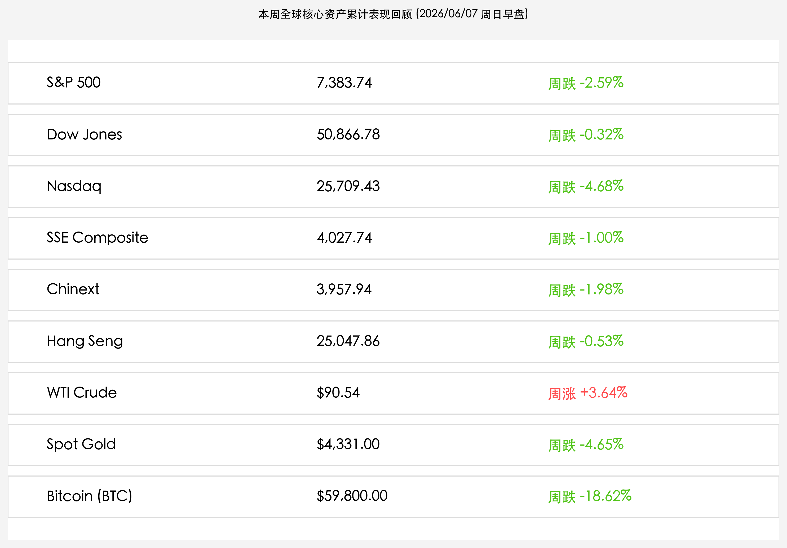

# 全球市场周报（周日晨版）：非农风暴肆虐全球，比特币信仰开裂，A股天量换手与算力新星的星辰大海

**日期：2026年06月07日 (星期日)** &nbsp; **时段：早报 (周末复盘模式)**

> **核心摘要**：本周全球资本市场遭遇非农“爆表”数据带来的估值海啸。美国5月非农就业达17.2万人彻底锁死降息窗口，10年期美债收益率狂飙至4.55%引发费城半导体单日大跌超10%的踩踏风暴；加密资产核心MicroStrategy四年首度“售币”令信仰大厦崩塌，比特币全周暴跌逾18%击穿6万美元关口。国内A股经历3.1万亿元天量筹码的高低切换，在证监会强化程序化交易和公募基金监管的紧箍咒下震荡蓄势，而SpaceX即将于6月12日IPO与谷歌签署300亿美元协议等消息，正持续为硬科技与新质生产力注入结构性信心。

## 核心资产周度/日度表现回顾

本周（06月01日-06月05日）全球主要资产呈现严重的流动性挤压，高估值半导体科技股、黄金及加密市场跌幅惨烈，而原油受中东海峡博弈小幅上涨。A股与港股在天量换手中体现出较强的红利防守属性。

*   **道琼斯工业指数 (Dow Jones)**：周五收报 **50,866.78点**，全周累计下跌 **-0.32%**，表现出较强的蓝筹防御能力。
*   **标普 500 指数 (S&P 500)**：周五收报 **7,383.74点**，全周累计下跌 **-2.59%**，高估值权重回调拉低中枢。
*   **纳斯达克综合指数 (Nasdaq)**：周五收报 **25,709.43点**，全周累计大跌 **-4.68%**，科技股分母端重压导致明显失血。
*   **上证指数 (SSE Composite)**：周五收报 **4,027.74点**，全周累计下跌 **-1.00%**，于4000点整数关口进行筹码沉淀。
*   **创业板指 (Chinext)**：周五收报 **3,957.94点**，全周累计下跌 **-1.98%**，前期拥挤的科技算力成长股主力资金显著回吐。
*   **恒生指数 (Hang Seng)**：周五收报 **25,047.86点**，全周累计微跌 **-0.53%**，展示出极其强大的2.5万点承接底座。
*   **WTI原油 (WTI Crude)**：周五收报 **$90.54/桶**，全周累计上涨 **+3.64%**，多空双方在霍尔木兹海峡重开博弈下反复震荡。
*   **现货黄金 (Spot Gold)**：周五收报 **$4,331.00/盎司**，全周累计大跌 **-4.65%**，受高美债实际收益率压制，避险属性弱化。
*   **比特币 (Bitcoin)**：周五收报 **$59,800.00/枚**，全周累计暴跌 **-18.62%**，跌破6万美元大关并跌回前期支撑区间。

## 过去 48 小时重磅事件深度复盘

> **1. 美国“爆表”非农引爆加息定价，费城半导体单日大跌10%创纪录**
> 
> 美国5月新增非农就业人数达17.2万人，大大超出市场预期，且前值大幅上修，打消了市场的降息幻想。十年期美债利率狂飙至4.55%，无风险利率急拉直接对科技巨头进行估值“分母端绞杀”。在英伟达领衔回调的背景下，费城半导体指数单日暴跌超过10%，创下自2020年3月以来的最惨烈单日表现，凸显出当前位置美债利率对高估值科技股的极限施压。

> **2. 比特币跌破6万美元大关，MicroStrategy售币引发共识信仰松动**
> 
> 加密世界遭遇四年多来最大的共识冲击。持有海量比特币的迈克尔·塞勒（Michael Saylor）旗下的MicroStrategy向SEC提交的文件显示，其近期进行了近四年来的首次“售币”操作。这一举措不仅打破了其宣扬的“只买不卖”信仰，也在加密市场流动性紧绷之际点燃了多头踩踏。伴随高利率美元的挤压，比特币在48小时内断崖式下行，失守60,000美元大关，录得全周超18%的惨痛跌幅。

> **3. 证监会强化程序化交易与公募基金监管，3.1万亿大换手蓄力后市**
> 
> 国内A股经历周五的极端“大分化”。证监会主席吴清最新表态明确，将持续完善程序化交易（量化交易）监管机制，打击市场操纵，并大力整顿公募基金相关的行业乱象。在这一强监管预期与外围非农飓风的双重夹击下，前期拥挤的AI、CPO等高位主线遭遇集中出清。但两市高达3.07万亿元的巨量成交表明，恐慌之后承接盘力量同样惊人，低估值的顺周期有色及红利防御表现亮眼。此外，SpaceX计划于6月12日在纳斯达克IPO（估值达1.8万亿美元）且与谷歌签署300亿美元协议的消息，亦极大地稳定了全球高端智造和算力基建的长期逻辑。

## 下周全球宏观大事预警

1.  **中国5月CPI与PPI数据 (06/10)**：将公布最新物价与工业生产指数，是反映国内经济内生增长动能和工业出清程度的先行指引。
2.  **美联储6月利率决议 (FOMC) (06/11)**：凯文·沃什执掌美联储后的首次大考。在非农就业极强表现后，联储最新的经济预测、点阵图以及对长期通胀目标的表述将决定全球下半年的资产定价权。
3.  **SpaceX 6月12日正式挂牌上市 (06/12)**：估值近1.8万亿美元的商业航天巨头将登陆纳斯达克，其首日表现及巨额融资动向将彻底改写全球高端制造、卫星通信领域的估值体系。

## 顶级机构周末策略内参摘要

*   **中信证券 (CITIC Securities)**：**“构筑‘AI+能化’的杠铃组合，科技短期阵痛后仍是中期超配核心”**。由于美债利率冲高（4.55%），高估值科技主线短期迎来出清，这是不可避免的阵痛，但硬核半导体设备和低估值互联网依然是核心。布局思路应采用一边配置AI/具身智能设备，一边配置红利及顺周期能化板块的“新杠铃结构”。
*   **中金公司 (CICC)**：**“把握中国资产长期配置价值重估，规模经济为产业主轴”**。当前中国资产不仅具有短期跌深修复的性价比，更在步入长期价值重估过程。通过在新能源、高端制造和AI等规模经济优势上的政策协同，中国股市有望形成“有底无顶”的转型慢牛。
*   **海通证券 (Haitong Securities)**：**“转型慢牛长牛格局形成，侧重成长优势制造”**。无风险利率和企业风险贴现率系统性降低，正催生中国股市的历史性转型牛。建议超配通信设备、集成电路等新兴科技，以及新能源车、创新药等全球化优势制造龙头。
*   **申万宏源 (Shenyinhanguan)**：**“蓄力再突破，在顺周期出清中挖掘‘反内卷’先锋”**。科技内部轮动明显加快，注意交易拥挤和调仓风暴。本轮行情的进一步推展需要看到盈利端及宽信用信号的验证，配置上建议挖掘能成功出海或“反内卷”成功、实现利润改善的顺周期先锋。

## 今日市场情绪：数字麒麟的防线与星舰的征途

今日市场情绪在急促的非农电暴与比特币霓虹广告牌开裂中，呈现出攻守异位的冷峻美感。在由红色非农趋势闪电撕裂的夜空下，由中国核心算力与监管重塑所铸就的“数字麒麟”矗立于绿色的电路结界之中，散发着防御与防守的光芒，静静注视着跌落6万大关的比特币石碑所碎裂成的数字粉尘。而在风暴深处，一枚代表着SpaceX商业航天的星舰正伴随着亮白的光焰直刺星空，预示着即便全球流动性退潮，新质生产力的征途依然不可阻挡。

> Prompt: A majestic Qilin made of glowing green circuit boards and silicon chips, standing on a digital plateau. Around it, dramatic storm clouds with red neon lightning bolts shaped like downward stock trend lines, striking a massive, crumbling stone obelisk carved with the Bitcoin symbol. In the distance, a futuristic Starship rocket ascends into the deep cosmos leaving a brilliant trail of light. No humans.

---

免责声明：内容仅供参考，不构成投资建议。
