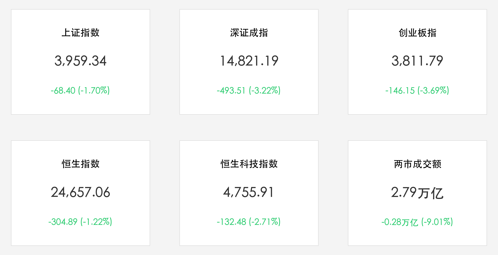

# A股放量重挫沪指失守4000点：两市成交2.79万亿，非农飓风与地缘阴云双击，机器人概念逆势活跃

**日期：2026年06月08日 (星期一)** &nbsp; **时段：下午 (常规交易日复盘)**

> **核心摘要**：今日A股与港股主要指数全线深幅调整。在上周五美股科技股暴跌、韩国股市熔断等全球风险偏好降温的共振下，加之美非农数据超预期引发的加息忧虑及中东地缘冲突风险升级，沪深两市全天呈现跳空低开、震荡下挫态势，沪指失守4000点整数关口。虽然全市场超4900只个股收跌，但在华为云具身智能等持续催化下，机器人与物理AI概念板块仍获得主力资金净流入并逆市爆发，两市全天成交额达2.79万亿元，呈现缩量调整。

## 核心行情复盘

今日A股与港股主要指数全线收跌，两市成交量出现明显缩量整理，市场内部避险情绪显著升温：

*   **A股主要指数集体收跌**：上证指数收盘报 **3,959.34点**，跌幅为 **1.70%**；深证成指收盘报 **14,821.19点**，跌幅为 **3.22%**；创业板指收盘报 **3,811.79点**，跌幅达 **3.69%**。
*   **港股市场同步走弱**：恒生指数收盘报 **24,657.06点**，较前一交易日下跌 **304.89点**（跌幅 **1.22%**）；恒生科技指数收盘报 **4,755.91点**，下跌 **132.48点**（跌幅 **2.71%**）。
*   **成交额较前一日缩量**：沪深两市合计成交额达 **2.79万亿元**（约27,927.38亿元），较前一个交易日缩量约 **2,765亿元**（-9.01%），呈现大跌缩量的防御态势。
*   **个股呈现普跌格局**：全市场上涨个股仅约 **900只**，下跌个股约 **4900只**，亏钱效应显著。
*   **行业板块剧烈分化**：
    *   **领涨主线（机器人与物理AI）**：**机器人及物理AI板块** 逆势爆发，中大力德、机器人等多股表现活跃或涨停，主要受机器人早盘吸金及具身智能长线催化；电力等公用事业防守板块相对抗跌。
    *   **领跌板块（高位科技与有色）**：**算力硬件、CPO概念、半导体芯片及有色金属板块** 跌幅居前，主要受上周五美股科技股大跌及前期获利盘回吐冲击。

## 核心解读与市场逻辑

> **非农“飓风”与地缘阴云：全球流动性与风险偏好双重重挫**
> 
> 本次A股与港股的大幅调整是典型的外部共振与技术性修复叠加。一方面，美国5月非农数据强劲超预期，导致美联储再次加息的阴霾复燃，美债收益率攀升，对全球科技与高估值成长资产形成直接估值压制；另一方面，中东局势的骤然紧张，使得避险情绪充斥市场，全球资金加速向安全资产腾挪。全球半导体板块的上周大跌更是直接拖累了国内AI算力等热门赛道，导致前期拥挤度过高的硬件、光模块等科技主线放量回吐筹码，拖累创业板与深成指大幅下杀。

> **“缩量整理”与“机器人独秀”：防守中有序换手的韧性**
> 
> 尽管大盘指数今日回撤幅度较大，但两市成交额依然维持在2.79万亿元的极高水平，且较前一日缩量，显示出盘面并非盲目恐慌杀跌，而是多头资金主动防御和高位筹码出清的表现。在AI算力大跌时，机器人板块及物理AI板块的逆市吸金，反映了资金仍在积极寻找景气度高、交易拥挤度低的替代性承载方向。这种大盘大跌下机器人板块的爆发，进一步证明了市场仍属于结构性“牛市中场”的休整与均衡重塑，而非系统性行情的结束。

## 政策脉动

*   **宏观流动性环境稳定**：尽管外部美债利率回升带来汇率与流动性压力，但央行近期持续释放中期流动性并推出稳市场举措，保证国内银行体系流动性整体合理充裕，防止了市场因外部冲击演化为无序踩踏。
*   **严惩违规与净化交易环境**：监管层继续贯彻落实公平交易原则，规范日内高频博弈与跑通道行为，引导市场投资逻辑回归基本面与长期景气，为后续大盘企稳构筑了坚实的制度防火墙。

## 最新机构观点

*   **中信证券**：**“外部冲击引发获利盘出清，科技景气主线机遇大于风险”**。中信证券认为，今日大跌主要是美非农数据与地缘风险引发的短期防御操作，AI算力等高位成长板块出现筹码松动，但产业基本面依然确定。若流动性冲击导致核心资产估值回调，带来的将是更好的建仓机遇，建议在控制波动的背景下继续关注具身智能、AI算力以及部分估值合理的非AI景气赛道。
*   **中金公司**：**“结构均衡再平衡，科技主线大趋势未动摇”**。中金公司指出，国际局势的复杂化与科技创新是当前市场的核心底色。虽然短期高位科技板块存在调整需求，但经历去泡沫后的科技龙头依然是长期的核心配置对象。短期建议采用“科技轮动+红利防守”的均衡配置，静待大盘止跌企稳。

## 今日市场情绪：红石棋局与数字星河的博弈

在今日汹涌的暴跌狂澜中，全球资本与地缘的博弈化为一幅幽深的超现实主义画卷。两尊巍峨的石巨人沉默地端坐在黑暗无垠的太空中，于一张闪耀着微光的星空棋盘上展开了冰冷而惨烈的经济对决。石巨人的手指拂过，将代表地缘危机的燃烧油桶与代表市场大跌的红色K线水晶棋子重重扣下，砸碎了往日由科技堆砌的虚幻繁荣，化为漫天飞舞的深色代码灰烬。然而，在浩瀚的背景里，一抹由绿色代码织就的螺旋星系依然在缓缓旋转，顽强地投射出属于硬科技与智能底座的未来曙光。在这盘石巨人的红石棋局中，虽然指数失守，但创新的火种与新秩序的博弈依然在幽深的时空中不断孕育。

> Prompt: Surrealism style, Two colossal stone giants playing chess on a glowing celestial board floating in a dark cosmic void. Instead of chess pieces, they use burning oil barrels and jagged red glowing crystals that resemble downward market candlesticks. In the background, a massive spiral galaxy of green code and digital dust slowly spins under a stormy sky. No human visible., masterpiece, high detail, intricate composition, cinematic lighting, 8k resolution

---

免责声明：内容仅供参考，不构成投资建议。
