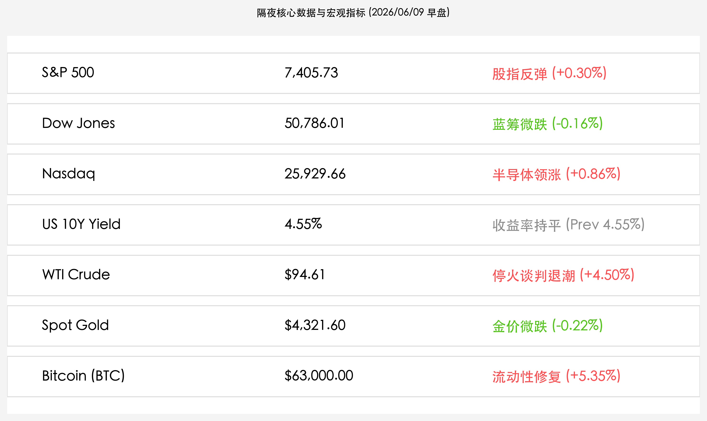

# 隔夜美股报复性反弹：费城半导体狂飙5.6%，中东停火预期拉低油价，纳指收涨近1%

**日期：2026年06月09日 (星期二)** &nbsp; **时段：上午 (常规交易日复盘)**

> **核心摘要**：隔夜全球市场迎来报复性反弹，科技与芯片股领衔修复。受中东局势降温、美伊停火谈判出现转机等和平红利提振，市场风险偏好迅速回暖，费城半导体指数狂飙5.6%，带动纳指收涨近1%；美债收益率持平于4.55%高位。大宗商品方面，避险情绪退潮促使金价微跌，原油在冲高后也有所回落。此外，比特币在大跌后强劲反弹，重回6.3万美元上方。

## 核心行情复盘

隔夜全球金融市场在经历上周惨烈抛售之后迎来强劲反弹，以芯片股为代表的高估值核心科技资产领涨市场修复：

*   **美股三大指数集体反弹**：标普 500 指数收涨 **21.99点**，报 **7,405.73点**（+0.30%）；纳斯达克综合指数上涨 **220.23点**，报 **25,929.66点**（+0.86%）；道琼斯工业平均指数微跌 **80.77点**，报 **50,786.01点**（-0.16%）。费城半导体指数（SOX）大涨 **5.6%**。
*   **美债收益率高位企稳**：10 年期美债收益率持平于 **4.55%**。尽管强劲非农引发的高利率预期仍在，但短期内恐慌情绪已有所钝化。
*   **大宗商品高位震荡**：受地缘局势缓和影响，WTI 原油收报 **$94.61/桶**（上涨+4.50%），布伦特原油收报 **$97.15/桶**（上涨+4.36%），油价在盘中一度逼近$98关口后受特朗普停火表态提振震荡回落；现货黄金录得微跌 **0.22%**，收报 **$4,321.60/盎司**。
*   **加密市场流动性修复**：比特币在经历了上周末的暴跌后，日内强劲反弹 **5.35%**，重新站上 **$63,000.00/枚** 关口。
*   **科技与芯片龙头强势修复**：
    *   **Marvell (MRVL)**：因将被纳入标普 500 指数的消息刺激，股价暴涨约 **9.3%**。
    *   **Intel**：有报道称谷歌已向其下单大批TPU订单，刺激股价大涨 **11.2%**。
    *   **Apple**：尽管发布了Siri的重大AI升级，股价仍逆势下跌 **1.9%**。

## 核心解读与市场逻辑

> **芯片领军科技反扑，“买入超跌”情绪点燃美股修复行情**
> 
> 在经历了上周非农爆表引发的惨烈杀跌后，周一美股市场呈现出极强的“超跌反弹”特征。尤其是费城半导体指数大涨5.6%，彻底扭转了此前的悲观情绪。英特尔大涨11.2%以及Marvell暴涨超9%成为领头羊，反映出资金在调整后依然对AI与硬科技的中长线景气度具有极高共识。虽然美债收益率依然维持在4.55%的高位，限制了估值分母端的扩张，但分子端硬科技的订单催化与被动建仓资金入场，依然推动纳指和标普走出一波强势反攻。

> **地缘政治谈判曙光，油价冲高回落与大宗商品震荡**
> 
> 地缘政治变局成为周一市场情绪改善的另一核心催化剂。虽然中东局势紧张一度推动布伦特原油冲向98美元大关，但随后伊朗与以色列罢兵的消息，以及美国当选总统特朗普关于停火的强力发声，令地缘溢价迅速挤出，油价震荡回落。和平红利的释放直接改善了市场的风险偏好，促使避险黄金微跌，而风险资产的代表——比特币则在跌破6万美元后获得流动性大举回流，飙升超5%，表明全球流动性恐慌在首个交易日得到了实质性缓解。

## 政策脉动

*   **中美停火呼声与地缘局势降温**：美国当选总统特朗普公开呼吁中东各方立即停火，伊朗和以色列在交火后表现出克制，这有效消解了原油可能被长期封锁的悲观预期，原油与贵金属中的地缘风险溢价开始挤出。
*   **联储鹰派预期钝化**：虽然非农爆表促使加息论调重返视野，但市场在暴跌后开始逐步消化高利率常态化的预期。本周即将公布的CPI和PPI数据将是决定联储后续利率走向的真正核心，在此之前市场选择以超跌反弹为交易主线。

## 最新机构观点

*   **高盛**：**“硬科技的订单增长证明AI周期仍在加速，利率虽高但盈利能对冲分母端压力”**。高盛指出，谷歌对英特尔的TPU大单等事实证明，科技巨头的资本开支仍在真金白银地落地。虽然4.55%的美债收益率对二线成长股构成了巨大的估值天花板，但对于拥有订单和高盈利能力的半导体与硬件龙头，基本面能够有效支撑其股价在回调后继续创新高。
*   **摩根大通**：**“地缘政治的缓和为市场提供了宝贵的喘息期，但在通胀数据落地前应保持战术克制”**。小摩分析师强调，中东和平曙光让油价的恶性通胀隐忧得到缓解，但这并不意味着通胀威胁完全解除。如果本周晚些时候公布的美国CPI数据继续超预期，美债利率可能会冲向4.65%，因此现阶段反弹应被视为超跌修复，不宜盲目加仓。
*   **中金公司**：**“外围科技反弹有助于稳定A股情绪，国内机器人与硬科技主线将迎共振”**。中金公司认为，美股芯片股与科技龙头的报复性反弹，将极大地缓解周一A股科技板块因外围拖累而产生的恐慌情绪。预计A股中具有产业独立周期的机器人、具身智能及半导体设备板块，将在今日迎来明显的超跌反弹和估值共振。

## 今日市场情绪：火山岩上的硅凰与绿枝

今日市场情绪在报复性反弹与停火曙光的双重催化下迎来了凤凰涅槃般的洗礼。在一片由上周非农风暴肆虐后留下的焦黑、冷却的火山口上，一只由古雅红铜与微光翠绿电路板交织而成的机械凤凰展翅长鸣，它的每一次羽翼扇动都洒下点点耀眼的绿色光斑。火山上空的灰烬正在缓缓消散，一枝散发着柔和绿光的数字橄榄枝在半空中静静漂浮，驱散了往日沉重而暴烈的地缘阴霾。在火山群的背景深处，数道粗壮的绿色激光代码从冰冷的岩石裂隙中直冲云霄，划破了阴沉的夜幕，投射出数字时代无可阻挡的复苏与生机。这幅充满科技隐喻的超现实画卷，生动勾勒出了在停火红利与硬科技双轮驱动下，全球风险偏好再度被点燃的壮丽图景。

> Prompt: Surrealism style, A glowing mechanical phoenix made of polished copper and green circuitry rises from a cooling, cracked volcanic crater. The volcanic ash is settling, and a glowing green olive branch floats gently in the air. In the background, vertical beams of green laser code shoot up from the volcano into a clearing dark sky. No humans visible., masterpiece, high detail, intricate composition, cinematic lighting, 8k resolution

---

免责声明：内容仅供参考，不构成投资建议。
