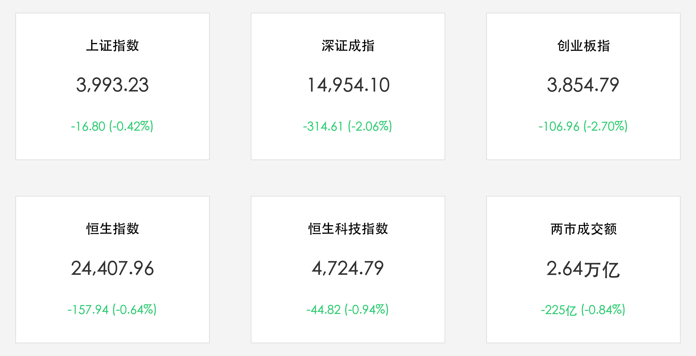

# A股震荡调整沪指失守4000点：半导体材料逆市活跃，大金融稳健护盘，市场静待美通胀大考

**日期：2026年06月10日 (星期三)** &nbsp; **时段：下午 (常规交易日复盘)**

> **核心摘要**：今日A股与港股主要指数震荡收跌，沪指收盘失守4000点整数关口。受隔夜美股科技股大跌映射以及海外地缘局势反复、美通胀数据公布前资金防御性撤离等多重因素冲击，创业板指跌幅达2.70%。尽管全市场个股呈现普跌，但大金融板块稳健护盘，半导体材料及体育啤酒等大消费概念逆市活跃，两市成交额达2.64万亿元，较前一日小幅缩量，多空博弈静待今晚美CPI数据落地。

## 核心行情复盘

今日A股与港股主要指数全线收跌，两市成交量出现小幅缩量整理，市场内部避险与防守情绪显著：

*   **A股主要指数集体收跌**：上证指数收盘报 **3,993.23点**，跌幅为 **0.42%**（跌16.80点）；深证成指收盘报 **14,954.10点**，跌幅为 **2.06%**（跌314.61点）；创业板指收盘报 **3,854.79点**，跌幅达 **2.70%**（跌106.96点）。
*   **港股市场同步走弱**：恒生指数收盘报 **24,407.96点**，较前一交易日下跌 **157.94点**（跌幅 **0.64%**）；恒生科技指数收盘报 **4,724.79点**，下跌 **44.82点**（跌幅 **0.94%**）。
*   **成交额较前一日微幅缩量**：沪深两市合计成交额达 **2.64万亿元**（约26,444亿元），较前一个交易日缩量约 **225亿元**（-0.84%），资金在高位呈现观望防御态势。
*   **个股呈现普跌格局**：全市场上涨个股约 **1200只**，下跌个股超 **3800只**，局部亏钱效应较强。
*   **行业板块剧烈分化**：
    *   **领涨主线（半导体材料与大金融）**：**半导体材料板块** 表现突出，电子特气、封装材料等细分方向领涨；**大金融板块**（银行、保险）逆市走强，扮演重要护盘角色；大消费（体育概念、啤酒股）因2026年世界杯临近预期催化表现活跃。
    *   **领跌板块（高位科技与传统资源）**：**液冷服务器、数据中心电源、通信设备（CPO等）** 跌幅居前，主要受隔夜美股科技股回调及出货预期调整的映射冲击；煤炭、电力设备及机械设备等板块亦出现较大幅度调整。

## 核心解读与市场逻辑

> **美通胀大考与地缘反复：全球资金进入防守态势**
> 
> 本次A股与港股的震荡回调，核心原因在于全球市场在重磅宏观数据公布前的防御性避险。今晚美国5月CPI数据和明晚的PPI数据将是美联储后续货币政策走向的真正分水岭。在强劲非农数据公布后，市场已对美联储的加息预期有所升温，加之中东地缘局势的偶有反复，避险情绪导致全球资金向低风险和防御性资产腾挪。隔夜美股科技板块（尤其是高位芯片与光通讯）的回调对国内AI算力等热门赛道形成了估值挤压，导致前期拥挤度过高的硬件与通信设备板块回吐筹码。

> **结构性轮动与大金融护盘：缩量休整尽显市场韧性**
> 
> 尽管大盘指数今日回撤，尤其是深成指与创业板指跌幅明显，但两市成交额依然维持在2.64万亿元的极高水平，且较前一日仅微幅缩量，显示出市场并非盲目恐慌踩踏。大盘下跌过程中，银行、保险等大金融板块逆市护盘，同时半导体材料等细分领域展现出极强的国产替代和产业自主逻辑。这种在科技大跌时大金融护盘、细分材料活跃的景象，印证了市场目前仍处于“结构性牛市中场”的休整与再平衡阶段，通过板块良性轮动实现筹码的充分交换。

## 政策脉动

*   **战略新兴产业与人才布局持续推进**：近期央国企密集发布战略性新兴产业人才招聘与升级计划，政策对新质生产力（如机器人、人工智能、大数据等）的政策与资金扶持力度只增不减。
*   **半导体材料及关键产业链自主可控**：监管和产业引导部门继续加大对半导体设备、核心特种气体及封装材料等基础领域的支持力度，国产替代的战略窗口期正加速转化为企业订单，为高科技板块构筑长期基本面底座。

## 最新机构观点

*   **中信证券**：**“科技板块短期面临分化整理，MLCC及核心元器件仍具长线配置价值”**。中信证券认为，当前电网投资等部分板块估值已有所透支，建议逢高优化持仓。在科技领域，MLCC等核心元器件受益于AI服务器与新能源汽车的强劲拉动，正处于景气上行周期，科技股的回调是分批低吸优质硬科技资产的良机。
*   **中金公司**：**“宏观流动性主导全球胜负手，建议哑铃型策略均衡配置”**。中金公司指出，当前A股整体盈利改善但结构分化明显，受避险情绪影响，高股息资产（如银行、红利低波）具备极高的防御属性。策略上建议采用“科技成长+高股息红利”的杠铃策略，以应对宏观经济数据发布前后的市场波动。

## 今日市场情绪：石门微光与数据之流

在今日多空博弈的大潮中，全球资本对美通胀数据的焦虑化为一幅幽深的超现实主义画卷。一扇刻满绿色发光电路板与数字符文的宏伟石门矗立在冰冷、黑暗的太空深处，象征着半导体材料与硬科技自主的坚实护盘。石门后方，一尊由青铜与黄铜精雕细琢而成的巨型齿轮时钟静静悬浮，指针指向即将到来的重磅数据节点，散发着时间的沉重重力。从时钟底部奔流而出的数据浪潮与数字货币化作两条激流：一条泛着红光的激流（科技股高位获利抛售）与一条泛着绿光的激流（大金融与防御性红利资产）在大门两侧剧烈冲刷。在这场石门前的数据对决中，虽然主要指数全线收跌，但那扇象征着硬科技自主的石门依旧在光影斑驳的余晖中岿然不动，静待着天平重新平衡的曙光。

> Prompt: Surrealism style, A colossal stone gate covered in glowing green circuitry and digital runes standing in a dark cosmic void. Behind the gate, a massive golden clock representing a countdown looms under a stormy sky of red and green digital dust. A river of digital codes and coins flows from the clock, splitting into a glowing red stream and a glowing green stream. No humans visible., masterpiece, high detail, intricate composition, cinematic lighting, 8k resolution

---

免责声明：内容仅供参考，不构成投资建议。
