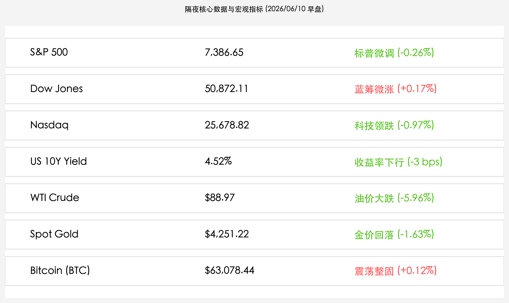

# 隔夜美股分化整理：科技与AI股高位获利回吐，油价暴跌中东溢价消退，市场屏息静待今日CPI

**日期：2026年06月10日 (星期三)** &nbsp; **时段：上午 (常规交易日复盘)**

> **核心摘要**：隔夜全球市场呈现“分化整理”特征，科技与芯片龙头面临高位获利回吐，纳指收跌近1%，而道指在尾盘拉升下微涨。随着中东局势的缓和与停火谈判推进，原油价格暴跌近6%，极大缓解了短期地缘通胀隐忧。同时，全球投资者正在屏息等待本周三（今日）和周四即将公布的5月CPI和PPI重磅通胀数据。

## 核心行情复盘

隔夜全球金融市场在经历周一的反弹后转入分化调整，前期涨幅较大的芯片与AI科技板块迎来集中获利了结，而能源与大宗商品则因地缘局势降温录得重挫：

*   **美股三大指数涨跌互现**：标普 500 指数收跌 **19.08点**，报 **7,386.65点**（-0.26%）；纳斯达克综合指数大跌 **250.84点**，报 **25,678.82点**（-0.97%）；道琼斯工业平均指数收涨 **86.10点**，报 **50,872.11点**（+0.17%）。
*   **美债收益率小幅下行**：10 年期美债收益率收跌 **3个基点**，报 **4.52%**，主要受原油暴跌及美债避险买盘推动。
*   **大宗商品大幅回调**：WTI 原油价格大跌 **-5.96%**（日内下跌约2.55%），收报 **$88.97/桶**，跌破$90关口；现货黄金收跌 **1.63%**，报 **$4,251.22/盎司**，显示避险资金有所撤离。
*   **加密市场震荡整固**：比特币在经历了周一的强反弹后，日内围绕 **$63,000.00** 关口窄幅盘整，最终微涨 **+0.12%**，收报 **$63,078.44/枚**。
*   **科技巨头与芯片股承压**：
    *   **Apple (苹果)**：大跌约 **4.0%**，市场对Siri智能升级的后续销量提振和AI变现节奏仍抱有疑虑。
    *   **芯片龙头**：Broadcom、Micron 及 AMD 等前期累计涨幅巨大的半导体龙头表现不佳，跌幅明显。

## 核心解读与市场逻辑

> **重要通胀数据公布前夕，高估值科技板块迎来防御性抛售**
> 
> 在本周三（今日）关键的5月CPI数据和周四的PPI数据发布前，市场风险偏好明显收敛。由于近期非农爆表提升了美联储长期维持高利率的预期，美债收益率依然盘踞在4.5%上方。在分母端承压的背景下，投资者对博通、美光等芯片股及苹果等高估值龙头展开了防御性的获利了结。苹果大跌4%反映出，缺乏强力基本面爆点支持时，高昂的估值溢价在宏观数据大考前显得极为脆弱。

> **地缘冲突溢价快速挤出，原油与黄金双双大跌**
> 
> 地缘政治谈判的推进成为隔夜大宗商品暴跌的主因。尽管有报道提及美伊之间的零星军事接触，但伊朗与以色列的缓和表态以及停火协议的推进使市场确信“最坏的供应中断期已经过去”。WTI原油大跌近6%回落至$89附近，黄金同样录得1.63%的跌幅。通胀分项中能源成本压力的骤减，在客观上为美股提供了底盘支撑，使得道指能够逆势收涨。

## 政策脉动

*   **美国5月通胀数据大考临近**：今日晚间将公布的CPI数据将直接定调美联储7月的利率决议。目前市场预期核心CPI将保持粘性。若数据超预期走高，美债收益率恐将再次挑战4.65%高位。
*   **中东停火预期再起**：地缘政治各方释放出更明确的停火信号，原油与黄金的地缘溢价持续挤出，全球能源和商品供应链紧张态势得到实质性缓解。

## 最新机构观点

*   **摩根大通**：**“科技板块的抛售是典型的宏观避险行为，CPI发布前建议增持价值与防御性资产”**。小摩分析师指出，在核心CPI面临粘性挑战的当下，纳指面临的多头回吐风险尚未完全释放，道指成分股中的价值龙头在原油下跌降低成本的背景下更具防御吸引力。
*   **高盛**：**“原油暴跌降低了通胀尾部风险，科技股的回调反而为长期配置提供了良机”**。高盛维持对硬科技及AI芯片的中期看好态度，认为目前原油下跌改善了未来的通胀前景，科技股回调在估值消化后将重新吸引长期资金入场。
*   **中金公司**：**“外围科技回调或压制A股成长股表现，国内市场将延续高股息防御主线”**。中金公司认为，美股芯片与大厂的获利回吐将制约A股AI及半导体板块的反弹空间，在美通胀数据明朗前，资金将继续向电力、煤炭等低估值高分红红利资产抱团。

## 今日市场情绪：硅海波涛与重力时计

今日市场情绪在宏观通胀数据的压顶之下显得深沉而充满戒备。在深邃的数码硅海中，电路板组成的波涛翻卷着，前期闪耀的绿色微芯片和发光硅片正缓缓沉向泛着冷光的深海，表现出高位资金的谨慎回撤。海面之上，一个由青铜与黄铜精雕细琢而成的巨大齿轮时钟在半空中静静悬浮，指针指向即将到来的重磅数据节点，散发着时间的沉重重力。在波涛的缝隙间，几只残破的黑色油桶正无声地破裂，里面倾泻而出的并非粘稠的石油，而是耀眼的金色流沙，在深色水面上画出一条条趋于缓和的弧线。在天际的远方，一杆宏伟的巨型天平在稀薄的云层中若隐若现，其两端在金色的余晖中逐渐趋于平衡，预示着在地缘降温与通胀大考的博弈下，市场正在竭力寻找新的平衡。

> Prompt: Surrealism style, A colossal golden clock floating above a stormy digital silicon ocean. The waves of the ocean are composed of glowing circuit boards and sinking green microchips. Cracked black oil barrels float on the water, slowly leaking golden sand instead of oil. In the background, a massive glowing scale of justice balances in a clearing sky. No humans visible., masterpiece, high detail, intricate composition, cinematic lighting, 8k resolution

---

免责声明：内容仅供参考，不构成投资建议。
