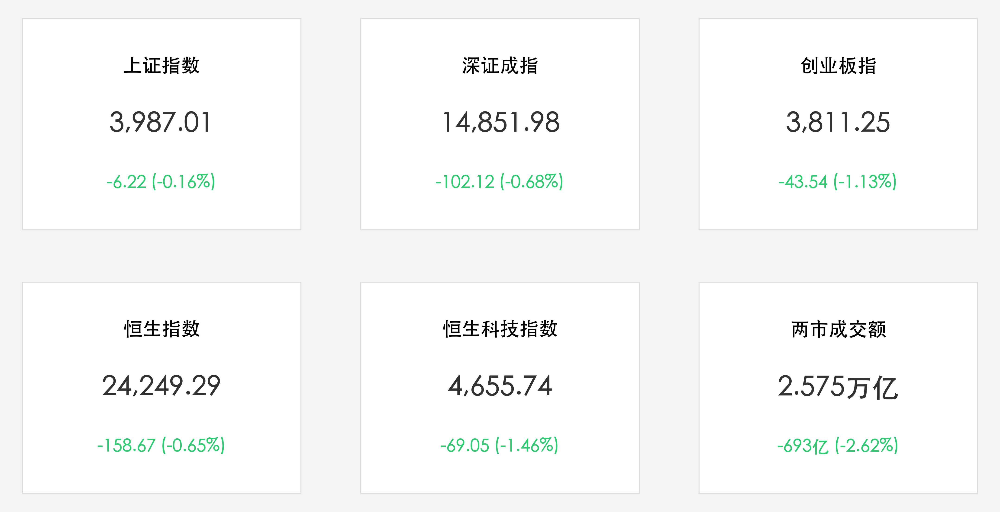

# A股震荡整理沪深失守：成交额微缩至2.57万亿，工信部“AI+信息通信”新规重磅出炉，电子化学品与小金属逆市狂飙

**日期：2026年06月11日 (星期四)** &nbsp; **时段：下午 (常规交易日复盘)**

> **核心摘要**：今日A股与港股主要指数呈震荡调整走势，沪指及创业板指集体收跌，市场情绪偏向谨慎。受隔夜美股因美CPI新高遭遇双击重挫的溢出效应影响，港股恒生指数跌0.65%，恒生科技指数跌1.46%。在避险情绪升温、两市成交额小幅回落至2.575万亿元 the背景下，工信部最新发布的“AI+信息通信”创新发展意见以及即将实施的战略性矿产资源法实施条例成为多头催化剂，电子化学品、小金属及半导体设备板块逆市爆发，展现出极强的产业自主可控与国产替代逻辑。

## 核心行情复盘

今日A股与港股主要指数全线收跌，两市成交量出现小幅缩量整理，市场内部避险与防守情绪显著：

*   **A股主要指数集体收跌**：上证指数收盘报 **3,987.01点**，跌幅为 **0.16%**（跌6.22点）；深证成指收盘报 **14,851.98点**，跌幅为 **0.68%**（跌102.12点）；创业板指收盘报 **3,811.25点**，跌幅达 **1.13%**（跌43.54点）。
*   **港股市场同步走弱**：恒生指数收盘报 **24,249.29点**，较前一交易日下跌 **158.67点**（跌幅 **0.65%**）；恒生科技指数收盘报 **4,655.74点**，下跌 **69.05点**（跌幅 **1.46%**）。
*   **成交额较前一日微幅缩量**：沪深两市合计成交额达 **2.575万亿元**（约25,751亿元），较前一个交易日缩量约 **693亿元**（-2.62%），资金在高位呈现观望防御态势。
*   **个股呈现普跌格局**：全市场共有超过4000只个股下跌，局部亏钱效应较强，但科技细分题材表现出较强韧性。
*   **行业板块剧烈分化**：
    *   **领涨主线（半导体材料、电子化学品与小金属）**：**电子化学品** 表现突出，濮阳惠成、兴福电子等录得 20cm 涨停，华特气体、中巨芯等涨幅显著；**小金属板块** 强势反弹，翔鹭钨业、章源钨业、金钼股份等多股涨停；**半导体设备及内存芯片** 龙头盘中表现活跃，澜起科技（688008.SH）午后回升，收盘涨幅超 5%。
    *   **领领跌板块（高位科技与传统资源）**：影视院线、机器人、传媒、软件及计算机等板块跌幅居前，主要受前期估值过高及短期抛盘影响。

## 核心解读与市场逻辑

> **美CPI新高与全球市场共震：科技成长遭遇海外估值压力**
> 
> 本次A股与港股的震荡回调，核心原因在于海外宏观数据的溢出冲击。隔夜美CPI创三年新高，彻底引爆市场对美联储紧缩政策时间延长的担忧，美股三大股指遭遇重挫。这种避险情绪直接传导至港股恒生科技指数，进而对A股高位科技成长板块构成了估值挤压。在宏观流动性承压、地缘局势偶有扰动的背景下，全市场成交额微缩至2.57万亿元，显示出多空资金在重磅博弈关口的防御与观望姿态。

> **双重政策利好激活国产替代：电子化学品与尖端材料展现韧性**
> 
> 尽管主要指数收跌，但市场并未出现系统性风险，反而展现出极强的结构性生命力。这主要得益于国内“数字智能+关键资源”的双轮政策驱动。工信部“AI+信息通信”三年行动方案出炉，加速了算力大通道与端侧AI落地的底层建设；而即将于6月15日施行的矿产资源法实施条例，进一步确立了战略性金属材料的安全保障。政策暖风直接点燃了电子化学品及小金属的重估行情，澜起科技等AI服务器核心标的的逆市拉升，表明资金正加速向具备基本面支撑和“硬科技自主可控”逻辑的行业细分龙头集聚。

## 政策脉动

*   **工信部推进“AI+信息通信”融合升级**：工业和信息化部印发《“人工智能+信息通信”创新发展实施意见（2026—2028年）》，明确到2028年构建“人工智能+信息通信”融合互促格局。意见要求加快算力大通道建设，优化枢纽智算网络，推动AI手机、AI电脑等智能终端的端侧大模型规模化落地，并实现城域算力1毫秒时延圈覆盖率不低于75%。
*   **国务院规范战略性矿产资源保障**：国务院印发新版《中华人民共和国矿产资源法实施条例》，自2026年6月15日起施行。条例细化了战略性矿产目录确定机制，鼓励全链条管控与优先招标出让探矿权。政策特别强调健全储备与应急体系，并鼓励利用AI及遥感等数字技术赋能智慧矿山，保障我国半导体、新能源等高端制造的物质安全。

## 最新机构观点

*   **中信证券**：**“关注半导体材料与电子化学品的国产替代加速突破与验证放量”**。中信证券认为，随着AI算力的高速演进及国内晶圆厂产能的持续扩张，大硅片、光刻胶、电子特气等关键电子化学品的市场需求进入景气上期。建议投资者警惕无实质支撑的概念炒作，逢低优化持仓，重点关注具备真实业绩、订单落地和产能释放的硬科技材料龙头。
*   **中金公司**：**“AI算力与全球能源转型深度重构小金属及能源金属估值体系”**。中金公司指出，战略性小金属（如钨、钼、锗等）在高端半导体和新型电池领域的关键地位正日益凸显。在全球宏观通胀担忧反复及地缘政治扰动下，建议投资者采取“高景气尖端材料+高股息防御资产”的杠铃策略，防范短期市场波动。

## 今日市场情绪：绿色晶木与暗潮涌动

在今日多空博弈的大潮中，全球资本的震荡化为一幅幽深的超现实主义画卷。一棵由翠绿晶体铸就的宏伟巨木矗立在太空般的深邃虚空中，其密布的枝桠宛如复杂的AI芯片网络与电子化学数据链，闪烁着代表科技力量的柔和绿光。晶木庞大的根系深深地扎入一块蕴含着各色闪耀金属矿石的古老基岩中，象征着战略性小金属资源为科技自主构建的坚实物质安全底座。天空中，一道璀璨的金色政策激光直射而下，穿透了暗淡的宇宙，将晶木照耀得熠熠生辉，并在枝头绽放出无数火花般的数字光芒。而在远景处，一片由暗红色K线波动构成的暴风雨海洋正发出沉闷的轰鸣，代表着海外市场的通胀风暴与调整压力。在这场海天交汇的画面里，绿色晶木牢牢扎根于矿石基岩上，任凭海浪翻滚，依然顽强生长，静待下一次破茧化蝶的晴空。

> Prompt: Surrealism style, A massive green crystal tree representing AI chip networks and electronic chemicals, its roots deep in a bedrock of glowing metallic ores representing strategic mineral resources. A golden laser beam shoots from the sky, illuminating the tree and causing it to blossom with sparkling data flowers. In the background, a dark turbulent sea of red financial K-line waves represents global market volatility. No humans visible., masterpiece, high detail, intricate composition, cinematic lighting, 8k resolution

---

免责声明：内容仅供参考，不构成投资建议。
