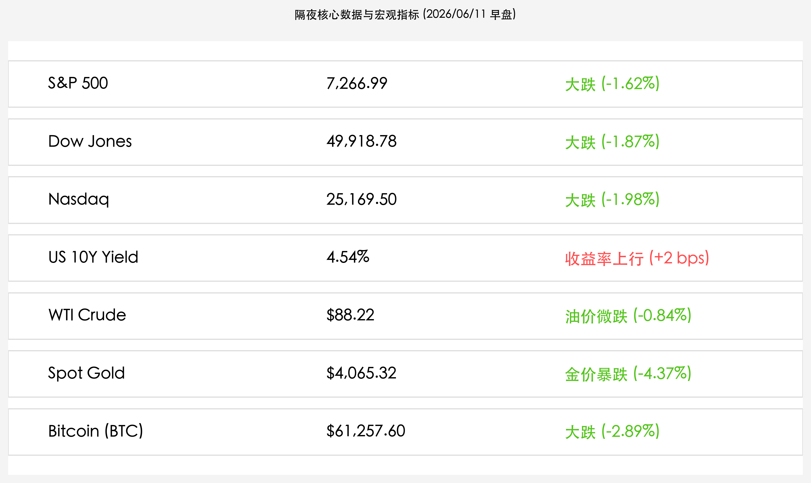

# 隔夜美股遭遇双击重挫：CPI创三年新高引发通胀大震荡，美伊局势剧烈升级，三大股指全线大跌

**日期：2026年06月11日 (星期四)** &nbsp; **时段：上午 (常规交易日复盘)**

> **核心摘要**：隔夜全球金融市场遭遇重创，美国5月CPI出乎意料加速至4.2%，创三年来新高，通胀压力再次重燃；与此同时，美军连续两天对伊朗境内实施空袭，中东地缘局势剧烈升级，地缘溢价与通胀双重警报拉响。美股三大股指应声大跌，纳指大跌近2%，科技与AI芯片股承压深重，黄金与比特币亦纷纷下挫，避险情绪全面席卷市场。

## 核心行情复盘

隔夜全球金融市场在超预期的通胀数据与中东军事冲突剧烈升级的双重打击下全线走低，高估值科技板块与数字货币跌幅惨烈：

*   **美股三大指数全线暴跌**：标普 500 指数收跌 **119.66点**，报 **7,266.99点**（-1.62%）；纳斯达克综合指数大跌 **509.32点**，报 **25,169.50点**（-1.98%）；道琼斯工业平均指数大跌 **953.33点**，报 **49,918.78点**（-1.87%）。
*   **美债收益率温和上行**：10 年期美债收益率收涨 **2个基点**（+2 bps），报 **4.54%**。尽管通胀数据爆表，但中东开火引发的避险买盘在一定程度上平抑了美债收益率的冲高空间。
*   **大宗商品剧烈震荡**：WTI 原油价格微跌 **-0.84%**，收报 **$88.22/桶**，尽管能源通胀压力高企，但高利率下经济衰退的担忧在盘中对油价形成制约；现货黄金大跌 **-4.37%**，报 **$4,065.32/盎司**，强美元预期及地缘溢价的资金踩踏导致金价发生暴跌。
*   **加密市场大举下挫**：比特币在避险抛售中大跌 **-2.89%**，跌破62,000美元关口，收报 **$61,257.60/枚**，市场多头防线出现裂痕。
*   **科技股与芯片巨头全线低迷**：
    *   **Nvidia (英伟达)**：收盘报 **$205.10**，在AI高估值压力下面临大举回撤。
    *   **Apple (苹果)**：收盘报 **$290.29**，销量提振疑虑犹存，股价持续走弱。
    *   **Broadcom (博通)**：收盘报 **$373.86**，科技龙头大盘普跌下亦随市回调。

## 核心解读与市场逻辑

> **CPI加速至4.2%爆表，能源冲击引发“通胀二次抬头”恐慌**
> 
> 美国5月CPI同比加速上行至4.2%（前值3.8%），不仅超越市场预期，也创下了三年以来的最高通胀记录。其中，受中东冲突影响，5月能源价格环比飙升3.9%，贡献了超过60%的月度整体涨幅。虽然剔除能源和食品后的核心CPI在2.9%附近表现出一定的抵抗力，但高昂的能源账单令市场彻底打消了美联储在下半年大幅降息的幻想。分母端无风险利率的持续高企，对纳斯达克及高估值AI芯片板块构成沉重压力。

> **美伊军事冲突持续升级，地缘避险与高利率担忧的“极限拉扯”**
> 
> 随着美国连续第二天对伊朗Bandar Abbas、Sirik等南部港口城市实施空袭，以报复美军Apache直升机被击落，长达两个月的停火期宣告破碎。在极端的战争恐慌中，资金并未向往常一样一味推高黄金和石油。相反，高昂的CPI通胀指标暗示着全球央行将把利率维持在“更高更久”的水平，美元的强势上涨反而对黄金构成了严重的流动性抽水，黄金价格大跌超4%，出现多头高位变现的踩踏现象。WTI原油在88美元附近维持震荡，高利率预期带来的经济衰退担忧与供应中断风险正在激烈博弈。

## 政策脉动

*   **美联储7月决议鹰风大作**：4.2%的CPI暴涨数据几乎封死美联储7月甚至9月降息的可能。目前市场衍生品定价显示美联储年内不降息的概率大幅增加。
*   **美伊交火冲击全球航道**：Strait of Hormuz（霍尔木兹海峡）目前局势极度紧张。若军事行动演变为长期封锁，将直接切断波斯湾海上能源生命线，进而引发更深层的全球滞胀。

## 最新机构观点

*   **高盛**：**“能源通胀再次成为全球市场的‘核心毒药’，下调短期美股评级至中性”**。高盛宏观研究团队指出，此次CPI超预期揭示了由于军事冲突造成的能源脆弱性，除非美伊紧张局势获得政治解决，否则高企的能源通胀将长期压制标普500的估值中枢。
*   **摩根士丹利**：**“黄金的暴跌是高利率与强势美元挤压的结果，避险资金正在涌向美元而非商品”**。大摩大宗商品分析师表示，通胀创三年新高意味着无风险收益率极具吸引力，持有黄金的机会成本大幅抬升，导致地缘危机非但没能托起金价，反而因流动性回收而遭遇重挫。
*   **中信证券**：**“外围双重黑天鹅将加剧A股避险情绪，红利与公用事业板块防御价值凸显”**。中信证券认为，美股纳斯达克与高估值板块大跌将压制国内AI与泛半导体成长主线的估值，面对海外不确定性，国内防御资金将进一步抱团电力、煤炭等低估值且不受外围供应链影响的红利资产。

## 今日市场情绪：碎裂的水晶与重压天平

今日全球市场情绪在超预期的CPI和地缘炮火的摧毁下步入冰点。在深邃灰暗的数字海洋中，红色的K线巨浪疯狂翻涌，一架碎裂的黑色水晶直升机正冒着浓烟，旋转着坠向浪花之中。海面上，几只黑色的原油桶正在烈焰中炸裂开来，倾泻而出的金色沙砾宛如一场沙尘暴般在水面和半空中肆虐，表达出高通胀与地缘摩擦的双重撕裂。在灰暗沉重的背景天空中，一个泛着冰冷青铜光泽的巨型时钟在无声地空转，其内部齿轮在咬合时发出刺耳的火花，表盘上闪烁着猩红的“4.2%”字样，将宏观利率的沉重重力倾泻在整个市场之上。在狂暴的暴雨深处，一杆巨大的青铜天平在风暴中剧烈晃动，两端的托盘中分别盛放着燃烧的导弹与闪烁的美元，在极限的摇摆中苦苦挣扎，象征着投资者在局部冲突和高利率抽水之间的极度纠结。

> Prompt: Surrealism style, A damaged crystal helicopter falling into a dark ocean of red digital waves. Exploding black oil barrels float on the water, leaking golden sand instead of oil. In the background, a colossal bronze clock with grinding gears floats in a stormy red sky, with a glowing red percentage sign 4.2% shining brightly. No humans., masterpiece, high detail, intricate composition, cinematic lighting, 8k resolution

---

免责声明：内容仅供参考，不构成投资建议。
