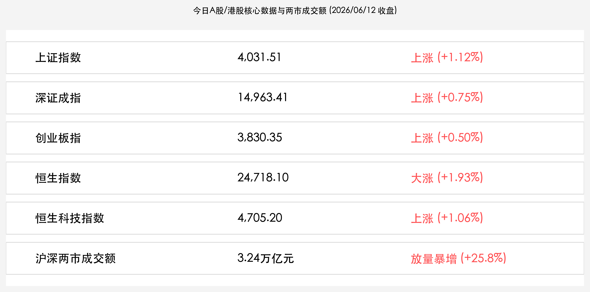

# A股与港股报复性暴涨：沪指重返4000点，成交额破3.2万亿创天量，指数重磅调仓与世界杯开幕共震

**日期：2026年06月12日 (星期五)** &nbsp; **时段：下午 (常规交易日复盘)**

> **核心摘要**：今日A股与港股主要指数迎来报复性全线大涨，沪指大涨1.12%一举收复4000点大关。美伊外交和平曙光引燃全球避险资金重归风险资产，加之收盘后各大指数样本调整正式生效，尾盘被动调仓资金引爆两市成交额暴增至3.24万亿元创历史天量。有色金属、券商及国防军工板块全面爆发，前一日回调较深的成长板块也迎来有力修复。2026美加墨世界杯今日拉开帷幕，市场情绪全面转暖，所谓的“世界杯魔咒”被天量成交额直接粉碎。

## 核心行情复盘

今日A股与港股主要指数全线收涨，两市成交量出现爆发式增长，市场情绪极为高涨，多头力量强劲：

*   **A股三大指数集体大涨**：上证指数收盘报 **4,031.51点**，上涨 **1.12%**（涨44.50点）；深证成指收盘报 **14,963.41点**，上涨 **0.75%**（涨111.43点）；创业板指收盘报 **3,830.35点**，上涨 **0.50%**（涨19.10点）。
*   **港股市场报复性反弹**：恒生指数收盘报 **24,718.10点**，上涨 **1.93%**（涨468.81点）；恒生科技指数收盘报 **4,705.20点**，上涨 **1.06%**（涨49.46点）。
*   **成交额暴增创历史级天量**：沪深两市今日合计成交额达 **3.24万亿元**（约32,400亿元），较前一个交易日（2.575万亿元）放量暴增约 **6,650亿元**（**+25.8%**）。尾盘成交的异常放大主要受指数权重调整生效后的被动基金调仓影响。
*   **个股呈现普涨格局**：全市场共有超过 **3900只** 个股上涨，赚钱效应极强，成交量的大幅放大表明场外资金正在加速入场。
*   **行业板块剧烈分化**：
    *   **领涨主线（有色金属、券商与国防军工）**：**有色金属板块** 掀起涨停潮，铜陵有色、洛阳钼业等表现抢眼，受益于现货黄金暴涨及战略金属安全叙事；**券商与保险板块** 作为金融权重显著发力，扮演护盘主力，处于估值底与政策底的共振方向；**国防军工与商业航天** 表现亮眼，受国内密集发射与SpaceX相关消息催化，多股封死涨停。
    *   **领跌板块（半导体材料与部分热门题材）**：电子化学品、玻璃基板、存储芯片及半导体设备等昨日热门板块出现小幅获利回吐，主要是资金向大金融与战略金属等方向轮动。

## 核心解读与市场逻辑

> **和平红利与全球避险情绪退潮，风险资产重获配置风口**
> 
> 隔夜特朗普宣布取消对伊朗的军事打击计划并暗示周末或签署和平协议，令长期笼罩全球市场的地缘政治危机瞬间消退。全球无风险利率回落，避险情绪显著降温，促使大批避险资金重返亚太及新兴市场。港股恒生指数大涨1.93%成为反弹急先锋，A股也在资金共振流入下高歌猛进，收复4000点重要心理关口。这表明“地缘冲突”向“和平红利”切换的预期正成为推动全球资本重新定价中国核心资产的强力引擎。

> **指数定调重磅生效与世界杯开赛，天量成交粉碎情绪魔咒**
> 
> 今日收盘后，沪深300、中证500、中证A50等主流指数样本调整正式生效，尾盘被动调仓资金集体异动，推升两市成交额至3.24万亿元的历史极值。与此同时，2026年美加墨世界杯在今日正式开赛，往年令投资者担忧的“世界杯魔咒”并未发生，相反，在流动性宽裕与地缘政治好转的双重刺激下，市场以极强的爆发力向前期阻力区发起冲锋。科技权重调入提升了相关指数的“含科量”，未来配置结构将更加偏向国产替代与新质生产力方向。

## 政策脉动

*   **国务院常务会议强化战略科技力量**：国常会指出，要紧紧锚定科技强国目标，强化国家战略科技力量，加大尖端硬科技研发支持力度，推动战略性新兴产业和新质生产力加快发展。这进一步为半导体、有色金属新材料和国防军工的自主可控指明了产业方向。
*   **国家数据局推进数据要素市场化配置改革**：国家数据局今日强调，将深入推进数据要素市场化配置改革，加速公共数据授权运营与数据资产化进程，赋能人工智能创新发展，为数字经济主线注入了明确的政策信心。

## 最新机构观点

*   **中信建投**：**“科技板块中长期高景气逻辑稳固，关注细分材料量价齐升”**。中信建投策略团队指出，尽管今日半导体材料和部分AI应用出现获利调整，但高端半导体前驱体及PTFE高频高速材料在AI推理侧和高速算力基建下的需求扩张趋势没有改变。建议投资者在海外科技股企稳后继续均衡布局，关注有真实订单和技术壁垒的科创细分龙头。
*   **中金公司**：**“中国资产迎来重估共振，哑铃配置仍是防范波动的利器”**。中金公司认为，国际地缘缓和与国内产业创新趋势的共振，是驱动A股与港股本轮反弹的底层动力。随着美元流动性可能在下半年迎来实质性切换，建议投资者采取“战略性金属与科技成长 + 高股息高红利资产”的哑铃型配置，防范中报业绩交易期前的短期反复。
*   **华泰证券**：**“关注中报业绩确定性，港股相对收益配置价值凸显”**。华泰证券策略团队表示，6月下旬市场将正式步入中报披露前哨战，业绩兑现度将成为个股分化的核心决定力量。短期随着指数重磅调仓生效，建议投资者关注半导体、电力设备和国防军工等具备强订单支撑的方向，同时关注恒生指数等港股大市值资产的相对抗震属性。

## 今日市场情绪：金牛踏歌与世界杯之光

今日全球与国内市场情绪被彻底点燃。一尊由黄金、数字电路与高精尖机械零件铸造的宏大金牛傲然立于由巨型金币和各色闪烁金属矿石铺就的厚重基岩之上，象征着中国资产在战略资源与大金融筑底下的稳固与力量。在它的背后，一块覆盖地平线的巨大全息屏幕在灿烂的蓝色晴空中被点亮，上面呈现出大举跃升的绿色K线轨迹以及数字“3.24T”的耀眼光芒。而在草地的边缘，一颗由半导体芯片网格拼凑而成的微型足球静静停靠，虽然世界杯的号角今日吹响，但在无与伦比的牛市天量洪流面前，所谓的魔咒已被金牛的蹄声彻底踏碎，化为漫天金光与生机。

> Prompt: Surrealism style, A majestic golden bull made of glowing mechanical parts and digital circuits standing on a foundation of massive golden coins and sparkling metallic ores. In the background, a giant glowing digital screen displaying ascending green stock candlestick charts and the words '3.24T' in brilliant neon light, rising into a bright blue sky filled with warm sunlight. Below, a small soccer ball made of silicon chips sits on the grass, representing the World Cup, untouched by the rising market energy. No humans., masterpiece, high detail, intricate composition, cinematic lighting, 8k resolution

---

免责声明：内容仅供参考，不构成投资建议。
