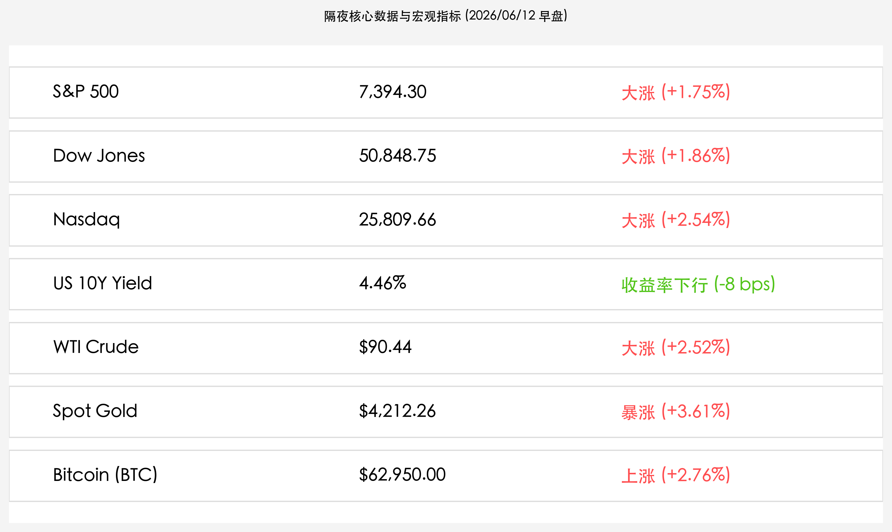

# 隔夜美股迎来狂欢反弹：特朗普撤回对伊军事打击威胁，外交和平曙光引燃两月最佳表现

**日期：2026年06月12日 (星期五)** &nbsp; **时段：上午 (常规交易日复盘)**

> **核心摘要**：隔夜全球市场迎来惊人逆转，美国总统特朗普宣布取消对伊朗的军事打击计划，并暗示双方有望在周末达成重大和平协议。地缘政治危机骤然降温引发风险偏好狂热回归，美股三大股指录得两个月来最佳单日表现，纳指飙升逾2.5%，芯片及科技股高歌稳进；同时，黄金与比特币大幅反弹，美债收益率显著回落，市场从极端紧缩避险情绪中迎来全面解脱。

## 核心行情复盘

隔夜全球金融市场在和平曙光的照耀下全线暴涨，风险资产爆发报复性反弹，避险情绪显著退潮：

*   **美股三大指数集体狂飙**：标普 500 指数收涨 **127.31点**，报 **7,394.30点**（+1.75%）；纳斯达克综合指数大涨 **640.16点**，报 **25,809.66点**（+2.54%）；道琼斯工业平均指数狂涨 **929.97点**，报 **50,848.75点**（+1.86%）。
*   **美债收益率明显回落**：10 年期美债收益率收跌 **8个基点**（-8 bps），报 **4.46%**。地缘局势的缓和降低了市场对恶性滞胀的恐慌，美债作为定价分母的压力减轻。
*   **大宗商品高位震荡**：WTI 原油价格虽从盘中冲高水准有所回落，但仍收报 **$90.44/桶**（+2.52%），盘中因特朗普威胁夺取伊朗Kharg岛等石油设施一度狂飙，随后因危机降温而收敛部分涨幅；现货黄金大幅反弹 **+3.61%**，报 **$4,212.26/盎司**，收复了前一交易日通胀爆表造成的部分跌幅。
*   **加密市场震荡回升**：比特币在流动性重归的预期下反弹 **+2.76%**，重新收复62,000美元关口，收报 **$62,950.00/枚**。
*   **科技股与芯片巨头强劲领涨**：
    *   **Nvidia (英伟达)**：收盘报 **$208.64**，涨幅 **+1.73%**，重拾升势。
    *   **Apple (苹果)**：收盘报 **$295.96**，涨幅 **+1.95%**，领跑蓝筹科技股。
    *   **Broadcom (博通)**：收盘报 **$385.31**，涨幅 **+3.06%**，表现抢眼。
    *   **Marvell Technology (美满电子)**：狂飙 **+11.10%**，领涨半导体板块。

## 核心解读与市场逻辑

> **军事打击红线解除，美伊外交“大和解”曙光引爆解脱交易**
> 
> 在经历了连续数日美伊局部军事交火、霍尔木兹海峡全面封锁恐慌后，特朗普在最后一刻撤回了针对伊朗的大规模军事打击方案。特朗普公开表示，美伊高层已达成某种“重大共识”，并表示最早可能于本周末在欧洲签署正式和平协议。尽管德黑兰官方尚未对此公开背书，但外交斡旋取得重大突破的信号让恐慌已久的资本市场如释重负。油价从盘中暴涨的脉冲中回落，地缘避险警报解除，市场风险偏好迅速升温，资金全面涌向前期超跌的科技与半导体成长板块。

> **PPI数据与利率压力边际缓和，科技股分母端迎来喘息之机**
> 
> 在前一日爆表的CPI创下三年新高后，市场本已对高利率持久性感到绝望。然而，随着地缘政治危机缓和，对于战争引发油价失控并反噬通胀的担忧大幅减轻。同时，美债收益率从高位4.54%回落至4.46%，给对利率极其敏感的高估值科技巨头注入了强心针。美满电子（Marvell）暴涨11.1%，英伟达、博通等芯片核心资产也全线收复失地。市场逻辑从“通胀大震荡下的避险防御”迅速切换为“和平红利预期下的估值修复”。

## 政策脉动

*   **美联储独立性与加息门槛**：凯文·沃什重申联储独立性，强调虽然CPI依然处于4.2%的高位，但地缘和平若能持续降低供应链瓶颈 and 原油压力，联储在7月决策中维持观望、不急于进一步收紧的余地将会增加。
*   **中东航道安全与协议前景**：霍尔木兹海峡的通航警报尚未完全撤销，全球航运界正密切关注本周末所谓“和平协议”的实质性进展。若能成功达成60天停火协议，全球供应链阻碍将显著降低，有望直接消解今年下半年的“硬着陆”风险。

## 最新机构观点

*   **高盛**：**“外交解套重塑风险偏好，但高通胀依然是中长期隐患”**。高盛策略分析师指出，尽管特朗普取消打击伊朗令短期市场迎来强烈反弹，但5月CPI所揭示的核心物价顽固性并未改变，建议投资者在享受反弹红利的同时，保持对通胀资产的合理配置。
*   **摩根士丹利**：**“黄金与美股的共振反弹，体现了流动性极度紧缩后的‘久旱逢甘霖’”**。大摩大宗商品主管表示，前一日黄金暴跌是因无风险利率飙升导致流动性抽水，而今日地缘冲突缓和导致美债收益率回落，令黄金和数字货币等无息及另类资产重新获得资金青睐。
*   **中金公司**：**“外围情绪大逆转将提振 A 股，成长主线有望迎来修复窗口”**。中金公司认为，美股纳斯达克及费城半导体大反弹，将显著改善国内科创板及电子信息产业链的外部偏好。前几日避险红利资产可能出现部分资金分流，前期受地缘压力的泛半导体、新能源及AI应用端有望在今日A股市场迎来修复。

## 今日市场情绪：和平之羽与晨曦曙光

今日全球市场情绪在和平曙光的普照下剧烈转暖。在广袤而深邃的数字海洋中，一尊由巨石雕琢而成的和平之鸽正徐徐展开翅膀，掠过依然波涛汹涌的海面，将天空中坠落的导弹与战争铁幕在半空中轻柔地化为漫天飞舞的鲜红玫瑰与翠绿藤蔓。在它的下方，一幅宏大的全息屏幕在晨曦中被点亮，上面呈现出大举跃升的绿色与蓝色市场曲线，向着地平线处冉冉升起的金色旭日无限延伸。四周的空气中不再弥漫着黑色的原油浓烟，取而代之的是纯净的金黄光晕，将昨日紧绷而冰冷的市场天平彻底融化，重新赋予这片数字世界以生机与希望。

> Prompt: Surrealism style, A giant stone dove spreading its wings over a stormy battlefield, transforming falling missiles into blooming roses and green ivy. In the background, a massive glowing digital screen showing ascending market trend lines rising into a bright golden sunrise. No humans., masterpiece, high detail, intricate composition, cinematic lighting, 8k resolution

---

免责声明：内容仅供参考，不构成投资建议。
