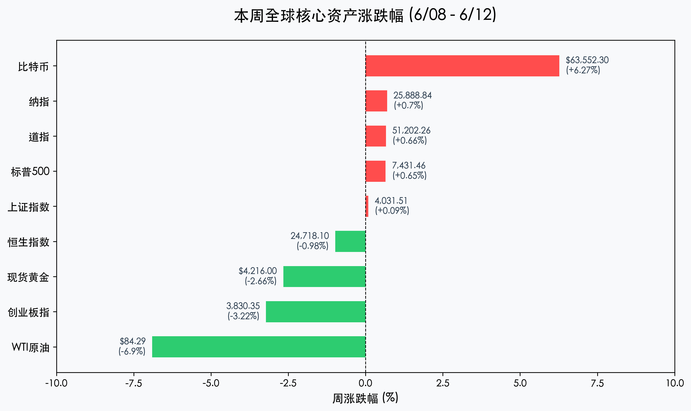
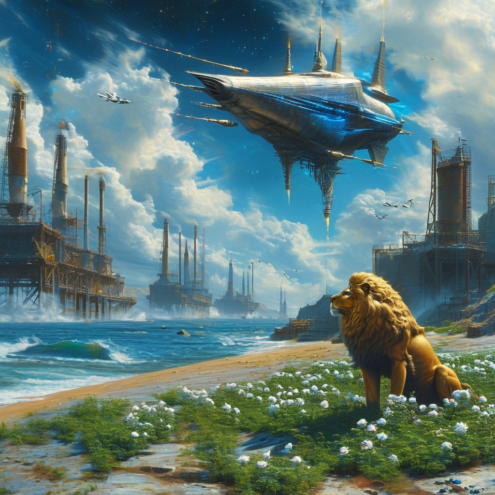

# 全球市场周报：SpaceX 世纪 IPO 挂牌首日暴涨 19% 领航深科技，美伊和平协议预期重挫油价近 7%，A 股 3.2 万亿天量重夺 4000 点

**日期：2026年06月13日 (星期六)** &nbsp; **时段：周六晚报 (周末复盘模式)**

> **核心摘要**：本周全球金融市场在地缘政治重大缓和与硬科技世纪 IPO 挂牌的共振中迎来了反弹与重构。备受瞩目的 SpaceX 挂牌首日暴涨 19.22% 突破 2 万亿美元市值，引爆全球资金对太空和高端制造等硬科技的热情；特朗普宣称美伊有望在周末签署和平条约并重启霍尔木兹海峡，促使原油战争溢价崩塌，WTI 原油暴跌 6.90% 缓解二次通胀担忧，促使标普 500、纳指与道指全周均录得 0.6% 以上涨幅。国内 A 股市场本周经历剧烈高低切换，两市成交额爆量至 3.24 万亿元，上证指数重夺 4000 点关口全周微涨 0.09%，而前期获利丰厚的创业板指周线跌幅 3.22%。

## 核心资产周度/日度表现回顾

本周（06月08日-06月12日）全球主要资产在震荡中寻找新均衡。中东和平预期的升温使得大宗商品与能源遭遇沉重抛压，而美债流动性压力的释放在一定程度上托底了权益市场。

*   **道琼斯工业指数 (Dow Jones)**：周五收报 **51,202.26点**，单日上涨 **0.70%**，全周累计上涨 **+0.66%**。
*   **标普 500 指数 (S&P 500)**：周五收报 **7,431.46点**，单日上涨 **0.50%**，全周累计上涨 **+0.65%**。
*   **纳斯达克综合指数 (Nasdaq)**：周五收报 **25,888.84点**，单日上涨 **0.31%**，全周累计上涨 **+0.70%**。
*   **上证指数 (SSE Composite)**：周五收报 **4,031.51点**，单日上涨 **1.12%**，全周累计微涨 **+0.09%**，重回 4000 点上方。
*   **创业板指 (Chinext)**：周五收报 **3,830.35点**，单日上涨 **0.50%**，全周累计下跌 **-3.22%**，资金在科技成长高位大举获利回吐。
*   **恒生指数 (Hang Seng)**：周五收报 **24,718.10点**，单日上涨 **1.93%**，全周累计下跌 **-0.98%**，港股金融权重回暖。
*   **WTI原油 (Oil)**：周五收报 **$84.29/桶**，单日暴跌 **-6.80%**，全周累计大跌 **-6.90%**，地缘避险红利退潮。
*   **现货黄金 (Gold)**：周五收报 **$4,216.00/盎司**，单日微涨 **+0.09%**，全周累计下跌 **-2.66%**。
*   **比特币 (BTC)**：周五收报 **$63,552.30/枚**，单日上涨 **+0.96%**，全周累计上涨 **+6.27%**，从上周失守 6 万美元的惨烈中强劲反弹。

## 过去 48 小时重磅事件深度复盘

> **1. SpaceX 世纪 IPO 震撼登场，点燃硬科技全球投资主线**
> 
> SpaceX (SPCX) 在美东时间周五正式以每股 135 美元定价上市，募集高达 750 亿美元，创下美股史上最大规模 IPO。挂牌首日开盘即被抢购至 150 美元，收盘暴涨 19.22% 报 160.95 美元，首日市值直接飞越 2 万亿美元大关。尽管传统 AI 与半导体芯片股（如英伟达、苹果）在本周后半段高位回吐，但 SpaceX 挂牌首日的历史性行情极大地振奋了科技股多头，成为资金本周进攻成长板块的新图腾，为全球硬科技及商业航天估值重构打开了想象空间。

> **2. 地缘局势迎来停火曙光，原油“避险溢价”崩溃缓解通胀顾虑**
> 
> 本周最核心的宏观变化来自中东局势的剧烈反转。随着美伊双方有望在戴维营签署 60 天停火谅解备忘录，并重开具有全球能源咽喉之称的霍尔木兹海峡，此前因地缘冲突产生的“地缘战争溢价”被迅速剥离。WTI 原油周五单日暴跌 6.80% 至 84.29 美元/桶，全周跌幅达 6.90%，创下三个月来新低。油价的大幅回调大幅度舒缓了全球二次通胀的担忧，给欧美央行政策腾挪以及全球债市、股市释放了流动性分母端压力。

> **3. A 股大金融与红利接棒，3.2 万亿天量见证“高低切”与重夺 4000 点**
> 
> 国内 A 股在周五呈现出了波澜壮阔的“高低大切换”。在成交额爆量增至 3.24 万亿元的背景下，资金大幅从前期拥挤的半导体硅片、高位 AI 应用及化工等科技方向流出，转而重仓配置有色金属、电力设备以及非银金融（券商）。上证指数单日上涨 1.12%，一举收复 4000 点大关，收于 4031.51 点；而创业板指在早盘大涨 2% 后面临严重的获利盘涌出，高开低走仅收涨 0.50%，全周累计跌幅达 3.22%。这种天量换手表明市场流动性极其充沛，主力资金防守与进攻切换明显，短期回洗筑底有利于后市健康运行。

## 下周全球宏观大事预警

1.  **中国 5 月金融数据发布后的政策回响与 LPR 报价前瞻**：本周五央行公布了 5 月社融和信贷数据，M2 同比增长 8.6%，社会融资规模略有改善。同时，央行宣布 6 月 15 日将开展 6000 亿买断式逆回购，大额存单起点降至 20 万。市场正静待下周的政策宣贯及流动性补充落地。
2.  **2026 陆家嘴论坛定于 6 月 17 日至 18 日召开**：主题为“全球治理倡议下的金融发展与合作：新愿景、新挑战和新机遇”。由于论坛常被视为国内重磅金融监管政策的发声渠道，证监会、央行等负责人的现场发言将成为下周 A 股和港股最关键的政策风向标。
3.  **美伊戴维营协议的最终签署与霍尔木兹海峡通行权落地**：本周末将见证中东和平协议是否能真正付诸纸面。若签署成功，原油市场与国际航运运费下周将面临更明确的压力测试，大宗商品供应链重建将正式启动。

## 顶级机构周末策略内参摘要

*   **中信证券 (CITIC Securities)**：**“A 股 3.2 万亿天量见证估值再均衡，陆家嘴论坛将成下半场风向标”**。本周的剧烈震荡标志着筹码在高估值科技与防御性红利板块间的快速换手。虽然创业板受到一定抛压，但上证指数成功收复 4000 点说明大盘支撑力强劲。下周的陆家嘴论坛极大可能会释放更具体的中长期制度利好，建议投资者在洗盘后积极布局商业航天、特种芯片等硬科技题材。
*   **高盛 (Goldman Sachs)**：**“SpaceX 世纪挂牌启动全球科技重估，原油下跌为美股软着陆加码”**。高盛指出，SpaceX 上市首日大涨 19.22% 说明全球流动性对具备高技术壁垒、太空场景的“真科技”依然极度饥渴。同时，WTI 原油周跌近 7% 的和平红利给美联储未来的政策利率预留了完美空间。在高收益率下行和 SpaceX 财富效应下，全球科技白马下周有望重回升势。
*   **中金公司 (CICC)**：**“红利防御与成长弹性交织，关注长鑫科技 IPO 注册对半导体板块的长期映射”**。中金表示，本周五证监会同意长鑫科技科创板 IPO 注册（募资 295 亿）代表着国家大力支持半导体制造与核心产业链本土化。加之周五 3.24 万亿的历史换手率，预计短期的行业回调将使半导体设备、核心存储等先进制造方向迎来配置性价比极高的拐点。

## 今日市场情绪：和平飞羽与星河破晓

今日市场情绪在 SpaceX 的世纪 IPO 狂欢与地缘停火的乐观预期中展现出昂扬的生机。在和平鸽盘旋的蔚蓝天空下，一艘巍峨的银色宇宙飞船正从地平线升腾而起，周身环绕着翠绿的K线数据长弧，代表着科技挂牌引爆的多头买盘。在它的下方，昔日喧嚣的黑色原油钻井平台和油桶已被翠绿的常春藤和洁白的百合花所覆盖，一尊代表金融守护的金色巨石狮子矗立在海岸旁，仰望星空，几只和平鸽正振翅掠过开裂的红色K线云层，飞向无垠的蔚蓝星海，象征着随着霍尔木兹危机散去、地缘和平协议落地，全球市场正在洗尽地缘硝烟，开启以太空深科技为主线的星海新征途。

> Prompt: Surrealism style, A colossal silver and blue spacecraft ascending towards the starry sky from a coastal launching base, surrounded by glowing green data streams and rising stock market curves. In the foreground, retired dark industrial oil wells and black oil barrels are covered by fresh green ivy and white lilies, while a majestic golden stone lion stands on the shore looking up. In the cloudy sky, a flock of white doves flies towards the horizon, clearing away red storm clouds. No humans., masterpiece, high detail, intricate composition, cinematic lighting, 8k resolution

---

免责声明：内容仅供参考，不构成投资建议。
