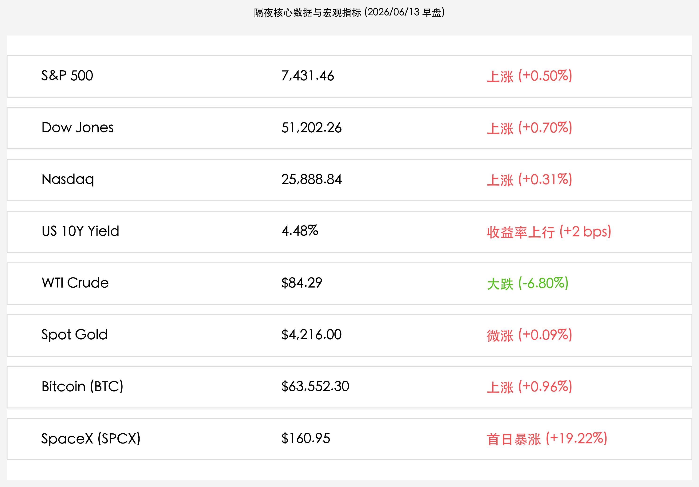
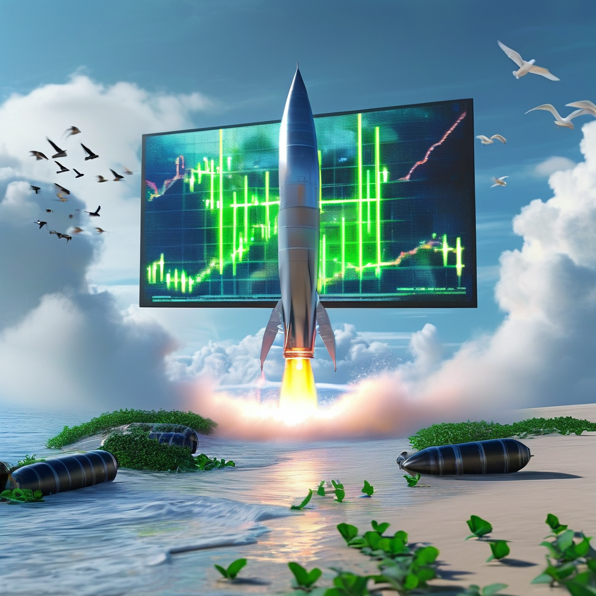

# 历史级巨无霸 SpaceX 首日暴涨 19% 领航深科技：美伊和平曙光施压原油，美股全线小幅收涨，欧股创历史第三高

**日期：2026年06月13日 (星期六)** &nbsp; **时段：上午 (常规交易日复盘)**

> **核心摘要**：隔夜全球市场在 SpaceX 历史性 IPO 首日暴涨 19% 的狂欢与美伊外交缓和的乐观预期中继续走强。美股三大指数集体温和收涨，欧洲 Stoxx 600 指数大涨 1.88% 创历史第三高点位。随着美伊和平协议有望在周末签署的预期升温，原油价格大跌，WTI 跌幅近 7.0%；科技股呈现轻度获利回吐，但 SpaceX (SPCX) 首日市值突破 2 万亿美元，重新激活了市场对太空与硬科技的狂热。

## 核心行情复盘

隔夜全球金融市场在 SpaceX 世纪 IPO 挂牌与地缘和平红利预期下整体上行，大盘资金在大金融、公用事业与深科技板块间轮动，前期炒高的部分科技巨头则出现温和整理：

*   **美股三大指数集体温和收涨**：标普 500 指数收涨 **37.16点**，报 **7,431.46点**（+0.50%）；纳斯达克综合指数上涨 **79.18点**，报 **25,888.84点**（+0.31%）；道琼斯工业平均指数收涨 **353.51点**，报 **51,202.26点**（+0.70%）。
*   **SpaceX 首日暴涨，创下美股历史最大规模 IPO**：**SpaceX (SPCX)** 挂牌首日表现惊艳，IPO 定价为 $135.00，开盘跳空至 $150.00，收盘大涨 **+19.22%** 报 **$160.95**。公司市值在上市首日便成功突破 2 万亿美元大关，为硬科技与商业航天板块注入强心针。
*   **美债收益率微升**：10 年期美债收益率上涨 **2个基点**（+2 bps），收报 **4.48%**。
*   **大宗商品剧烈调整**：受美伊潜在停火协议及霍尔木兹海峡解封预期催化，原油大跌，WTI 原油价格狂泻 **-6.80%**，收报 **$84.29/桶**，创下近两个月来最大单日跌幅；现货黄金微涨 **+0.09%**，报 **$4,216.00/盎司**，依然维持高位整理。
*   **加密市场震荡上行**：比特币 (BTC) 反弹 **+0.96%**，收报 **$63,552.30/枚**，市场流动性预期有所改善。
*   **主流半导体与科技股略有回调（获利了结）**：
    *   **Nvidia (英伟达)**：收盘报 **$205.18**，跌幅 **-1.66%**。
    *   **Apple (苹果)**：收盘报 **$291.13**，跌幅 **-1.63%**。
    *   **Broadcom (博通)**：收盘报 **$382.80**，跌幅 **-0.65%**。
    *   **Marvell Technology (美满电子)**：收盘报 **$278.97**，跌幅 **-0.62%**。

## 核心解读与市场逻辑

> **SpaceX 世纪 IPO 震撼登场，重构科技估值坐标**
> 
> SpaceX (SPCX) 作为历史最大规模 IPO 募资 750 亿美元并在上市首日突破 2 万亿美元市值，其重要性不言而喻。市场不仅看到了商业航天的巨大潜力，更将其视为新一轮由“实体硬科技 + 宇宙探索”引领的成长动力。虽然传统 AI 芯片股如英伟达、苹果在前期高点处遭遇短期获利了结，但 SpaceX 的狂欢完美接棒，维持了高科技资产的赚钱效应和流动性热度。

> **和平博弈接近终局，原油暴跌释放全球通胀压力**
> 
> 特朗普公开宣称美伊有望在周末签署和平协议，直接解除了霍尔木兹海峡的封锁警报。这导致前期因避险溢价推高的油价暴跌（WTI 狂跌近 7.0% 至 $84.29/桶）。原油价格的显著下行，很大程度上打消了市场对大宗商品二次通胀的顾虑，给全球股市的分母端估值释放了压力，是欧股创历史第三高点位、美股大金融与公用事业板块走强的重要背景。

## 政策脉动

*   **欧洲央行（ECB）25基点加息与抗通胀决心**：欧洲央行尽管将存款利率提高了25个基点至2.25%（2023年以来首次加息），但市场并未感到恐慌。相反，原油价格大跌和美伊和平希望使得投资者普遍预期，这可能是本轮欧洲通胀周期的“最后一次利空”，欧股不跌反涨，STOXX 600 指数大涨 1.88%。
*   **周末“戴维营”美伊和平条约前瞻**：市场所有的目光正聚焦于即将到来的周末外交进展。如果美伊能够达成实质性停火，国际原油价格和全球航运成本预计将进一步平稳化，这也为下周全球央行的货币政策博弈腾出了空间。

## 最新机构观点

*   **高盛**：**“SpaceX 上市引爆科技板块结构性重组，防守与进攻需兼顾”**。高盛策略分析师指出，SpaceX 首日暴涨 19% 证实了私募巨头和公众资金对太空互联网及地表最强运输系统的极高定价。然而，传统 AI 算力在经历多日拉升后短期面临整理。随着原油大跌，下半年滞胀风险大幅降低，建议配置逐步向“商业航天+核心科技+高股息资源股”倾斜。
*   **摩根士丹利**：**“油价暴跌是降温良药，美股下半年软着陆概率升至 70%”**。大摩首席经济学家分析，WTI 原油暴跌 6.8% 表明市场对供应链被完全切断的极端恐慌已经完全散去。虽然欧央行首度加息以示决心，但地缘和平若落实，大宗商品下跌带来的输入型通胀消退，将为美联储提供在下半年降息的完美宏观环境。
*   **中金公司**：**“SpaceX 催化硬科技崛起，A 股商业航天与半导体设备将迎重估”**。中金公司策略研究团队表示，SpaceX 在美股以超 2 万亿美元市值亮相，将深刻映射到国内 A 股和港股的资本市场。预计下周 A 股的商业航天、卫星互联网以及特种半导体板块将迎来强烈资金催化。加之周五 A 股 3.24 万亿历史天量成交所带来的沉淀资金，市场做多成长主线的阻力将显著减弱。

## 今日市场情绪：星海逐梦与和平之翼

在科技光芒与和平暖意的交织下，今日全球市场情绪升腾至崭新的维度。一艘巨大的银蓝色飞船正从海岸线旁的现代发射塔架上轰鸣起飞，喷薄而出的并非常规火焰，而是由绿色和金色数字电路交织而成的星尘长尾，象征着 SpaceX 世纪 IPO 挂牌首日所激发的无尽想象力和多头流动性。在它的背后，巨幅的全息投影屏幕在晴空下闪烁，清晰地刻画着上升的绿色K线以及“SPCX”和“2.0T”的耀眼符号。海滩上，昔日冰冷的黑色原油桶已倾覆并被翠绿的常春藤所覆盖，几只洁白的和平鸽正掠过宁静的蓝色海面，冲向火箭轨迹所划破的深邃星海，预示着地缘硝烟正在退去，太空与深科技的崭新梦想正在地平线上起航。

> Prompt: Surrealism style, A majestic silver and blue rocket rising majestically from a coastal launchpad, leaving a trail of glowing green stardust. In the background, a giant holographic screen in the sky showing climbing green stock candlestick charts and the neon green text 'SPCX' and '2.0T'. In the foreground, a calm blue sea, with empty black oil barrels half-buried in the sand and covered in fresh green ivy, while a flock of white doves flies towards the horizon. No humans., masterpiece, high detail, intricate composition, cinematic lighting, 8k resolution

---

免责声明：内容仅供参考，不构成投资建议。
