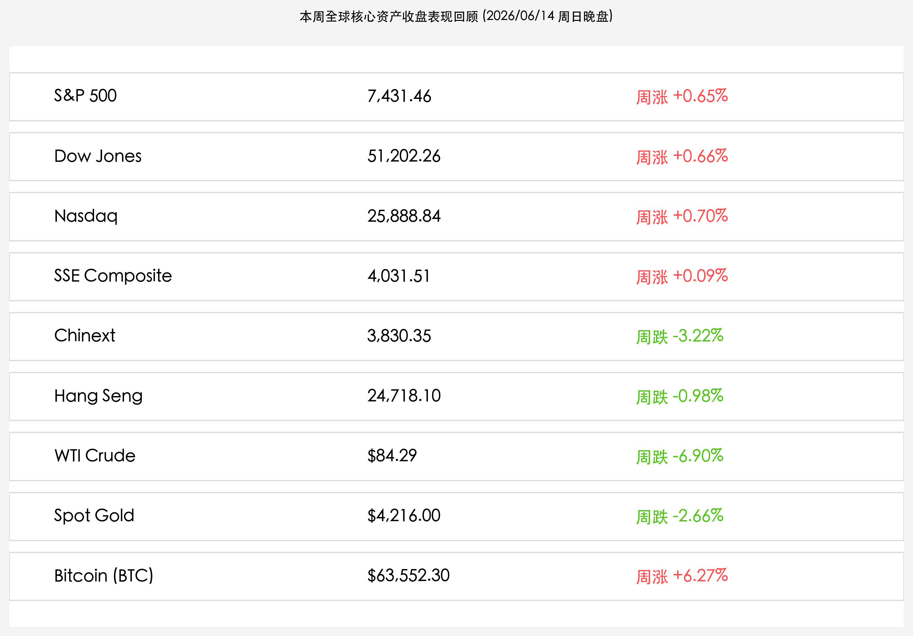

# 全球市场新周展望：美联储首演“沃什大考”风暴将至，SpaceX 估值重塑硬科技图腾，中东戴维营协议悬念拉扯与 LPR/陆家嘴论坛共振

**日期：2026年06月14日 (星期日)** &nbsp; **时段：晚报 (新周展望模式)**

> **核心摘要**：本周末，全球市场在 SpaceX 首日暴涨 19.22% 突破 2.1 万亿美元估值的财富效应中，拉开了新一周的序幕。虽然美伊戴维营协议面临最后拉扯、中东停火签署延迟至未来数日，但 WTI 原油全周大跌 6.90% 表明市场已大体出清战争溢价。新的一周将迎来“超级央行周”，美联储新任主席沃什的 FOMC 首秀利率大考与日本央行 88% 的加息预期将加剧全球流动性再定价。国内市场则在 5 月金融数据筑底后，静待 6 月 15 日深市指数定期样本股调仓以及 6 月 17-18 日陆家嘴论坛的政策定调，多重因素将驱动 A 股红利防守与硬科技成长的“杠铃结构”重新平衡。

## 周末财经要闻终极汇总

本周全球资产收盘数据如下，各大核心资产均经历了显著的波动与筹码重组：

> **1. 美伊戴维营协议临门一脚面临拉扯，停火签署虽有推迟但海峡通航预期致油价战争溢价大出清**
> 
> 过去48小时，地缘局势呈现精彩的外交博弈。美国总统特朗普高调宣称美伊定于6月14日在戴维营正式签署为期60天的停火谅解备忘录，并立即开放霍尔木兹海峡。然而，伊朗外交部发言人巴加埃随即表示不会在周日签署该协议，但重申双方的草案谈判正聚焦于停火与通航，不排除在未来数天内完成签署。虽然签署时点生变，但地缘停火的确定性已被市场极大锚定，WTI原油全周累计暴跌 **-6.90%** 收报 **$84.29/桶**，地缘避险溢价基本出清，这为下周全球通胀和利率博弈预留了极大的弹性空间。
> 
> **2. SpaceX 世纪 IPO 挂牌首日暴涨 19.22% 破 2.1 万亿美元，确立硬科技估值新图腾**
> 
> 全球史上最大规模 IPO 正式落地。SpaceX (SPCX) 于美东时间周五正式定价 135 美元上市，挂牌首日即遭到资金疯抢，收盘暴涨 **+19.22%** 报 **160.95 美元**，市值突破 **2.1 万亿美元** 大关。SpaceX 的暴涨不仅巩固了马斯克全球首富与首位“万亿富豪”的地位，更为全球商业航天、卫星互联网及深空硬科技资产开辟了巨大的估值重构空间，对冲了英伟达等传统 AI 硬件股高位震荡的估值收缩担忧。
> 
> **3. 中国 M2 与社融增速稳健筑底，外储突破 3.44 万亿美元筑牢金融安全垫，商务部坚决反对美将中企列入“军事企业清单”**
> 
> 央行公布 5 月金融数据，广义货币（M2）同比增长 **8.6%**，前 5 个月社会融资规模增量累计为 **17.48 万亿元**，反映出在资产负债表良性重构阶段信贷供给的合理与充沛。同时，5 月末我国外汇储备规模大幅增至 **34,422 亿美元**，人民币汇率底座十分扎实。此外，商务部针对美方将中企列入“中国军事企业清单”表达强烈不满，表示中方将保留采取坚决反制措施的权利，为外部博弈预留了政策工具。
> 
> **4. 指数定期样本股重大调整，深证成指、创业板指等 6 月 15 日正式生效调仓**
> 
> 深交所及深圳证券信息有限公司关于深证成指、创业板指、深证100、创业板50等指数的样本股定期调整将于 **6月15日（周一）** 正式生效。此前，沪深300、中证500、科创50等上海及跨市场指数调整已于6月12日收市后生效。本次调仓涉及范围较广（调入安泰科技、佛塑科技等），虽然不影响上市公司基本面，但可能引发相关被动 ETF 在周一开盘出现明显的资金重组和交易波动。

## 新一周市场核心博弈逻辑

新的一周（06月15日-06月21日），全球资本市场将面临四个核心博弈主线：
* **沃什式美联储利率决议的政策重估**：即将于美东时间周四公布的 FOMC 决议，是凯文·沃什（Kevin Warsh）执执掌美联储后的首个利率决议。沃什是否会取消“点阵图”或发表强硬鹰派言论成为决定下半年全球资产定价的终极考点。目前 10 年期美债利率在 4.55% 附近震荡，若美联储暗示利率将在高位维持更久，高估值科技股的风险偏好将继续承压；若鹰派态度弱于预期，全球分母端压力释放将引导科技成长股迎来反弹。
* **“超级央行周”的流动性大考与日本央行加息悬念**：下周包括美联储、日本央行、英国央行、澳大利亚央行等多国将密集公布决议。尽管日本央行行长植田和男因病缺席，但市场对日本央行加息的预期仍高达 **88%**。日元汇率的潜在异动和全球套利交易（Carry Trade）资金的被动回流，将给全球债市和跨国股市流动性注入极大的不确定性。
* **陆家嘴论坛与 A 股资本市场新风口**：2026 陆家嘴论坛（6月17日-18日）以“全球治理倡议下的金融发展与合作：新愿景、新挑战和新机遇”为主题。国家金融监督管理总局局长丁向群及证监会主席吴清等官员将发表主旨演讲，市场期待关于促进新质生产力融资、优化指数红利结构等监管红利的具化解读。这与深市指数调仓落地共振，将催生主力资金重组。
* **端午节假期休市的节前避险情绪**：下周五（6月19日）因端午节假期，A股、港股、台股及美国市场均休市。周四收盘后将迎来三天的假期，叠加此前 3.24 万亿历史天量洗盘的余波，节前交易日市场情绪可能偏于防守，资金或向低估值的防御红利板块与先进封装等有业绩支撑的科创成长核心做“杠铃两端”的靠拢。

## 本周重磅经济数据与会议前瞻

* **06月15-17日 (周一至周三)**：
  * **G7峰会 (法国主办)**：聚焦全球宏观失衡、产业链外迁与地缘制裁。
  * **日本央行议息会议**：评估加息窗口与应对日元贬值策略（市场预期加息概率 88%）。
  * **深市主要指数调仓生效**：深证成指、创业板指等指数调整正式落地。
* **06月17-18日 (周三至周四)**：
  * **2026 陆家嘴论坛**：聚焦全球金融监管治理与科技金融合作。
  * **中国5月主要经济数据**：中国5月社会消费品零售总额、规模以上工业增加值、70城房价等数据出炉，验证国内经济修复成色。
* **06月18日 (周四)**：
  * **美联储 6 月 FOMC 利率决议 (沃什首秀)**：发布最新点阵图及主席沃什的政策前景前瞻。
* **06月19日 (周五)**：
  * **端午节假期**：中国A股、港股、台股及美股全天休市。

## 头部券商/投行开盘策略点睛

* **中信证券 (CITIC Securities)**：**“3.2万亿天量洗盘接近尾声，均衡配置迎陆家嘴新风”**。上周五A股成交放量至3.24万亿的极值，表明多空资金进行了大体量的筹码清洗。本周随深市调仓落地与陆家嘴论坛召开，监管政策指引有望推动市场重新确立健康的慢牛逻辑。建议继续采取“科技基建与红利有色金属”的杠铃组合，关注回调充分的半导体制造、商业卫星链条以及具备抗内卷优势的有色龙头。
* **高盛 (Goldman Sachs)**：**“SpaceX 估值跃升提振科技风险偏好，油价下挫拓宽联储缓释空间”**。SpaceX 创纪录的 IPO 确立了科技股“星辰大海”的全新想象空间，而中东和平谈判的缓和使得原油全周暴跌近 7%，这为美联储提供了解冻紧缩政策的完美窗口。尽管下周面临沃什决议大考，但在通胀降温和科技财富效应对冲下，对美股科技股的后市依然保持超配观点。
* **中金公司 (CICC)**：**“宏观数据检验实体复苏，精选反内卷与核心出海龙头”**。5月社融和外储数据表明基本面流动性整体充沛。下周5月宏观数据发布将是对内需修复的集中验证。操作上，应聚焦能够跨越内卷、拥有强大自主核心技术并成功融入全球高端产业链的细分龙头，如商业航天链条、特种电子化学品及智能电力设备。
* **海通证券 (Haitong Securities)**：**“制度筑底优化市场秩序，关注新兴成长制造的价值修复”**。吴清主席在基金协会致辞对“押赛道”等顽疾的整治短期虽然加速了部分拥挤板块的出清，但中长期确立了转型慢牛的发展根基。配置上应在防守端继续持有红利的基础上，寻找代表先进制造方向的集成电路、通信设备及新能源车产业链优质龙头的低吸机会。
* **申万宏源 (Shenwan Hongyuan)**：**“端午长假前防守反击，在顺周期分化中寻找结构突破”**。下周端午休市和美伊协议的最终落地将放大地缘和假期不确定性，节前操作建议倾向于中庸均衡。注意题材高位波动风险，配置上侧重具有真实盈利验证的硬科技及能成功出海实现业绩突破的制造业企业。

## 今日市场情绪：星海织梦与天平的序章

今日市场情绪在SpaceX世纪IPO挂牌的科技狂欢与地缘局势临门一脚的拉扯中，展现出宏大而神秘的超现实主义美感。在幽深星河的背景下，一只由闪烁的银色金属与蓝色光伏板构筑的“机械凤凰”自高耸的发射台拔地而起，振翅冲向繁星密布的无垠宇宙，折射出SpaceX估值重塑带来的无限探索渴望。在其下方的数字海洋上，一座古老的黄金大门赫然敞开，旁边一尊巨大的石质日晷将其庞大的阴影精准投向写有“G7”与“Fed”的金色徽章上，象征着即将到来的超级央行决议大考。而日晷旁的黑色油桶已然开裂，一只只雪白的和平鸽自裂缝中破茧而出，迎着星光展翅飞翔，寓意着随着和平条约的推进，战争阴霾的消融。在这个周日晚间，市场在寂静的星空中默默积蓄着迎接新周潮汐的力量。

> Prompt: Surrealism style, A majestic mechanical phoenix made of silver metal and blue solar panels soaring from a launchpad into a starry galaxy. In the background, a golden gateway stands open on a calm digital sea, with a massive stone sundial whose shadow points to the upcoming G7 and Fed logos. A black oil barrel next to the sundial is cracking, and white peace doves are emerging from the cracks, flying toward the starry horizon. No humans., masterpiece, high detail, intricate composition, cinematic lighting, 8k resolution

---

免责声明：内容仅供参考，不构成投资建议。
