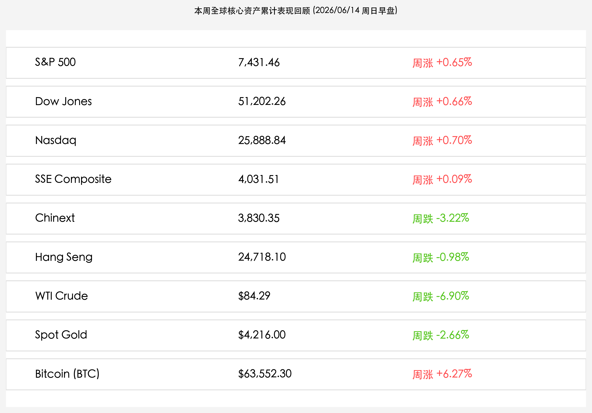
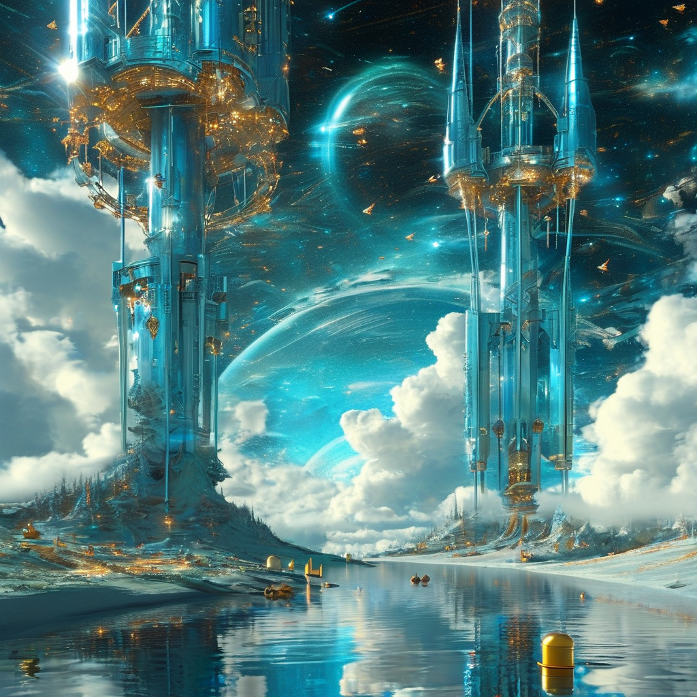

# 全球市场周报（周日晨版）：SpaceX 2.1万亿世纪航天估值重构，美伊和平条约突生波折，5月社融见证中国资产负债表良性修复

**日期：2026年06月14日 (星期日)** &nbsp; **时段：早报 (周末复盘模式)**

> **核心摘要**：本周全球金融市场在中东停火博弈与 SpaceX 世纪 IPO 挂牌的共振中迎来了反弹与洗盘。SpaceX 首日暴涨 19.22% 冲破 2.1 万亿美元，确立硬科技估值新图腾；特朗普单方面宣称美伊将于周日签署协议，但随后遭伊朗官方否认，导致油价战争溢价崩塌（WTI 全周大跌 6.90%）的同时保留了地缘博弈的战术悬念。中国 5 月金融数据出炉，社融与信贷修复、外储升至 3.44 万亿美元，展现出稳健运行态势，市场静待下周陆家嘴论坛释放重磅政策信号。

## 核心资产周度/日度表现回顾

本周（06月08日-06月12日）全球主要资产呈现宽幅震荡。中东和平预期的拉扯使得能源大宗商品遭遇沉重抛压，而美债流动性压力的释放在一定程度上托底了权益市场。A股与港股在天量换手中体现出较强的红利防守属性，美股则在科技世纪 IPO 财富效应下全线收高。

*   **道琼斯工业指数 (Dow Jones)**：周五收报 **51,202.26点**，全周累计上涨 **+0.66%**，表现出较强的蓝筹防御能力。
*   **标普 500 指数 (S&P 500)**：周五收报 **7,431.46点**，全周累计上涨 **+0.65%**，高估值权重回调拉低中枢。
*   **纳斯达克综合指数 (Nasdaq)**：周五收报 **25,888.84点**，全周累计上涨 **+0.70%**，科技股财富效应及利率压力缓解共同支撑。
*   **上证指数 (SSE Composite)**：周五收报 **4,031.51点**，全周累计微涨 **+0.09%**，于 4000 点整数关口上方进行筹码沉淀。
*   **创业板指 (Chinext)**：周五收报 **3,830.35点**，全周累计下跌 **-3.22%**，前期拥挤的科技算力成长股主力资金显著回吐。
*   **恒生指数 (Hang Seng)**：周五收报 **24,718.10点**，全周累计微跌 **-0.98%**，展示出极其强大的承接底座。
*   **WTI原油 (WTI Crude)**：周五收报 **$84.29/桶**，全周累计大跌 **-6.90%**，地缘避险红利在和平预期拉扯下退潮。
*   **现货黄金 (Spot Gold)**：周五收报 **$4,216.00/盎司**，全周累计下跌 **-2.66%**，受美债实际收益率压制，避险属性走弱。
*   **比特币 (Bitcoin)**：周五收报 **$63,552.30/枚**，全周累计上涨 **+6.27%**，从失守 6 万美元的惨烈中强劲反弹。

## 过去 48 小时重磅事件深度复盘

> **1. SpaceX 世纪 IPO 震撼登场，收盘市值突破 2.1 万亿美元大关**
> 
> SpaceX (SPCX) 在美东时间周五正式以每股 135 美元定价上市，募集高达 750 亿美元，创下美股史上最大规模 IPO。挂牌首日开盘即被抢购至 150 美元，收盘暴涨 19.22% 报 160.95 美元，首日市值直接飞越 2.1 万亿美元大关。尽管传统 AI 与半导体芯片股（如英伟达、苹果）在本周后半段高位回吐，但 SpaceX 挂牌首日的历史性行情极大地振奋了科技股多头，成为资金本周进攻成长板块的新图腾，为全球硬科技及商业航天估值重构打开了想象空间，这也助力马斯克稳固了其在全球富豪榜上的领先地位。

> **2. 美伊和平协议突生波折：特朗普高调官宣，但伊朗明确予以否认**
> 
> 过去 48 小时，中东和平谈判经历了戏剧性的一幕。美国总统特朗普高调发文称，美伊定于 6 月 14 日在戴维营正式签署为期 60 天的停火谅解备忘录，并立即开放霍尔木兹海峡，甚至声称伊朗承诺不再寻求核武器。然而，伊朗外交部发言人巴加埃（Esmaeil Baqaei）随即明确否认了周日签署协议的消息，并重申当前的草案备忘录聚焦于停火与海峡通航，暂不涉及核问题。这一表态为原本乐观的“和平红利”增添了战术不确定性。但不可否认的是，谈判本身已取得前所未有的进展，WTI 原油周五收报 84.29 美元/桶，全周累计大跌 6.90%，表明战争溢价已基本出清。

> **3. 中国 5 月金融数据出炉：社融与信贷稳健筑底，外汇储备增至 3.44 万亿美元**
> 
> 中国人民银行于周五盘后公布 5 月金融数据，广义货币（M2）同比增长 8.6%，社会融资规模存量同比增长 7.7%，前 5 个月社融增量累计达 17.48 万亿元。数据折射出国内信贷需求依然处于“资产负债表修复”的良性整理过程中。值得注意的是，5 月末我国外汇储备规模达到 34,422 亿美元，较上月末大幅增加 317 亿美元。融资结构的优化（债券融资占比提升）以及外汇储备的强劲增长，为国内实体经济企稳回升筑牢了金融底座，也为下周陆家嘴论坛即将出炉的配套政策留足了空间。

## 下周全球宏观大事预警

1.  **2026 陆家嘴论坛开幕在即（6月17-18日）**：本届论坛主题为“全球治理倡议下的金融发展与合作：新愿景、新挑战和新机遇”。金融监管总局局长丁向群等重磅官员将出席并发表主旨演讲，市场期待在此次论坛上看到关于新质生产力融资、资本市场制度建设及养老金融等方面的具体政策宣贯。
2.  **美伊戴维营协议的拉扯与海峡通航验证**：在伊朗外交部否认周日签署后，多方外交角力将在下周进入白热化阶段。市场将密切关注协议的具体签署时点以及霍尔木兹海峡的实际通航状况，这决定了油价和海运运费是否会迎来二次探底。
3.  **LPR 报价与流动性对冲前瞻**：下周将迎来最新一期 LPR 报价。在 5 月金融数据出炉后，央行于 6 月 15 日即将开展的 6000 亿买断式逆回购以及大额存单的政策变动，将成为引导市场预期和宽信用落地的风向标。

## 顶级机构周末策略内参摘要

*   **中信证券 (CITIC Securities)**：**“3.2 万亿成交洗盘接近尾声，红利防守与硬科技成长估值将迎再平衡”**。中信证券认为，本周五 A 股两市创下 3.24 万亿的历史天量成交，主力资金在科技与大金融之间完成了充分的筹码换手，洗盘已接近尾声。随着下周陆家嘴论坛的召开，重磅监管信号的释出有望推动市场转向更加健康的中长期慢牛。建议关注回调充分的半导体设备、商业航天以及具有业绩支撑的顺周期有色金属。
*   **高盛 (Goldman Sachs)**：**“SpaceX 财富效应对冲利率担忧，能源回调为美股‘软着陆’提供完美掩护”**。高盛指出，SpaceX 的 2.1 万亿美金估值标杆点燃了全球对于深空科技的狂热。同时，中东和平预期的推进导致原油周跌近 7%，这为美联储未来的货币政策预留了极大的弹性空间。在分子端财富效应与分母端无风险利率压力缓解的共同作用下，美股科技股下周有望重回升势。
*   **中金公司 (CICC)**：**“金融数据强化实体筑底预期，寻找具备反内卷与出海竞争力的优质制造”**。中金公司表示，5 月 M2 同比增长 8.6% 表明货币供应合理充沛，居民部门杠杆率企稳显示资产负债表处于良性重构阶段。随着外储增至 3.44 万亿美元，人民币汇率底座扎实。未来应关注具备结构性优势的先进制造出海，如商业卫星链条、特种化学品和电力设备。

## 今日市场情绪：星河引渡与地缘云雾的微澜

今日市场情绪在 SpaceX 世纪 IPO 挂牌的科技狂欢与美伊戴维营协议突生波折的微妙博弈中，展现出宏大而深邃的超现实美感。在深邃的繁星夜空中，一座散发着幽蓝与银白光芒的“太空电梯”穿透了由绿色数字K线编织而成的硅谷微芯片森林，直插苍穹，上端一艘庞大的银色航天飞船正在对接，象征着全球科技估值重构的新高度。在它的下方，一尊高耸的黄金天平矗立在波涛汹涌的数字海洋上，天平一端是一枚精致的银色运载火箭，另一端是一个逐渐风化开裂的黑色原油桶，正化为数只洁白的和平鸽振翅飞向无垠的夜空，寓意着随着和平条约的前进，战争溢价的消融。而在电梯的巨大屏幕上，正散发出“2026-06-14”的柔和光辉，折射出在这个周日，市场在星空与未完的谈判悬念中，静待新周破晓。

> Prompt: Surrealism style, A colossal silver-and-blue space elevator structure extending from a glowing green microchip forest up into the star-studded cosmic void, where a majestic silver spacecraft is docking. In the background, a large digital clock displays the date '2026-06-14' in soft blue light, while a majestic golden scale balances a tiny silver rocket against a black oil barrel that is slowly dissolving into a cloud of white peace doves. No humans., masterpiece, high detail, intricate composition, cinematic lighting, 8k resolution

---

免责声明：内容仅供参考，不构成投资建议。
