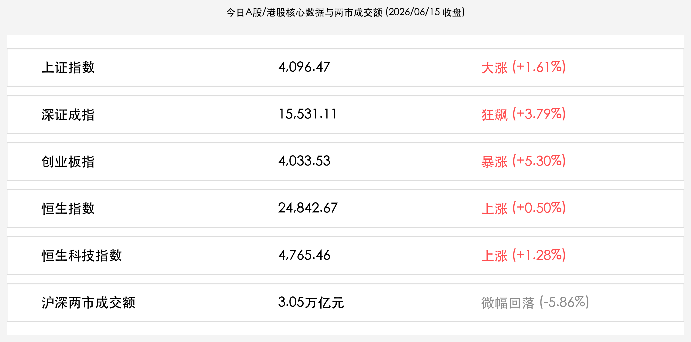

# A股创业板狂飙5.3%重返4000点，万亿科创与逆回购护航两市重上三万亿，港股大模型与芯片板块携手沸腾

**日期：2026年06月15日 (星期一)** &nbsp; **时段：下午 (常规交易日复盘)**

> **核心摘要**：今日 A 股与港股主要指数在央行等量买断式逆回购与陆家嘴论坛等多重流动性利好下迎来暴涨狂欢，创业板指狂飙 5.30% 收复 4000 点，上证指数大涨 1.61%，两市成交额达 3.05 万亿元，科技成长主线全线爆发。港股同样表现强劲，恒生科技指数大涨 1.28%，大模型及芯片概念股领涨全场。日本央行议息会议召开及 G7 峰会开幕引起地缘与跨国流动性防御性关注，但未阻挡中国资产的科技重估。

## 核心行情复盘

今日 A 股与港股主要指数全线收涨，两市成交量依然保持极高水平，市场多头情绪彻底被科创主线和流动性利好点燃：

*   **A股三大指数集体暴涨**：上证指数收盘报 **4,096.47点**，上涨 **1.61%**；深证成指收盘报 **15,531.11点**，上涨 **3.79%**；创业板指收盘报 **4,033.53点**，狂飙 **5.30%**。
*   **港股主要指数强势拉升**：恒生指数收盘报 **24,842.67点**，上涨 **0.50%**；恒生科技指数收盘报 **4,765.46点**，上涨 **1.28%**。
*   **成交额维持三万亿天量平台**：沪深两市今日合计成交额达 **3.05万亿元**，较前一交易日（3.24万亿元）微幅回落，但依然连续两个交易日站稳 3 万亿高位。
*   **个股呈现普涨红盘**：全市场共有超过 **3900只** 个股上涨，赚钱效应极为突出。
*   **行业板块表现分化**：
    *   **领涨主线（算力产业链、半导体及电子元器件）**：受高科技重估与深市样本调仓生效后的资金入场催化，**算力产业链**（CPO、PCB概念等）全线爆发；**半导体与电子元器件板块** 表现强势，先进封装与PET铜箔等方向涨幅居前。
    *   **领退板块（煤炭与大金融）**：煤炭、银行等前期避险红利板块今日走势偏弱，呈现明显的资金“弃守为攻”高低切换特征。
    *   **港股亮点**：大模型概念股（智谱暴涨超 32%、MiniMax 涨超 7%）及芯片股（华虹宏力涨超 10%、中芯国际涨近 7%）大放异彩，新股溜溜梅首日涨幅超 193%。

## 核心解读与市场逻辑

> **万亿科创支持与逆回购等量续作双击，夯实流动性底座**
> 
> 今日央行等量续作 6000 亿 6 个月期买断式逆回购，平抑了年中季节性资金波动，终结了连续三个月的净收回态势，给市场传递出维护年中流动性合理充裕的强烈信号。叠加本周即将召开的陆家嘴论坛，科创板改革与新质生产力发展的政策预期不断升温。在深市核心指数定期调仓今日正式生效的背景下，大批被动与主动资金加速向科创成长板块腾挪，从而造就了创业板指单日狂飙 5.3% 的奇迹，表明市场已从前期的防御红利模式切入科技进攻模式。

> **港股大模型与芯片板块共振，全球科技财富效应在亚太区外溢**
> 
> 随着 SpaceX 世纪 IPO 带来的科技狂欢及其衍生 ETF（SPXY、SPCM）在海外密集挂牌，全球科技多头情绪处于极度高昂状态。而在港股市场，智谱大模型概念暴涨超 32%，MiniMax 及国内核心芯片股（华虹宏力、中芯国际）集体大涨，反映出中国本土 AI 产业与半导体硬科技在估值上正在被重新发现。尽管日本央行本周议息会议可能加息至 1.00% 带来的套利盘平仓压力让部分跨国资金表现谨慎，但在国内强流动性和科创红利支撑下，中国资产已成功开启了一场完全独立的科技重估主线。

## 政策脉动

*   **央行等量开展 6000 亿买断式逆回购，释放流动性呵护信号**：6 月 15 日，中国人民银行开展了 6000 亿元 6 个月期买断式逆回购操作，旨在对冲年中资金波动并稳定市场预期。业内人士认为，央行此举精准满足了跨年中资金跨期需求，为下半年的政府债平稳发行和即将召开的陆家嘴论坛筑牢了资金安全垫。
*   **2026陆家嘴论坛预热升级，科创板深化改革预期高企**：定于 6 月 17-18 日在上海举办的陆家嘴论坛即将开幕，市场对于提高耐心资本比重、深化科创板机制改革以及建立多层次科技金融体系的政策探讨已达到高潮。监管层对于“反内卷”与高质量出海企业的扶持调子，将为先进制造板块的可持续高增长提供清晰的制度红利。

## 最新机构观点

*   **中信证券**：**“科技重估窗口开启，三万亿天量构筑坚实底部”**。中信证券认为，今日 A 股再次站上三万亿成交量级，虽然较上周五微幅回落，但已确立了双创板块被大额被动资金回补的趋势。操作上，随着深市指数调仓完成，资金正从电力、煤炭等红利防御方向流向以半导体设备、商业航天和 AI 算力为代表的硬科技板块，建议超配具备高技术壁垒的先进制造细分龙头。
*   **高盛**：**“港股科技股性价比凸显，防范日本央行政策带来的全球流动性脉冲”**。高盛维持对中国科技股的“超配”评级，并指出大模型及芯片股今日在港股的优异表现，凸显了亚太科技资产在估值和成长性上的性价比。不过，高盛提醒仍需密切紧盯 6 月 16 日日本央行关于将利率提升至 1.00% 这一决议的表态，防范套利交易（Carry Trade）平仓引发美债收益率短暂上升和全球成长股短期分母端的压制。
*   **中金公司**：**“流动性支撑力度强劲，聚焦自主可控与出海硬制造”**。中金公司指出，央行 6000 亿买断式逆回购等量续作打消了市场对年中流动性紧张的担忧。陆家嘴论坛召开在即，科技创新和自主可控是绝对主线。建议把握反内卷竞争格局清晰、在核心产业链实现关键突破并能够成功出海融入全球高端供应链的优质软硬件科技企业。

## 今日市场情绪：彩翼星空与水木宫殿

今日市场情绪在流动性充盈与科创突破的交响中，展现出充满科幻与古典交织的超现实主义美感。在深邃而繁星点点的数字星空之下，一只由莹莹绿光的晶莹硅片与光纤织就的飞鸟正在大展双翼，带着数码芯片飞向太空，代表着科创与大模型的全线爆发。而在下方的静谧大地上，一座古典的法式石质宫殿静静矗立在如镜的翠绿湖面之上，水面上浮光掠影，闪烁着代表逆回购支持的翠绿色波光，显得无比稳定而祥和。与此同时，在天空中，一弯红日正缓缓升起，映射在一座巨大的红白石质日晷之上，它的指针正精准指向“1.00%”的标记，象征着日本央行即将落地的加息大考。这个周一收盘，中国资产在坚实流动性的护航下，已然张开了科创飞翔的双翼。

> Prompt: Surrealism style, A majestic bird woven from glowing green silicon chips and optical fibers spreading its wings in a starry digital sky, carrying microchips towards deep space. Below, a classic French stone palace stands peacefully on the shore of a calm, reflective green lake, with gentle ripples shimmering like currency symbols. In the sky, a red sun rises next to a giant stone sundial with its mechanical hand pointing precisely to a glowing '1.00%' mark. No humans., masterpiece, high detail, intricate composition, cinematic lighting, 8k resolution

---

免责声明：内容仅供参考，不构成投资建议。
