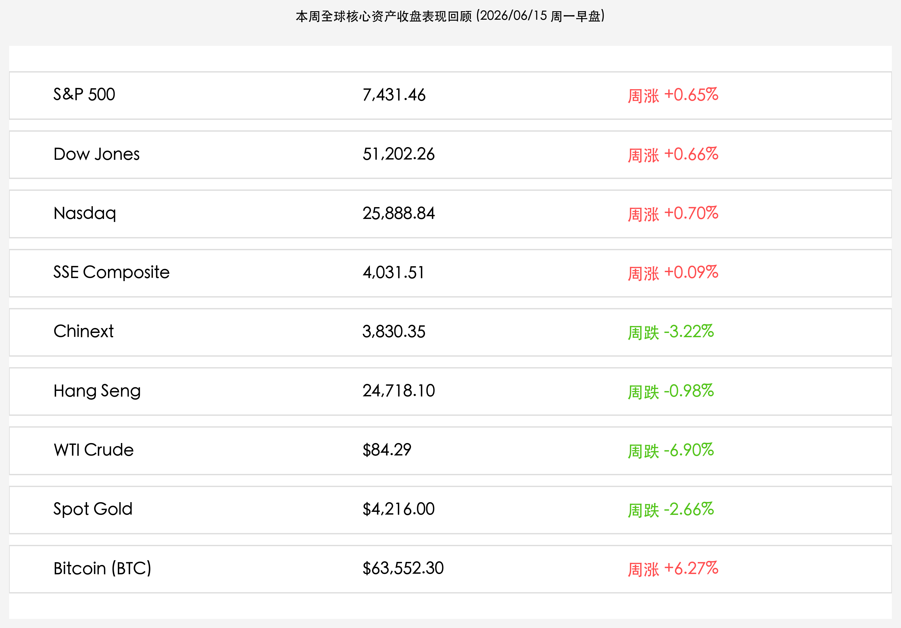

# 全球市场新周启航：G7 Évian 峰会引路地缘重塑，日央行加息箭在弦上，央行等量买断逆回购平抑流动性与 SpaceX 衍生品狂欢共振

**日期：2026年06月15日 (星期一)** &nbsp; **时段：早报 (新周展望模式)**

> **核心摘要**：本周一，全球金融市场在 SpaceX 衍生 ETF 密集挂牌的科技热潮中开启了新一周的航程。随着 G7 峰会在法国 Évian-les-Bains 正式开幕，地缘外交与经济重塑进入关键窗口，同时市场全力聚焦日本央行本周一至周二议息会议中高达 88% 的加息预期。国内市场方面，中国人民银行在 6 月 15 日正式开展 6000 亿买断式逆回购操作，结束了连续三个月的收缩，释出稳定流动性合理充裕的明确信号，为本周陆家嘴论坛及指数调仓落地筑牢了国内资产的价值底座。

## 周末财经要闻终极汇总

本周全球资产收盘数据如下，各大核心资产在科技狂欢与地缘博弈中表现分化：

*   **1. SpaceX 世纪 IPO 财富效应持续放大，两倍杠杆及收益类衍生 ETF 今日密集挂牌**
    
    > **事件原因与市场洞察**：SpaceX (SPCX) 在上周五定价 135 美元上市，挂牌首日暴涨 **+19.22%** 收报 **160.95 美元**，市值直接突破 **2.1 万亿美元** 大关。SpaceX 的世纪上市不仅巩固了其作为全球硬科技图腾的地位，更在衍生品市场掀起狂欢。今日（6 月 15 日），**Purpose SpaceX (SPCX) Yield Shares ETF** (代码：SPXY) 将正式在 Cboe Canada 交易；同时，Tradr ETFs 将推出两倍杠杆衍生基金 **Tradr 2X Long SpaceX Daily ETF** (代码：SPCM) 和 **Tradr 2X Short SpaceX Daily ETF** (代码：SPCG)，这标志着硬科技龙头的流动性衍生与财富效应将得到进一步放大，吸引大批杠杆及收益型资金涌入。

*   **2. 第 52 届 G7 领导人峰会今日开幕，聚焦地缘博弈、供应链安全与 AI 新秩序**
    
    > **事件原因与市场洞察**：由法国主办的第 52 届 G7 首脑峰会今日在法国埃维昂莱班（Évian-les-Bains）正式开幕。本次峰会重点聚焦全球地缘政治危机、大宗商品供应链安全以及 AI 等前沿科技的国际协调规制。峰会前夕，邻近的瑞士日内瓦等地发生了激烈的示威抗议冲突，引发外界对地缘安全的密切关注。G7 峰会释放的政策定调将直接影响下半年多边贸易及战略硬科技产业链的安全系数，市场情绪整体维持防御性观望。

*   **3. 日本央行议息会议召开在即，市场对其加息至 1.00% 的预期高达 88%**
    
    > **事件原因与市场洞察**：日本央行于 6 月 15-16 日召开货币政策会议。由于日元持续疲软对输入型通胀形成推动，且国内通胀粘性依然高企，市场预期日本央行将政策利率由 0.75% 提升至 **1.00%** 的概率高达 **88%**。尽管行长植田和男因健康问题缺席近期部分活动，但市场分析指出，为了平衡日元贬值与国债收益率上行风险，央行加息几近“箭在弦上”。如果靴子落地，美日利差将收窄，可能引发日元套利交易（Carry Trade）资金的脉冲式平仓回流，给全球债券市场及高估值跨国股市流动性注入震荡因子。

*   **4. 央行 6 月 15 日等量开展 6000 亿买断式逆回购，结束连续三个月流动性净收缩**
    
    > **事件原因与市场洞察**：中国人民银行于今日开展 6000 亿元 6 个月期买断式逆回购操作，精准置换本月到期同等规模流动性。这一操作宣告了此前连续三个月的货币 market 净回笼操作结束，释放出管理层平衡市场利率波动、保持年中流动性合理充裕的明确信号。在通胀小幅上行与跨年中结汇压力增大的背景下，央行的政策护航将为本周 A 股指数定期调仓及陆家嘴论坛的政策落地提供平稳的资金底座。

*   **5. 深市核心指数定期调仓今日正式生效，被动资金腾挪引发局部盘面波动**
    
    > **事件原因与市场洞察**：深交所及深圳证券信息有限公司此前宣布的深证成指、创业板指、深证 100 和创业板 50 等核心指数样本股定期调整于今日（6 月 15 日周一）开盘后正式生效。随着安泰科技、佛塑科技等调入股以及部分调出股的筹码重组，相关跟踪 ETF 被动资金在早盘的集中腾挪将导致相关个股的成交额和波动率显著放大，主力资金正在寻找新的均衡水平。

## 新一周市场核心博弈逻辑

*   **日央行加息靴子落地与 Carry Trade 套利盘平仓压力**：日本央行本周一至周二公布的利率决议，是继上周美联储新主席沃什抗通胀态度之后的又一流动性定音锤。若加息至 1.00% 兑现，高息美债与日元之间的套利链条将被动收缩。在套利资本平仓回流日本的预期下，全球债券市场收益率高企，对高估值科技股的多头情绪仍是一种考验。
*   **陆家嘴论坛的政策定调与科创板改革深化预期**：将于 6 月 17-18 日举行的 2026 陆家嘴论坛是本周国内最重要的事件。吴清主席、丁向群局长等监管高层将发表演讲，市场高度期待在新质生产力融资支持、耐心资本引导以及红利估值体系建设等方面的制度宣贯。这与本周一开始生效的指数样本股调整交织共振，有望带来“科技成长”与“稳定红利”的轮动重塑。
*   **端午节假期休市的节前避险防御情绪**：由于 6 月 19 日（周五）为端午节假期，A股、港股、台股及美国市场（六月节）均休市，形成三天的假期窗口。在经历了前期 3.24 万亿天量筹码清洗后，假期前仅有的四个交易日中，部分主力资金可能倾向于防御性操作，红利防守板块与高能见度科创底座（如先进封装、商业卫星）的结构分化将更趋明显。

## 本周重磅经济数据与会议前瞻

*   **06月15-17日 (周一至周三)**：
    *   **G7 Leaders' Summit**：法国 Évian-les-Bains 主办，商讨地缘及供应链大计。
    *   **日本央行 6 月议息会议**：定调是否加息至 1.00% 及缩减购债计划。
    *   **深证成指/创业板指等调仓生效**：被动 ETF 资金完成筹码对齐。
    *   **中国央行买断式逆回购**：6000 亿买断式逆回购落地实施。
*   **06月17-18日 (周三至周四)**：
    *   **2026 陆家嘴论坛**：聚焦资本市场新政与金融高水平开放。
    *   **中国 5 月宏观经济数据**：5 月社会消费品零售总额、规模以上工业增加值、70城房价出炉，检验内需成色。
*   **06月18日 (周四)**：
    *   **美联储 FOMC 利率决议 (沃什时代首秀)**：评估点阵图及主席沃什的政策前景前瞻。
*   **06月19日 (周五)**：
    *   **端午节假期休市**：中国 A 股、港股、台股以及美股（Juneteenth 纪念日）全天休市。

## 头部券商/投行开盘策略点睛

*   **中信证券 (CITIC Securities)**：**“3.2万亿成交洗盘基本完成，等量买断逆回购稳定信心”**。中信证券分析，今日央行开展 6000 亿买断式逆回购结束了连续三个月的流动性净收缩，为年中资金面筑底。深市调仓落地后被动资金换手完成，市场在 3.24 万亿创纪录成交量清洗后，慢牛格局并未改变。操作上，建议继续秉持“硬科技成长底仓 + 顺周期红利防御”的杠铃组合，寻找半导体设备、商业航天和有色金属龙头。
*   **高盛 (Goldman Sachs)**：**“SpaceX 衍生品密集上市催化科技行情，防范 Carry Trade 汇回对流动性的扰动”**。高盛维持对全球科技股的“超配”策略，并指出 SpaceX 世纪 IPO 带来的财富效应正在其衍生 ETF SPXY/SPCM 上市后加速变现，这有利于对冲高估值成长股在美联储沃什决议前的分母端压力。但仍需紧盯日本央行 88% 的加息决策，防范日元汇回引发跨国资产及美债收益率出现短暂脉冲式调整。
*   **中金公司 (CICC)**：**“流动性等量置换静待政策信号，聚焦反内卷与核心出海龙头”**。中金公司指出，央行买断式逆回购操作成功等量续作，平抑了流动性波动，而陆家嘴论坛临近为科创与耐心资本重组预留政策期待。实体复苏成色将在本周 5 月宏观数据出炉后得到验证，配置上建议坚定选择具备跨越内卷壁垒、拥有高能自主技术并成功融入全球高端供应链的优质制造出海企业。
*   **海通证券 (Haitong Securities)**：**“样本股调整完毕强化指数底座，在监管红利下精选先进制造”**。吴清主席近期强化市场秩序对整治题材押注起到良性引导，深市核心指数完成定期调仓后，指数代表性与分红结构将更加优化。短期应利用节前震荡期，逢低吸纳集成电路、高端电力设备等有业绩支撑的先进制造龙头。

## 今日市场情绪：清晨的樱花与轨道的星芒

今日市场情绪在 G7 峰会序幕的宏大画卷中，展现出冷暖交织的超现实主义美感。在一片金黄色的清晨薄雾中，一座古老而典雅的法式石质宫殿静静矗立在如镜的翠绿湖畔，湖面反射出柔和而充满希冀的破晓微光，代表着 G7 峰会的大幕拉开。在宫殿旁，一株繁茂的巨大日本樱花树傲然挺立，树根处正交织环绕着一枚枚散发出耀眼金光的日元货币符号，旁边的石质日晷指针已被机械指针精准指向“1.00%”的标记，暗示着即将到来的日本央行加息大考。在它们的下方，一曲由翠绿液体组成的河流沿着古老的石桥拱洞汩汩流过，水流中浮动着一片片微小的金币与散发着莹莹绿光的芯片版，象征着央行买断逆回购带来的深层而稳定的流动性。而在万里无云的晨曦天际中，一条由银白色金属构筑的巨大轨道环线正环绕着地球，轨道上正投影出“SPXY”和“SPCM”的深蓝色星芒，一艘微型航天飞机正迎着红日冲上云霄，折射出 SpaceX 衍生品时代下全球科技股多头的星辰大海之梦。在这个周一破晓，市场在谨慎的防守中，已然上膛了新周进攻的动力。

> Prompt: Surrealism style, A majestic stone palace on the shore of a calm lake under a bright morning sky with a soft golden sunrise. A giant Japanese cherry blossom tree stands nearby, its roots intertwined with glowing golden Yen symbols, and a massive stone dial next to it showing '1.00%'. A river of glowing green liquid with floating golden coins and circuit boards flows under a stone archway. In the sky, a silver orbital ring displays the glowing neon text 'SPXY' and 'SPCM', while a spacecraft rises towards the heavens in the distance. No humans., masterpiece, high detail, intricate composition, cinematic lighting, 8k resolution

---

免责声明：内容仅供参考，不构成投资建议。
