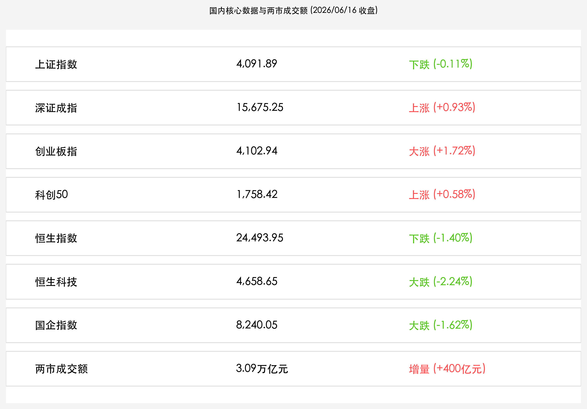

# 日央行历史性加息落地引港股巨震，3.09万亿天量护航A股双创逆势收红，五月高技术工业大增15.1%彰显核心韧性

**日期：2026年06月16日 (星期二)** &nbsp; **时段：下午 (常规交易日复盘)**

> **核心摘要**：今日日本央行历史性加息至 1.0% 引发全球流动性与套利交易平仓忧虑，港股恒生指数大跌 1.40%，科指重挫 2.24%。然而，A股在 3.09 万亿元天量成交额与国家统计局 5 月高技术工业大增 15.1% 的强劲基本面护航下展现极强内生韧性，创业板指逆势上涨 1.72% 站稳 4100 点，深成指涨 0.93%，算力与半导体产业链全线大涨，形成境内外市场的显著分化。

## 核心行情复盘

今日 A 股与港股主要指数走势分化。受外部流动性收缩预期拖累，港股全线走弱；而 A 股凭借强劲的本土资金与政策底座，双创板块逆势狂飙，科创主线做多情绪依然高涨。

*   **A股三大指数分化收红**：上证指数微跌 **0.11%**（下跌 4.58点），收报 **4,091.89点**；深证成指上涨 **0.93%**（上涨 144.14点），收报 **15,675.25点**；创业板指大涨 **1.72%**（上涨 69.41点），收报 **4,102.94点**。代表硬科技的**科创50指数**上涨 **0.58%**，收报 **1,758.42点**。
*   **两市成交额刷新历史新高**：沪深两市全天合计成交额达 **3.09万亿元**，较前一交易日（3.05万亿元）继续增量 **400亿元**，连续三个交易日站稳 3 万亿高位平台，交投极其活跃。
*   **个股呈现结构性普涨**：全市场超过 **2700只** 个股上涨，逾百股涨停，赚钱效应显著集中于科技成长方向。
*   **港股主要指数集体深幅回调**：恒生指数收盘大跌 **1.40%**（下跌 348.72点），收报 **24,493.95点**；恒生科技指数重挫 **2.24%**，收报 **4,658.65点**；恒生国企指数下跌 **1.62%**，收报 **8,240.05点**。商业航天等板块逆势走强，但石油、地产与有色金属板块跌幅居前。
*   **行业板块高低切换明显**：
    *   **领涨主线（算力产业链与半导体科技）**：**算力芯片、MLCC概念、复合铜箔、PCB概念、光通信（CPO概念）及玻璃基板** 等科技题材涨幅居前，体现资金对新质生产力的高度认同。
    *   **领跌板块（顺周期与红利防守）**：受原油等大宗商品价格大跌与全球套利平仓影响，交通运输、煤炭、保险、酿酒、房地产及贵金属等板块表现低迷。

## 核心解读与市场逻辑

> **日央行1995年以来最高利率落地，全球 Carry Trade 平仓风暴首当其冲重创港股**
> 
> 6 月 16 日，日本央行在行长植田和男因病缺席下，由副行长内田真一主持会议，以 7 票赞成、1 票反对的压倒性优势，决定将政策利率上调至 1.00%。这一自 1995 年以来的最高利率水平，彻底拉开了日本常态化加息的序幕。由于日元加息将引发庞大的全球套利交易（Carry Trade）平仓汇回，对极度依赖全球外资流动性的香港市场形成了直接打击，导致恒指与恒生科技指数深幅收跌。同时，外资对流动性敏感板块的防守出逃，也拖累了大宗商品以及国内红利防御板块（如煤炭、有色等）。

> **五月宏观数据“总体平稳，向新向优”：高技术工业暴增15.1%提供硬支撑**
> 
> 国家统计局今日公布了 5 月份国民经济运行数据。虽然单月社零因去年同期高基数等影响微跌 0.6%，但前 5 个月货物进出口总额同比暴增 15.3%，出口韧性十足。更重要的是，5 月规上工业增加值同比增长 4.5%，其中代表新质生产力的**高技术制造业同比大增 15.1%**（装备制造业增长 9.5%）。这组数据清晰地表明，中国经济结构转型成效显著，硬科技和先进制造正成为拉动经济的坚实引擎，这也为 A 股双创板块的逆势走强提供了最坚实的基本面护航。

> **三万亿天量流动性沉淀，A股科技板块开启特立独行的“去分母端”行情**
> 
> 与港股的剧烈震荡不同，A 股今日展现了极强的本土独立性。沪深两市成交额非但没有因为外部风暴而萎缩，反而继续放量至 3.09 万亿元。这说明前期从红利防守板块流出的资金，以及国内央行持续买断式逆回购与即将召开的陆家嘴论坛深化改革预期，使得国内“耐心资本”和“活跃资金”源源不断流入科创方向。A 股科技成长股正在摆脱外部流动性紧缩（分母端受压）的干扰，由强劲的自主可控产业红利与新质生产力业绩兑现（分子端爆发）驱动，走出一条特立独行的独立行情。

## 政策脉动

*   **国家统计局回应五月经济运行，积极储备增量政策工具**：在今日的国新办新闻发布会上，统计局首次发布了“社会消费商品和服务零售总额”指标（1-5月同比增长2.8%）。官方强调，面对国际环境复杂性，将继续强化宏观政策集成效应，发挥存量和增量政策的协同力，对内挖潜，积极做好稳就业、促消费工作。
*   **央行开展 4495 亿元逆回购，呵护年中流动性稳定**：6 月 16 日，中国人民银行以 1.40% 的操作利率开展了 4495 亿元 7 天期逆回购操作，全额满足了一级交易商需求。这与昨日 6000 亿买断式逆回购操作共同构成了强有力的中期流动性支持，为陆家嘴论坛开幕前的国内资金面构筑了安全缓冲垫。

## 最新机构观点

*   **中信证券**：**“外部紧缩冲击港股，A 股天量成交构筑科创‘护城河’”**。中信证券认为，日本央行历史性加息至 1.0% 对港股等离岸资产带来了阶段性的套利资金流出压力，但 A 股成交额连续站稳 3 万亿高台，显示本土资金具有充足的深度与防御力。当前市场逻辑已从前期的政策博弈转向 5 月宏观数据验证，高技术制造业 15.1% 的增速为半导体、算力设备提供了强烈的景气度背书，建议投资者继续锚定硬科技龙头。
*   **中金公司**：**“聚焦内需与科技突破，日元加息无碍 A 股独立估值重构”**。中金公司指出，日元汇率波动虽然对全球 Carry Trade 造成脉冲式扰动，但中国资产当前的估值底座非常扎实。5 月出口同比增长 15.3% 以及高技术生产的景气表明中国自主制造具备极强的国际竞争力。随着明日陆家嘴论坛的开幕，科创板深化改革举措出炉在即，A 股先进制造和自主可控板块有望迎来新一轮制度红利溢价。
*   **高盛**：**“警惕全球流动性短暂收紧，港股科技股经历压力测试后性价比将更加突出”**。高盛分析，植田和男行长因病缺席并未动摇日央行常规化加息步伐，内田真一的鹰派表态推动了日元套利平仓，这也是港股大跌的主因。尽管面临短期阵痛，高盛认为，港股芯片与商业航天板块在经历本次外部压力测试后，其估值性价比将更具吸引力，长线外资在洗盘结束后有望重新流入。

## 今日市场情绪：日晷与科创之塔

今日市场情绪在日央行加息尘埃落定与 A 股科创独立走强的多空交织中，呈现出宏伟而充满张力的超现实主义画面。在海天交界的海岸线上，一座由青铜与黄金铸造的巨大机械日晷庄严耸立，其指针正精准指向代表历史性决策的“1.00%”刻度，一位身穿黑色西装的日本绅士神色肃穆，正紧紧扶着日晷的金色控制杠杆。日晷一侧的波涛汹涌的海面上，一艘古老的木船正迎着由流动性紧缩引发的巨浪艰难前行，象征着港股在风浪中经受的短期考验。然而，在海湾的另一侧，一片生机盎然的绿色陆地上，一座由晶莹的绿色硅片和脉冲光纤交织而成的科创之塔巍然耸立，在一道由漫天金钱符号交织而成的耀眼金色光柱的沐浴下熠熠生辉。两股宏大的力量在海岸两侧交汇对峙，展现出这个周二收盘时分，中国硬科技资产无惧外部风暴的底气与希望。

> Prompt: Surrealism style. Subject: A giant mechanical sundial made of bronze and gold stands on a shoreline. Next to it, a Japanese gentleman (real person) in a formal suit holds the sundial's golden lever. Background: In the sky, a red sun rises. On the nearby sea, a traditional wooden ship struggles against turbulent blue waves. On the opposite green land, a futuristic tower woven from glowing green silicon chips rises majestically under a pillar of golden light composed of currency symbols. No text, masterpiece, high detail, intricate composition, cinematic lighting, 8k resolution

---

免责声明：内容仅供参考，不构成投资建议。
