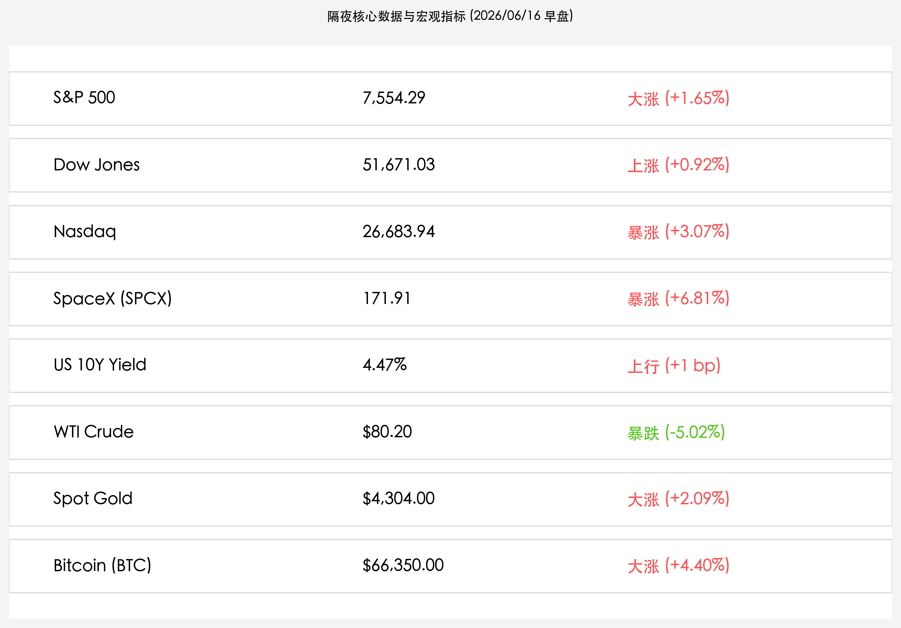

# 全球风险偏好爆发：美伊和平协议框架重塑地缘红利，纳指飙升3%与SpaceX狂欢共振，日央行加息大考在即与行长抱恙退居幕后

**日期：2026年06月16日 (星期二)** &nbsp; **时段：早报 (常规交易日复盘)**

> **核心摘要**：昨日晚间，随着美伊就和平协议框架达成初步共识，霍尔木兹海峡重开预期推动布伦特与 WTI 原油价格双双暴跌超 5%，引发全球金融市场“风险偏好”强劲回归，纳斯达克指数单日狂飙 3.07%，道琼斯指数创历史新高。同时，SpaceX 挂牌第二日股价继续拉升 6.81% 突破 171 美元，市值突破 2.52 万亿美元，其衍生杠杆 ETF 首日交投活跃。今日市场目光转向日本央行议息决议，尽管行长植田和男因病缺席，但市场对于利率提升至 1.00% 这一历史性决策的预期仍高悬在 88% 左右，多空博弈一触即发。

## 核心行情复盘

今日隔夜美股与欧洲主要指数全线收涨，避险资金大幅流向风险资产，主要受美伊和平协议框架地缘情绪释放推动：

*   **美股三大股指强势井喷**：道琼斯工业平均指数大涨 **0.92%**（上涨 468.77点），收盘报 **51,671.03点**，创历史最高收盘纪录；标普500指数上涨 **1.65%**（上涨 122.83点），收盘报 **7,554.29点**；纳斯达克综合指数大涨 **3.07%**（上涨 795.09点），收盘报 **26,683.94点**。
*   **科技硬科技龙头再度狂飙**：**SpaceX (NASDAQ: SPCX)** 盘中延续强势，收盘大涨 **6.81%**，收报 **171.91美元**，市值飙升至 **2.52万亿美元**。其首只两倍做多每日杠杆衍生基金 **Tradr 2X Long SpaceX Daily ETF (代码：SPCM)** 首日交易收盘报 **34.79美元**，交投极度活跃。
*   **大宗商品暴跌与金价避险拉升分化**：受到美伊框架协议地缘降温影响，**WTI原油**暴跌 **5.02%**，收盘报 **$80.20/桶**，极大地缓解了市场对二次通胀的担忧；而**现货黄金 (Spot Gold)** 呈现出利空出尽后的补涨，大涨 **2.09%** 收于 **$4,304.00/盎司**。
*   **美债与数字资产情绪高涨**：**美国10年期国债收益率**微升至 **4.47%**，反映出交易员在美联储沃什时代首场决议前仍保持防守姿态；**比特币 (BTC)** 同样受益于流动性压力的平抑，大涨 **4.40%** 重回 **$66,350.00** 关口。
*   **欧洲市场主要股指大涨**：除英国 FTSE 100 指数因原油权重股拖累逆势下跌 0.4% 外，法国 CAC 40 指数大涨 **1.6%**，德国 DAX 指数大涨 **1.7%**，欧盟 50 指数 (EU50) 上涨 **0.93%** 报 6245 点。

## 核心解读与市场逻辑

> **地缘政治黑天鹅平抑与油价暴跌：无通胀下的增长成科技股最强发动机**
> 
> 隔夜美欧股市的大暴涨，其核心导火索在于美伊达成和平协议框架及霍尔木兹海峡重开的预期。这一突发地缘利好促使布伦特及 WTI 原油跌超 5%，直接打碎了市场对能源危机与顽固通胀的负面预期，美债收益率保持平稳。在“通胀降温 + 经济平稳”的黄金窗口期，资金迅速撤离煤炭、防守类板块，重新拥抱高风险科技资产。纳指单日大涨超 3%，证明在分母端无通胀压力下，分子端的科技成长依然是全球资金最瞩目的星辰大海。

> **SpaceX 财富效应与衍生品加速挂牌：全球耐心资本的资产配置范式转移**
> 
> SpaceX 作为市值 2.52 万亿美元的科技旗舰，上市次日继续上涨 6.81% 报 171.91 美元，表明全球市场对其商业航天、星链与火星探测愿景的狂热追捧并未衰减。同时，两倍杠杆 ETF (SPCM) 的首日上市，为全球机构和散户提供了极佳的流动性工具。这种硬科技龙头带来的高估值狂欢，直接给港股及 A 股的芯片、算力、先进制造等“科技进攻”板块注入了极强的情绪溢出，中资科技资产同样处于新一轮估值修复的前夜。

> **日本央行加息大考与行长因病缺席：跨国 Carry Trade 平仓的潜在风暴眼**
> 
> 6 月 16 日日本央行议息会议的利率决议是今日全球最关键的宏观炸弹。目前市场预期加息至 1.00% 的概率高达 88%。然而，日本央行行长植田和男因肝囊肿感染紧急入院缺席会议，改由副行长内田真一主持。这一权力暂代事件给本已紧绷的加息决议平添了不确定性。一旦 1.00% 利率尘埃落定，日元贬值压力将得到系统性平抑，但需要警惕的是，日元套利交易 (Carry Trade) 被动平仓并汇回日本国内的脉冲效应，是否会给全球债券及跨国高估值股市带来短暂的流动性挤兑。

## 政策脉动

*   **G7 埃维昂峰会首日聚焦地缘与供应链，日本提议建立关键矿物联合储备**：在昨日于法国开幕的第 52 届 G7 峰会上，除商讨美伊协议和乌克兰局势外，日本首相高市早苗在首日晚宴中特别提议 G7 成员国建立“关键矿产联合储备合作机制”，以强化大国对抗和去风险背景下半导体、新能源关键金属的供应链安全，体现出地缘经济板块正加速进行制度化重塑。
*   **美联储 FOMC 利率决议临近，新主席沃什时代首秀受期待**：本周四（6月18日）美联储新主席沃什将迎来其任内首场决议。虽然地缘缓和导致油价暴跌，但联储官员近期表态依然偏向谨慎鹰派（沃什主义），市场正密切关注本次会议点阵图，评估下半年降息路径，这也解释了为什么美债收益率隔夜并未跟随油价大跌而大幅下行。

## 最新机构观点

*   **高盛 (Goldman Sachs)**：**“原油大跌平抑分母端压力，SpaceX 衍生品上市激活成长股流动性”**。高盛维持对美股科技股的“超配”策略，并指出美伊协议达成带来的油价暴跌是当前最好的宏观缓释剂。SpaceX 世纪上市及其两倍杠杆 SPCM 挂牌有助于形成“科技资产蓄水池”，吸引源源不断的被动资金。然而高盛同时警示，本周二日本央行 88% 的加息预期可能带来阶段性的日元空头平仓，对全球跨国美元流动性形成局部扰动，但难以动摇科技慢牛的基底。
*   **摩根士丹利 (Morgan Stanley)**：**“风险偏好系统性回归，周期红利防御板块面临高低切换”**。摩根士丹利指出，地缘政治风险急剧降温和油价破位下行，标志着市场前期因通胀焦虑而建立的“防守壁垒”开始瓦解。全球资金正在重新定价那些具备确定性成长前景的重科技与新质生产力资产，建议投资者将配置从煤炭、传统公共事业等高分红板块，逐渐向先进制造、AI 供应链及 SpaceX 产业链溢出的关键材料方向切换。
*   **中金公司 (CICC)**：**“地缘降温平抑外部波动，中国科创与出海龙头迎来估值共振”**。中金公司认为，隔夜纳指暴涨超 3% 和美伊局势缓和，显著降低了全球市场的系统性溢价。对中国资产而言，国内央行开展 6000 亿买断式逆回购释放的深层流动性，叠加陆家嘴论坛科创政策改革的预期，将彻底激活市场进攻情绪。配置上，继续坚定看好在半导体设备、商业航天等先进制造领域取得关键突破、且能成功开拓全球高端市场份额的硬核出海龙头。

## 今日市场情绪：清晨飞龙与深海沙漏

今日市场情绪在流动性宽松与硬科技的狂欢中，展现出宏大而奇丽的超现实主义美感。在深邃明亮的星空宇宙中，一条巨大的由银白色金属和集成电路编织而成的巨龙正载着闪闪发光的芯片飞向遥远的星海，彰显出 SpaceX 及硬科技牛市的无限希冀。而在下方的静谧大地上，一具巨大的古老青铜沙漏静静悬浮在如镜的蓝色海面上。沙漏上端黑色的原油缓缓流下，在触及海面的瞬间化作无数晶莹的金币，水波中映射出代表霍尔木兹海峡重开与和平的波光，一艘大型白船安然穿过远处的石拱门。与此同时，在海岸边的一棵繁茂日本樱花树下，一个巨大的石质日晷刻度指向“1.00%”，代表着加息大考的降临，而在树枝上，一个急救医疗箱与听诊器悄然悬挂，暗示着行长抱恙退居幕后的戏剧性插曲。这个周二清晨，全球市场以一种奇特而充满张力的方式，拉开了风险偏好狂欢的大幕。

> Prompt: Surrealism style, A giant celestial dragon woven from glowing silver metal and integrated circuits flying through a starry digital universe, carrying shining crystal microchips. Below, a massive antique bronze hourglass floats above a calm, reflective blue sea. The black oil in the top of the hourglass flows down, transforming into sparkling gold coins. In the distance, a large white vessel sails smoothly through an open archway. On the shore, next to a giant stone sundial with its hand pointing to '1.00%', a red cross medical box and a stethoscope hang gently on the branch of a blooming cherry blossom tree. No humans., masterpiece, high detail, intricate composition, cinematic lighting, 8k resolution

---

免责声明：内容仅供参考，不构成投资建议。
