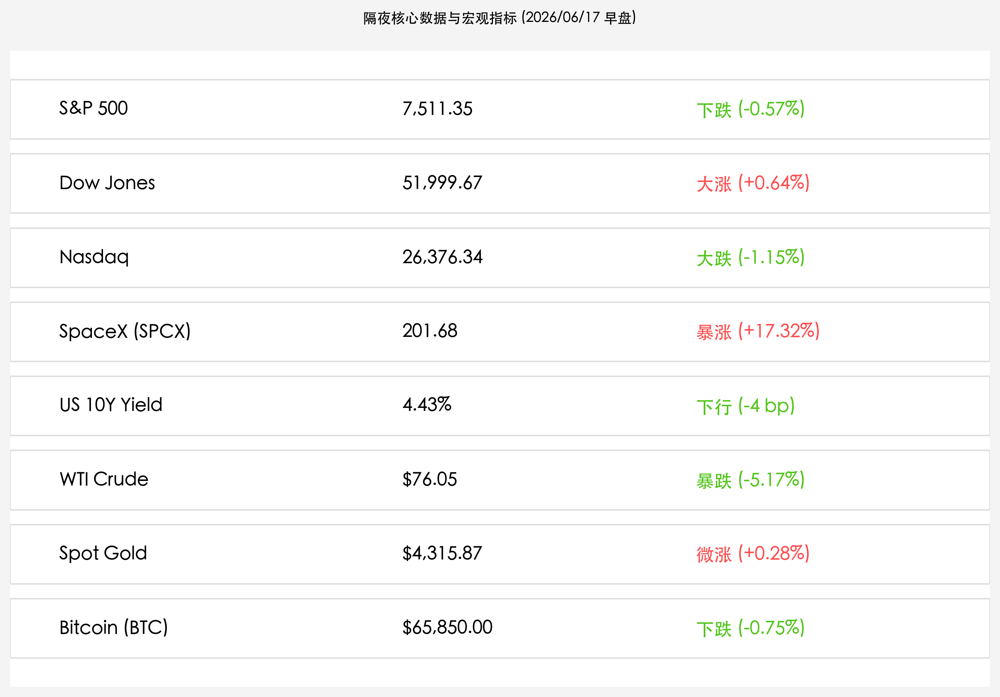
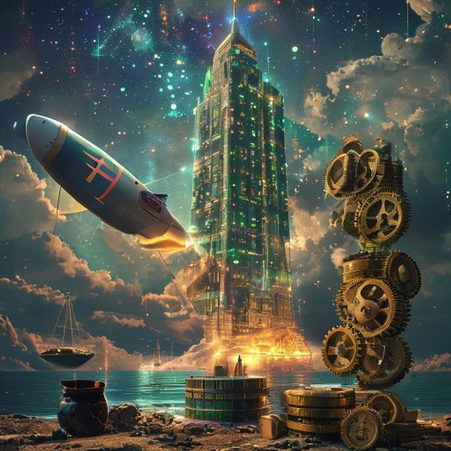

# 美股极端分化：科技股获利回吐纳指下挫，周期轮动道指创新高逼近5.2万点，SpaceX暴涨17%与原油大跌共振

**日期：2026年06月17日 (星期三)** &nbsp; **时段：早报 (常规交易日复盘)**

> **核心摘要**：隔夜美股呈现剧烈分化与强劲的板块轮动，投资者在美联储沃什时代首场利率决议前夕对AI及半导体科技巨头进行获利了结，拖累纳斯达克指数收跌1.15%，但资金流入金融与工业等传统蓝筹，推动道琼斯指数大涨并创下51,999.67点的历史新高。与此同时，SpaceX在IPO第三个交易日逆势狂飙17.32%突破201美元，成为科技成长股中唯一的超级明星；美伊和平备忘录及霍尔木兹海峡重开预期继续发酵，WTI原油大跌5.17%至76.05美元/桶，进一步平抑了分母端通胀担忧，促使十年期美债收益率回落至4.43%。

## 核心行情复盘

今日隔夜美股与欧洲主要指数分化收盘，由于半导体与AI巨头的落袋为安，科技股承压，但避险资金和轮动资金流入传统周期板块：

*   **美股三大股指极端分化**：道琼斯工业平均指数大涨 **0.64%**（上涨 328.64点），收盘报 **51,999.67点**，续创历史收盘最高纪录，盘中直逼 52,000点整数关口；标普500指数下跌 **0.57%**（下跌 42.94点），收报 **7,511.35点**；纳斯达克综合指数下跌 **1.15%**（下跌 307.60点），收报 **26,376.34点**。
*   **SpaceX 独撑大局与杠杆ETF暴涨**：**SpaceX (NASDAQ: SPCX)** 逆势展现惊人弹力，收盘暴涨 **17.32%**，收报 **201.68美元**，首次站上 200 美元大关，总市值狂飙至约 **2.96万亿美元**。其首只两倍做多每日杠杆衍生基金 **Tradr 2X Long SpaceX Daily ETF (代码：SPCM)** 亦大涨 **14.34%**，收报 **39.78美元**，市场资金疯狂涌入。
*   **原油崩跌与金价稳健上涨**：地缘政治方面，随着美伊签署初步和平条约框架及霍尔木兹海峡重开预期持续，**WTI原油**再度暴跌 **5.17%**，收盘报 **$76.05/桶**，从前一日的 $80 上方大幅下滑；**现货黄金 (Spot Gold)** 微幅攀升，上涨 **0.28%** 收于 **$4,315.87/盎司**。
*   **国债收益率与数字资产震荡**：**美国10年期国债收益率**回落至 **4.43%**（下行了约 4 bp），主要受能源暴跌平抑通胀预期和美联储周四决议前买盘支撑；**比特币 (BTC)** 宽幅震荡，小幅下跌 **0.75%**，收报 **$65,850.00**。
*   **欧洲市场收盘窄幅震荡**：英国富时100指数 (FTSE 100) 大涨 **0.72%** 收报 10,506 点，主要受银行股和公用事业拉动；德国 DAX 40 指数微涨 **0.07%** 收报 24,910 点；法国 CAC 40 指数震荡上扬，保持在 8,200–8,400 区间。
*   **行业板块高低切换与资金轮动**：
    *   **领涨行业（传统与高分红防御）**：金融（银行、保险）、工业制造、公用事业及资本品行业领涨，是道指创新高的主要推手。
    *   **领跌板块（半导体、软件及能源）**：前期累计涨幅巨大的AI半导体板块（如Nvidia、Broadcom、Micron等）出现深幅调整，引发半导体指数遭遇获利了结；受原油崩跌拖累，传统能源及石油开采板块同样表现低迷。

## 核心解读与市场逻辑

> **AI高开支遭审视与获利了结：估值极限拉扯下的健康回调**
> 
> 隔夜纳斯达克与标普500的下挫，并非行业基本面的崩塌，而是美股在长期上涨后进行的一场健康的“集中度消解”。近期市场开始以更苛刻的眼光审视科技巨头的AI资本开支（Capex）投资回报率（ROI）。云巨头每年数千亿美元的设备采购对短期财务报表利润的压制，令估值处于历史高位的AI科技股如履薄冰。在美联储关键决议的前夕，大笔活跃资金选择套现离场，导致半导体龙头普遍走低。然而，这恰恰给市场宽度（Breadth）的改善提供了契机，资金流入道琼斯传统价值股就是一种良性的流动性再分配。

> **美伊和平红利拉低原油：分母端压力系统性平抑**
> 
> 原油连续大跌并跌破 80 美元大关（WTI 收于 76.05 美元），反映出美伊和平条约备忘录正系统性消除能源溢价。霍尔木兹海峡重开不仅将为全球提供稳定的能源供给，更能有效阻断顽固通胀的传导路径。随着原油大跌，美债收益率回落到 4.43%，这对全球大盘的整体分母端（贴现率）压力的缓释具有里程碑式的意义。尽管短期内大宗商品和能源板块受挫，但中长期有利于提升工业和消费龙头的利润空间。

> **SpaceX $200 世纪跃迁：耐心资本筑牢硬科技塔尖信仰**
> 
> 在科技股普遍承压的背景下，SpaceX 暴涨 17.32% 突破 201 美元，彰显出市场对硬科技与商业航天硬资产的极致偏爱。相较于依然处于商业模式验证期的应用端 AI，SpaceX 所拥有的星链（Starlink）垄断地位与重型火箭发射的绝对物理壁垒，使其成为了真正意义上的“物理防守型科技龙头”。其 2 倍做多杠杆 ETF（SPCM）收于 39.78 美元，再次证明了耐心资本对于这种硬科技图腾的追捧已达疯狂状态，将对后续 A 股/港股的商业航天及精密制造估值带来强烈指引。

## 政策脉动

*   **美联储 FOMC 决议将至，凯文·沃什首考受聚焦**：本周四凌晨美联储将公布最新利率决议及点阵图。新任主席凯文·沃什（Kevin Warsh）的公开态度备受关注。在上一次日本央行超预期加息至 1.0% 的背景下，市场普遍预期沃什将维持其一贯的偏鹰（Hawkish）立场，以对冲日元套利交易平仓引发的外部金融波动，这令债市与股市的避险买盘在美股盘中形成了蓄水池。
*   **日本央行加息 1.0% 后续发酵，副行长表态平抑市场恐慌**：在日本央行历史性地将基准利率提升至 1.0% 后，副行长内田真一在周二收盘后发表平稳表态，暗示央行将继续观察日元利差平仓对实体经济和外部债券市场的温和回流效应，不会采取激进的连续加息，这对欧美的离岸资金稳定起到了一定安抚作用。

## 最新机构观点

*   **高盛 (Goldman Sachs)**：**“AI 算力开支进入 ROI 考核期，SpaceX 物理壁垒成资金最佳避风港”**。高盛发表策略报告指出，云厂商预计在 2026 年砸下约 7700 亿美元的资本支出，这促使投资者对 AI 龙头展开阶段性的盈利能力审视。在此背景下，拥有星链硬现金流和火箭发射硬垄断的 SpaceX（SPCX）成为科技资金最佳避风港。此外，原油崩跌对抑制通胀是极大外部利好，虽然短期引起科技股获利回吐，但美债收益率的回落将为美股大盘在下半年的表现构筑扎实的底部。
*   **摩根士丹利 (Morgan Stanley)**：**“市场宽度迎良性修复，轮动牛市逻辑依然未变”**。大摩指出，此前美股全线上涨的“纳斯达克独舞”是极不健康的。本次科技股退潮与道琼斯指数的大幅攀升，实质上是市场广度从狭窄走向宽广的标志。大摩建议继续缩减高估值芯片龙头仓位，转为超配资产负债表健康、且受益于利率下行的金融、工业及优质出海先进制造龙头。
*   **中金公司 (CICC)**：**“海外科技分化不改国货科创牛市，美债利率下行利好离岸成长”**。中金公司认为，虽然隔夜美股半导体回调，但 SpaceX 突破 200 美元将极大刺激国内商业航天与空天信息板块。随着美债收益率下行至 4.43%，全球分母端压力释放，将直接利好即将于今日开幕的陆家嘴论坛深化改革预期中的 A 股与港股科创板，尤其是半导体自主可控、商业航天和出海先进制造。

## 今日市场情绪：航天腾飞与周期天平

> Prompt: Surrealism style. In the starry celestial space, a colossal futuristic Starship with the SpaceX logo rockets vertically upward into a glowing nebula. Below, a massive tech tower built from glowing silicon chips and circuit boards shows slight cracks, with green binary codes peeling off like dust. In the foreground, a gigantic golden scale floats above a calm sea: the left pan holds an overturned oil drum leaking black crude oil, tilting upward, while the right pan, heavy with stacks of golden gear wheels and coins, sinks downward, representing market rotation and falling oil prices. On the shore, next to a giant stone sundial with its hand pointing to 'FOMC', a red ledger and a pen are placed. No humans., masterpiece, high detail, intricate composition, cinematic lighting, 8k resolution

---

免责声明：内容仅供参考，不构成投资建议。
