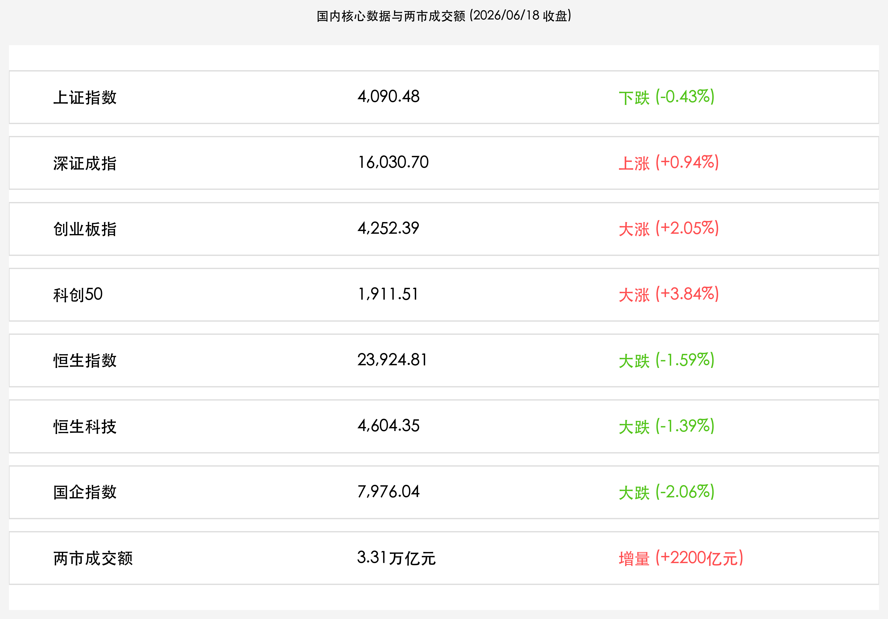

# A股放量狂飙刷新三万亿纪录，双创板块史诗级大涨科创50飙升3.8%，陆家嘴论坛利率与硬科技新规组合拳引燃做多热情，港股承压创年内新低

**日期：2026年06月18日 (星期四)** &nbsp; **时段：下午 (常规交易日复盘)**

> **核心摘要**：今日端午节假期前最后一个交易日，A股市场迎来流动性史诗级爆发，沪深两市全天成交额达 **3.31万亿元** 创历史新高。受陆家嘴论坛证监会发布支持人工智能等“硬科技”企业科创板上市新规，以及央行优化利率调控等一系列重磅金融组合拳刺激，创业板指大涨 2.05%，科创50指数史诗级飙升 3.84% 并创历史新高，算力与半导体产业链掀起涨停狂潮。然而，在外围流动性收紧与美联储沃什“首秀”偏鹰表态的双重压制下，港股三大指数集体深幅回调，恒生指数大跌 1.59%，恒指创年内新低，市场呈现极致的境内外行情分化。

## 核心行情复盘

今日 A 股与港股主要指数走势极致分化。受外部流动性收缩预期拖累，港股全线走弱并创下年内新低；而 A 股凭借强劲的本土资金与政策底座，双创板块逆势狂飙，科创主线做多情绪空前高涨，两市成交额刷下历史记录。

*   **A股三大指数分化收红**：上证指数震荡收跌 **0.43%**（下跌 17.59点），收报 **4,090.48点**；深证成指上涨 **0.94%**（上涨 149.75点），收报 **16,030.70点**；创业板指大涨 **2.05%**（上涨 85.34点），收报 **4,252.39点**。代表硬科技的**科创50指数**史诗级大涨 **3.84%**（上涨 70.69点），收报 **1,911.51点**，盘中最高触及 1,937.3点创历史新高。
*   **成交额刷新历史纪录**：沪深两市全天合计成交额达 **3.31万亿元**，较前一交易日（3.09万亿元）继续大幅放量 **2,200亿元**，体现交投情绪极度活跃。
*   **港股主要指数集体创新低**：恒生指数收盘大跌 **1.59%**（下跌 387.35点），收报 **23,924.81点**，创年内新低；恒生科技指数重挫 **1.39%**（下跌 64.72点），收报 **4,604.35点**；国企指数大跌 **2.06%**，收报 **7,976.04点**。
*   **行业板块高低切换明显**：
    *   **领涨主线（科技成长与自主可控）**：**矿物制品、通信设备（CPO、光通信）、半导体（芯片、先进封装）、培育钻石、GPU 及 AI 应用** 等板块大涨。中际旭创全天成交额达 **381.77亿元**，位居两市首位；兆易创新成交额达 **370.16亿元**。
    *   **领跌板块（周期与大金融）**：保险、电力、化纤、造纸等行业表现较弱，部分银行、券商等传统红利金融板块出现回调。

## 核心解读与市场逻辑

> **陆家嘴论坛多重红利共振，A股硬科技资产迎来“估值脱锚”的独立主线**
> 
> 证监会主席吴清在陆家嘴论坛上的表态，尤其是将科创板第五套标准适用范围扩大至人工智能大模型、量子科技、具身智能等硬科技领域，为新质生产力正名。这从根本上理顺了硬科技在A股的分子端（盈利成长性）逻辑。创业板与科创50的飙升，说明本土耐心资本与活跃资金正在对中国科技主线进行定价重构，摆脱了外围市场对分母端利率的压制，开启了独立行情。

> **两市成交3.31万亿创历史之最，富时指数调仓与端午节前避险情绪演绎“极致大腾挪”**
> 
> 3.31万亿元的天量换手，一方面源于富时中国A50指数调仓于今日收盘后正式生效，触发被动资金天量涌入相关科技权重股；另一方面也说明在端午节放假前，多空博弈白热化。部分前期拥挤的传统红利防守及传统大金融板块资金快速流出，涌入成长科技主线，中际旭创与兆易创新成交额均超370亿元，创下个股历史级流动性奇迹，体现出“高低大切换”和“防守向进攻转进”的凌厉风格。

> **美联储新主席沃什偏鹰首秀与港股“创年内新低”的深层隐忧**
> 
> 港股今日深度承压，主要在于隔夜美联储点阵图释放的“偏鹰”底色。新任美联储主席凯文·沃什重申了对通胀粘性的警惕，导致离岸流动性预期紧缩。同时，日本央行历史性加息至1.0%带来的全球Carry Trade（套利交易）平仓仍在深化，对极度依赖全球外资流动性的香港市场造成了持续的脉冲。恒指创下年内新低，显示了外部流动性对离岸中国资产的抽水效应。

## 政策脉动

*   **央行打出金融优化组合拳，短端利率调控机制再升级**：中国人民银行在陆家嘴论坛上宣布，将优化公开市场临时隔夜正、逆回购操作机制，操作时间调整为工作日15:00-15:30，不仅精细化了短端流动性调控，也极大缓和了非银金融机构的年末/年中流动性紧张。此外，出台《上海国际金融中心发展离岸金融行动方案》，在上海自贸区试点离岸人民币外汇交易，展示出高水平金融开放与风险防控并行的宏观格局。
*   **证监会硬科技支持政策落地，完善科技创新投融资生态**：中国证监会主席吴清宣布了科创板改革“组合拳”，明确支持量子科技、生物制造、具身智能及人工智能等“硬科技”企业上市。此举旨在畅通科技、产业和金融的良性循环，加快培育壮大“耐心资本”，为中国半导体、自主AI链构筑了制度层面的资金蓄水池。

## 最新机构观点

*   **中信证券**：**“A股3.31万亿天量见证科创做多主干道，端午节后建议聚焦中报景气主线”**。中信证券认为，尽管美联储点阵图表现偏鹰，但随着美伊和平协议推进对冲原油价格，外围紧缩对A股的影响边际递减。国内陆家嘴论坛抛出的金融优化与科创板上市新规是A股天量成交的核心催化剂。建议投资者在端午节后，关注中际旭创等AI通信设备龙头、半导体设备等中报业绩验证高弹性的方向。
*   **中金公司**：**“陆家嘴论坛新政打通科创估值通道，银行离岸金融迎来新蓝海”**。中金公司指出，央行创设境外央行回购工具及上海离岸人民币外汇交易试点，为大型银行及股份制银行拓展国际跨境及离岸金融业务提供了核心增量。同时，科创板放宽第五套标准至AI大模型，将为大模型研发及硬科技产业链带来估值重构机遇。建议配置基本面扎实、具备国际化金融服务能力的银行板块及科技龙头。
*   **高盛**：**“离岸流动性脉冲施压恒指创新低，港股AI与半导体已现超跌黄金坑”**。高盛分析，美联储利率前景及套利平仓担忧是压制港股恒指破位创新低的主因。但在今日下跌中，以智谱、MINIMAX为代表的港股AI大模型概念股，以及澜起科技等在港上市相关科技标的表现出极强抗跌性。高盛重申对港股科技龙头的长期建设性看法，认为当前压力测试下的超跌，为中长线外资提供了具有极高吸引力的建仓价位。

## 今日市场情绪：端午龙舟与科技之光

在端午佳节即将来临与A股流动性爆发的多空交织中，今日市场情绪呈现出宏伟的超现实主义意境。在由无数泛着微光的绿色硅片、脉冲光纤和蜿蜒电路板汇聚而成的“科创之河”上，一艘由黄金和青铜交织打造的巨大龙舟正劈波斩浪、奋勇前行，龙舟两侧溅起由漫天飞舞的二进制代码和A股指数符号交织而成的金色浪花，一位身着中国传统长袍的学者神情肃穆地伫立在龙舟船头，眺望着前方风云变幻的金融海域。而在河流一侧的阴影里，全球流动性紧缩的鹰派阴云在天际凝聚，化作一轮猩红色的落日，正将代表离岸资产的古老石桥无情地压迫下沉，象征着港股恒指在外部风浪下创出年内新低的阵痛；而在河流另一侧，在一束从九霄直插而下、由无数闪烁的货币符号汇聚而成的耀眼金色光柱沐浴下，一座由芯片晶圆和光导纤维交错层叠而成的“科创之塔”拔地而起，在金色天空中熠熠生辉。两股代表传统周期收缩与本土科技爆发的宏大力量在画面中激烈碰撞，深切地诠释了在这个端午假前收盘时分，中国硬科技资产无惧外部风暴、勇立潮头的底气与希望。

> Prompt: Surrealism style. Subject: A giant golden dragon boat racing forward on a river made of glowing green silicon circuits. Background: On the left, a dark red sun representing global high interest rates casts a shadow on a sinking stone bridge. On the right, a brilliant green silicon chip tower rises into a golden sky under a beam of golden light with currency symbols. No text, masterpiece, high detail, intricate composition, cinematic lighting, 8k resolution

---

免责声明：内容仅供参考，不构成投资建议。
