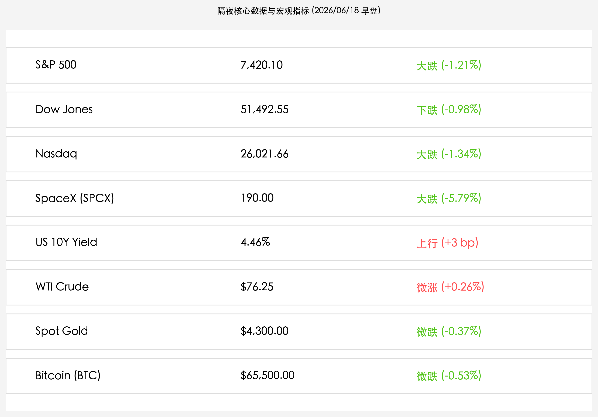
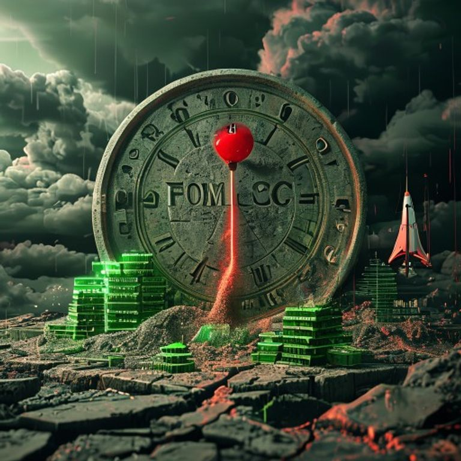

# 美联储鹰派“点阵图”震慑全场：美股科技蓝筹集体下挫，十年期美债收益率冲高，SpaceX高位退潮失守190美元

**日期：2026年06月18日 (星期四)** &nbsp; **时段：早报 (常规交易日复盘)**

> **核心摘要**：隔夜全球市场遭受美联储意外偏鹰的“点阵图”洗礼，新任主席凯文·沃什任内首场利率决议虽按兵不动，但点阵图显示多数官员倾向于在年内再次加息，导致市场风险偏好急剧降温。美股三大股指全线走低，科技龙头与半导体板块遭遇双击，纳斯达克指数收跌1.34%。SpaceX在连续暴涨后高位退潮跌逾5.7%至190美元，2倍做多杠杆ETF（SPCM）重挫超11%。避险情绪升温推动十年期美债收益率冲高至4.46%，WTI原油在供应正常化与地缘溢价消退中微涨，黄金及比特币等风险资产则延续震荡走弱态势。

## 核心行情复盘

今日隔夜美股与欧洲主要指数分化收跌，受美联储利率决议及鹰派点阵图打压，科技成长股与传统蓝筹普遍回撤：

*   **美股三大股指全线回落**：道琼斯工业平均指数收盘下跌 **0.98%**（下跌 507.12点），报 **51,492.55点**，失守前一日创下的历史高位；标普500指数收盘下跌 **1.21%**（下跌 91.25点），报 **7,420.10点**；纳斯达克综合指数领跌 **1.34%**（下跌 354.68点），报 **26,021.66点**。
*   **SpaceX 高位退潮与杠杆 ETF 大跌**：连日暴涨的 **SpaceX (NASDAQ: SPCX)** 遭遇强力获利了结，收盘下跌 **5.79%**，报 **190.00美元**，失守 200 美元整数关口；其两倍做多每日杠杆衍生基金 **Tradr 2X Long SpaceX Daily ETF (代码：SPCM)** 亦重挫 **11.59%**，收盘报 **35.17美元**，资金净流出明显。
*   **债市收益率冲高与数字资产承压**：**美国10年期国债收益率**冲高至 **4.46%**（上行了约 3 bp），主要受美联储暗示年内可能加息的鹰派指引刺激；**比特币 (BTC)** 延续震荡，小幅下跌 **0.53%**，收报 **$65,500.00**。
*   **商品市场窄幅整理**：**WTI原油**震荡微涨 **0.26%**，收盘报 **$76.25/桶**，尽管美伊签署初步和平条约框架及霍尔木兹海峡重开预期继续舒缓供给压力，但市场仍在观察具体落地时间；**现货黄金 (Spot Gold)** 微幅回落 **0.37%**，收报 **$4,300.00/盎司**，主要受实际利率与美元走强压制。
*   **欧洲市场跟随走弱**：英国富时100指数 (FTSE 100) 下跌 0.45% 收报 10,459 点；德国 DAX 40 指数下跌 0.62% 收报 24,756 点；法国 CAC 40 指数下跌 0.78% 收报 8,136 点。
*   **板块表现与资金动向**：
    *   **领涨/抗跌行业**：仅公用事业与防御性日常消费品板块微涨，资金避险意图明确。
    *   **领跌板块**：半导体、AI软件等高估值科技板块跌幅居前，英伟达、博通、超微半导体等AI硬件巨头集体走低；金融与工业制造板块在道指拖累下亦呈现普跌格局。

## 核心解读与市场逻辑

> **美联储鹰派“点阵图”惊魂：凯文·沃什时代的收缩预期再燃**
> 
> 隔夜市场最核心的驱动力在于美联储公布的6月点阵图。虽然本次会议将基准利率维持在 3.5%–3.75% 区间，但 updated dot plot 透露出令人意外的鹰派信号——多数联储官员将年内的政策路径调整为“仍需加息一次”，而非此前市场普遍预期的“年内降息一次或两次”。这是凯文·沃什（Kevin Warsh）就任主席以来的首次利率大考，其对通胀回弹风险的强硬防御立场展露无遗。高企的贴现率预期对处于估值顶部的科技成长股构成了致命压制，分母端资产定价模型被重新估值，引发纳斯达克指数和科技巨头遭遇无差别的估值修正。

> **SpaceX $200 关口折翼：投机盘出逃与锁定期担忧共振**
> 
> 在大盘退潮的泥沙俱下中，SpaceX（SPCX）也未能幸免，收盘暴跌 5.79% 跌破 190 美元。除了美债收益率冲高打压成长股估值这一宏观主线外，SpaceX 本身也面临筹码结构性的回吐。由于 IPO 仅释放了约 4% 的超低自由流通股（float），极端的供求失衡放大了价格波动。在 200 美元整数关口上方，前期获利巨大的短线投机资金与量化多头选择结账离场。环境中的高无风险利率重塑了资本对估值极限的容忍度。此外，虽然距离 180 天的标准锁定期（lockup period）结束尚早，但部分防御性机构开始重新评估其相对高估值下的安全性，促使资金短暂回流国债及高股息资产。

> **原油低位回暖与地缘脱敏：地缘重塑红利步入“真空期”**
> 
> WTI 原油震荡微涨 0.26% 至 $76.25，显示地缘政治缓和带来的“和平溢价出清”已经基本完成，原油价格开始围绕基础供需关系进行筑底。美伊和平备忘录及霍尔木兹海峡重开的利好已经被市场充分定价，在具体油轮复航和供给回升数据披露前，地缘红利进入了一段“真空期”。这也令原油对通胀压力的系统性平抑效应在短期内减弱，无法有效对冲美联储的偏鹰指引，使得隔夜市场的定价天平完全偏向了分母端（利率）收紧的负面冲击。

## 政策脉动

*   **美联储维持利率不变但暗示年内仍将加息**：FOMC宣布维持联邦基金利率在3.5%-3.75%不变。然而，利率预测“点阵图”出乎市场预料，多数官员预测年内仍有一次25bp的加息，以遏制具有粘性的顽固通胀。主席凯文·沃什在新闻发布会上明确表示，美联储将密切关注通胀走势，并准备在必要时采取行动，彻底粉碎了市场的降息幻想。
*   **日本央行加息后效应显现，离岸流动性持续抽水**：在日本央行加息至 1.0% 并进入温和收缩周期后，全球套利交易（Carry Trade）平仓仍在稳步进行。离岸资金回流日本对欧美债市构成了持续性抽水压力，间接推动了美债收益率攀升，与美联储点阵图共振加剧了全球流动性紧张局势。

## 最新机构观点

*   **高盛 (Goldman Sachs)**：**“沃什时代的首考展现出极强的抗通胀决心，点阵图对科技股估值是压力测试”**。高盛指出，此次美联储的偏鹰态度强于市场预期，尤其是新任主席沃什的强硬立场确立了美联储在通胀问题上的“鹰派平衡”。高盛建议投资者应在短期内对高 Beta 的半导体及软件板块进行防守性减配，但考虑到 SpaceX（SPCX）的核心商业航天和 Starlink 现金流的极高壁垒，目前的退潮是一次健康洗牌，180美元下方将展现极具吸引力的长线建仓机会。
*   **摩根士丹利 (Morgan Stanley)**：**“分母端压力促使科技股获利回吐，但基本面未变，关注传统价值股跌出来的空间”**。大摩分析称，点阵图的利息威胁导致了前期拥挤的科技多头发生阶段性踩踏。大摩认为，美债收益率冲高至 4.46% 会令无风险利率资产的吸引力相对上升，市场宽度在前期良性修复后又由于偏鹰指引被迫进入防守姿态。建议配置负债率低、现金流强的医疗、公用事业及资源龙头。
*   **中金公司 (CICC)**：**“海外偏鹰预期重塑外部流动性环境，A股/港股防守反击重视自主安全”**。中金公司认为，隔夜美股的普跌以及美债收益率走强，对亚太离岸流动性环境有一定短期压制。不过，SpaceX的退潮和高科技估值回吐，将倒逼国内资本更加聚焦于“自主安全”主线。在即将举行的陆家嘴论坛和政策支持窗口下，国内半导体设备、商业航天、特种芯片等硬科技板块在消化海外波动后，有望凭借政策护航走出独立的防守反击行情。

## 今日市场情绪：鹰派阴云与估值退潮

> Prompt: Surrealism style. A giant stone sundial with its shadow pointing to 'FOMC' sits on a cracked silicon ground. Stacks of glowing green computer chips are breaking apart, and binary numbers spill out like sand. In the center, a golden scale is tilted: the left side carries a heavy glowing red dot-plot chart, which is sinking down, while the right side carries a miniature model of a SpaceX Starship that is tilting upward. In the background, dark red storm clouds loom. No humans., masterpiece, high detail, intricate composition, cinematic lighting, 8k resolution

---

免责声明：内容仅供参考，不构成投资建议。
