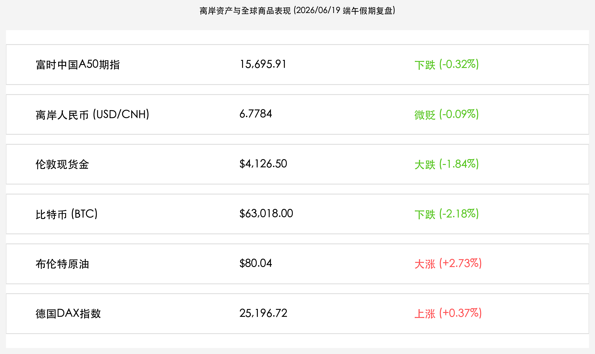
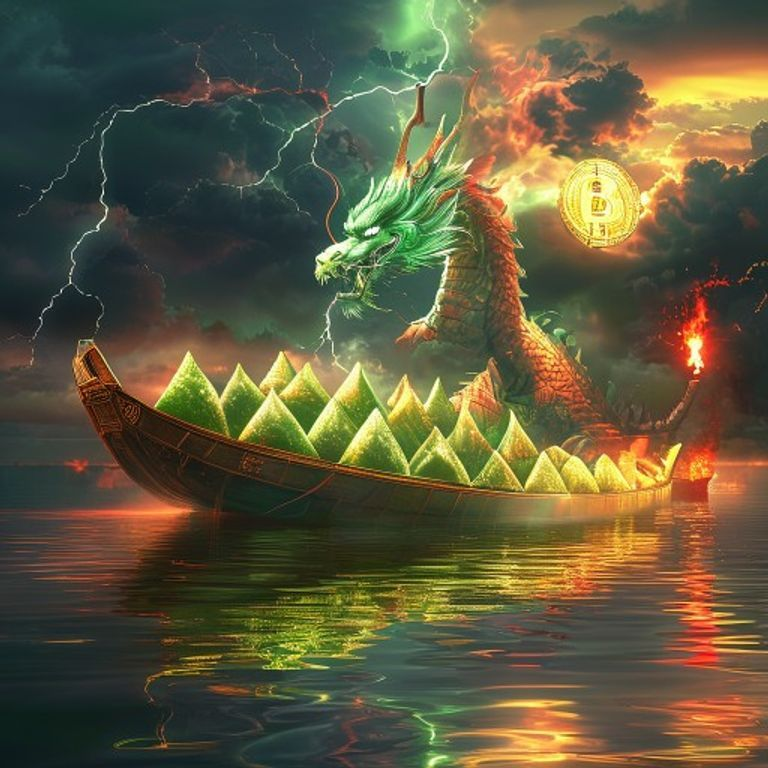

# 收报：端午假期首日离岸资产震荡分化，美伊会谈停摆引爆油价狂飙，黄金与加密资产双双跳水

**日期：2026年06月19日 (星期五)** &nbsp; **时段：晚报 (端午假期复盘)**

> **核心摘要**：端午假期首日，国内A股与港股休市。由于黎巴嫩局势升级导致美伊原定于19日在瑞士举行的和平会谈意外停摆，地缘避险担忧重燃，国际原油价格大反弹，布伦特原油大涨2.73%重回80.04美元。然而，会谈取消引发了避险资金在非股资产内部的剧烈震荡与重新定价，现货黄金重挫1.84%跌破4130美元，比特币受美联储鹰派情绪及流动性流出影响大跌2.18%至63018美元。富时中国A50期指受金融权重股走弱拖累微跌0.32%，离岸人民币兑美元汇率在6.7784附近窄幅震荡。

## 离岸行情复盘

虽然 A 股与港股今日因端午节休市，但离岸市场及国际商品市场交易仍在继续。由于地缘局势在日间发生重磅反转，大宗商品和加密资产价格出现剧烈波动：

| 资产名称 | 实时点位/价格 | 涨跌幅 | 市场解读 |
| :--- | :--- | :--- | :--- |
| **富时中国 A50 期指** | **15,695.91** | **-0.32%** | 震荡下行，权重金融板块压制指数 |
| **离岸人民币 (USD/CNH)** | **6.7784** | **-0.09%** | 人民币汇率微贬，在6.77区间窄幅盘整 |
| **伦敦现货金** | **$4,126.50** | **-1.84%** | 大幅走低，美伊瑞士会谈意外取消 |
| **比特币 (BTC)** | **$63,018.00** | **-2.18%** | 风险偏好收缩，加密市场现爆仓压力 |
| **布伦特原油** | **$80.04** | **+2.73%** | 重回80美元，地缘供应担忧再度升温 |
| **德国 DAX 指数** | **25,196.72** | **+0.37%** | 欧股震荡偏暖，避险与科技博弈 |

*   **富时中国A50期指微跌**：由于成分股中银行、保险及证券等大权重金融板块全天表现疲软，压制了指数表现。A50期指全天呈现震荡下行态势，收盘微跌 **0.32%**，报 **15,695.91点**。
*   **离岸人民币稳健盘整**：离岸人民币兑美元汇率微跌 **0.09%** 报 **6.7784**。近日，六家国有银行获批直接参与离岸外汇交易试点的举措为人民币汇率提供了坚实的蓄水池，有效平抑了外部流动性波动带来的单边预期。
*   **地缘局势翻转推动原油暴涨**：在美伊此前签署谅解备忘录（MOU）重开霍尔木兹海峡后，今日市场突传原定于瑞士进行的停火会谈因黎巴嫩边境冲突升级而被迫取消。地缘溢价卷土重来，**布伦特原油**大涨 **2.73%** 重回 **$80.04/桶**；**WTI原油**同步上扬。
*   **非股资产遭遇大幅“抽水”**：受地缘和平协议受阻及强美元因素打击，无息/避险资产黄金与加密资产遭资金撤回。**伦敦现货黄金**暴跌 **1.84%** 报 **$4,126.50/盎司**；**比特币 (BTC)** 承压大跌 **2.18%**，价格向 **$63,018.00** 支撑位靠拢，加密货币市场爆仓人数大增。
*   **美股休市与欧股震荡**：美股因“六月节（Juneteenth）”休市一天。欧洲股市受美伊会谈停摆影响表现谨慎，德国 DAX 40 指数微涨 **0.37%**，报 **25,196.72点**。

## 核心解读与市场逻辑

> **美伊会谈突发触礁：原油重回“战时定价”，避险非股资产多米诺倒塌**
> 
> 国际大宗商品与加密资产今日的走势折射了地缘局势的突发逆转。前一日因美伊和平谅解备忘录签署而大幅走低的油价，在今日会谈被证实取消后迎来报复性反弹，布油瞬间攻克 80 美元大关。然而，金市与币市的走势却出现了剧烈震荡。黄金暴跌近 2% 的逻辑在于，前期堆积的“地缘和平博弈”仓位在会谈触礁后发生了踩踏式去杠杆，加之美联储主席沃什强硬的强美元态度，无息资产的吸引力在避险资金的二次调配中被暂时削弱。而比特币的重挫，更多是由于海外 ETF 持续的净流出以及高杠杆多单在 63,000 美元支撑处的系统性崩溃，市场情绪重新转向保守。

> **端午闭门休整，离岸 A50 展现科技防线抗跌韧性**
> 
> 尽管今日 A 股与港股均因端午节放假休市，但富时 A50 指数的波幅被极力限缩在 -0.32%，显示出极强的底部韧性。虽然大金融权重压制了指数反弹，但受陆家嘴论坛之后关于半导体国产替代、商业航天等“硬科技”支持政策的持续发酵，相关离岸中概科技股与替代指标抗跌性显著。人民币汇率在 6.77 区间的波澜不惊，也验证了多空资金在假期对中国核心资产的观望和偏正面定价。

## 假期宏观热点与消费动向

*   **服务消费表现强劲，端午旅游再掀热潮**：国家统计局首次发布的社会消费商品和服务零售总额指标显示，服务消费增速达 **5.4%**，远高出商品零售增速。今年端午假期恰逢父亲节，民俗龙舟赛、避暑休闲及跨省演出经济成为了旅游消费的核心增长极，各地发放的文旅消费券有效激活了假日市场内需。
*   **十五五“就业优先”规划落地，护航新质生产力**：国务院正式印发《实施就业优先战略“十五五”规划》，要求将就业友好型目标融入宏观经济政策中，并强调随着人工智能大模型及硬科技产业发展，需加快健全劳动者技能转型培训体系，这不仅利好民生，也将为半导体、商业航天等硬科技产业链的后续人才红利提供制度保障。
*   **国内成品油价迎来大降**：自6月18日24时起，国内汽、柴油价格分别下调 **515元/吨** 和 **495元/吨**。此次价格大幅回落恰逢端午假期，大幅降低了居民自驾出行的物流成本，有助于刺激假期内需及周边零售市场的升温。

## 最新机构观点

*   **中金公司 (CICC)**：**“服务消费双轮驱动彰显内需韧性，关注节后科技自主与红利再平衡”**。中金公司指出，端午休市期间外围地缘冲突虽有波折，但国内宏观经济底座在服务消费高增和十五五规划落地的支撑下依旧强劲。央行在上海自贸区实施的离岸人民币外汇交易试点，对于平抑汇率非理性波动具有积极意义。建议投资者在节后把握科创板支持新政，布局商业航天、半导体等国产自主可控的核心赛道。
*   **高盛 (Goldman Sachs)**：**“地缘谈判触礁带来短期出清，大宗商品黄金已现中线价值坑”**。高盛大宗商品策略组分析称，美伊停火谈判在 19 日突发受阻是造成今日原油飙升与黄金暴跌的主因。然而，黄金价格大幅回调至 4126 美元附近，已经挤出了前期过度拥挤的避险杠杆，为长线配置资金提供了极具性价比的切入点；原油在 80 美元以上的震荡有助于防范后续全球通胀的尾部风险。
*   **中信证券**：**“美股休市交投清淡，节后 A 股聚焦中报景气主线”**。中信证券指出，由于美国“六月节”美股休市，今日全球权益资产的交投情绪偏于淡静，离岸 A50 跌幅微弱，显示了极佳的避风港属性。端午假期后市场将迎来 5 月宏观数据的验证和半年报业绩预告的密集披露，建议投资者继续聚焦 AI 通信光模块、半导体先进制程设备等中报业绩确定性极高的主线。

## 今日市场情绪：粽香里的假日静谧与风雨欲来

在端午佳节与全球避险情绪的多空交织中，今日的市场情绪呈现出一种假日静谧与外部风暴激烈碰撞的超现实图景。在完全静止、如镜面般平坦的“端午之湖”上，一艘用黄金与青铜合力打造的巨型龙舟静静漂浮着，龙舟上满载着散发着莹莹绿光的巨大粽子，象征着端午假日闭市后国内市场的宁静与坚实防线。然而，湖面远方的天际线却呈现出极致的分裂：左侧乌云密布，一道刺目的闪电破空而下，无情地击中了一只盛满金条的宝箱与一枚代表数字加密资产的巨大比特币铜币，使其产生蛛网般的裂纹并剥落，象征着伦敦金与比特币在美伊谈判破裂后的双双重挫；而右侧则是一支高耸入云的燃油火炬拔地而起，炽热的红色火焰熊熊燃烧，滚滚黑烟直冲九霄，象征着布伦特原油在供应担忧下重夺80美元高位的狂飙势头。整个画面将中国传统的节日静谧与国际地缘金融风暴的翻云覆雨完美融合，展现了中国资产无惧外围风雨的底气。

> Prompt: Surrealism style. Subject: A massive traditional Chinese Dragon Boat, loaded with giant glowing green zongzi, floats quietly on a completely still, mirror-like lake. In the background, on the left, a dark storm cloud gathers with lightning striking a chest of gold bars and a digital bitcoin coin, causing them to crack. On the right, a burning oil torch rises into the sky, emitting bright red flames. The sky is a blend of peaceful holiday golden hues and dark geopolitical storm clouds. No text, masterpiece, high detail, intricate composition, cinematic lighting, 8k resolution

---

免责声明：内容仅供参考，不构成投资建议。
